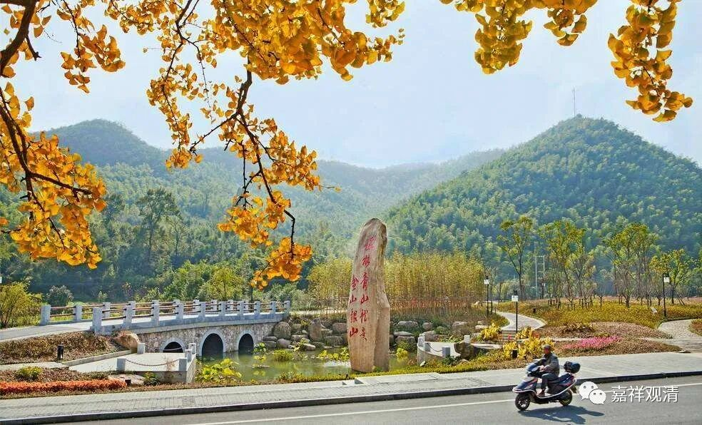

##  《微课堂佛教史》365·1 

好，我们继续佛教史，讲禅宗。现在讲到法眼文益禅师，也被称为清凉文益禅师。 

昨天我们好像提到了法眼文益禅师在和罗汉桂琛禅师讨论《肇论 》的时候用到了华严宗的“六相门”。其实 越到后期，华严和禅宗之间的关系越紧密，后面还会有类似的情形发生，我们以后再说。（另外， 这到底是华严宗内部的教理在退化，还是禅宗内部的教理在进步、在华严化，还是两者兼而有之……这还真的不好说呢。 ） 

前面讲到法眼文益禅师出行的时候因为大雨就在罗汉桂琛禅师的地藏院住下来了，于是两位禅师就在那里聊，有一搭没一搭地聊。很显然地，法眼文益禅师虽然那个时候在长庆慧稜禅师门下的名气很响，但是面对罗汉桂琛禅师还是水平不够，应该是败下阵来。 

过了一段时间，法眼文益禅师准备撤了，要走了，罗汉桂琛 禅师就送他到门口——真是很给面子啊。送到门口的时候，罗汉桂琛禅师就问了：“上座（大师），平时 你 老是讲‘ 三界唯心，万法唯识’，现 在我能不能问你一个问题？你看门口有一块石头，那么，这块石头是在心内呢，还是在心外呢？”

法眼文益禅师回答说：“在心内。”

罗汉桂琛 禅师就说：“前两天你还说你是个行脚人。那你作为一个行脚人，你放块石头在心里面干嘛？”

据说法眼文益禅师当时一下子就愣了。 

以前的人也很老实，发现被对方这么一问，自己确实是连这个问题都没搞清楚，而对方很显然应该是一个会家子。 那么，老实点吧……

于是法眼文益禅师就不走了，留下来 摆正位置降低身份学习了…… 待了一个多月，不断地在罗汉桂琛禅师面前请教。应该这么说吧，可能打坐的时间还是比较长的，因为禅宗毕竟不是教下。同时，也再请教一些问题，但是呢，总是不合意。 

最后，法眼文益禅师就说：**“某甲词穷理绝也。”**意思就是我完了，我已经没什么可以再说的了。可以说我已经一败涂地，都被你否定了，我已经没啥好讲的了。 

这时候罗汉桂琛禅师就说了一句话：**“若论佛法，一切见成。”**这句话讲出来之后，法眼文益禅师**“顿于言下大悟”**。 

大家还记得雪峰义存禅师和岩头全豁禅师两人聊天的时候，最后讲到了什么嘛？我觉得意思好像也有点接近，是吧？**“他后若欲播扬大教，一一从自己胸襟流出，将来与我盖天盖地去。”**从此以后，这些教义要从自己心中流出，是吧？那么这里也是：**“若论佛法，一切见成。”**这个字写的是“见”，实际上也就是“现”，“一切现成”。 

雪峰义存禅师正是罗汉桂琛禅师的师公（雪峰义存——玄沙师备——罗汉桂琛），所以，“若论佛法，一切见成”和“一一从自己胸襟流出”是有着承继关系的 。 

