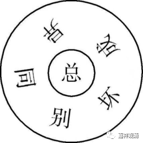

##  《微课堂佛教》368·1 

那么，沩仰宗还有一些其他的内容。比如说，我们之前讲过仰山禅师和沩山禅师的对话。就是沩山禅师做了个梦，就 说：“ 哎哟，刚才我做了个梦，你们谁来给我解个梦啊 ？” 然后香严禅师就带着碗茶上来，仰山禅师就给他端个洗脸盆过来，意思是“你清醒了没有”，两个人的意思都是“你清醒了没有”。 

而且沩山禅师和仰山禅师这两个人的有些公案拼起来看，就可以看出 这里写的“ 父慈子孝，上令下从”。比如说，大家还记得之前讲的那个公案吗——两位禅师在山里采茶，沩山禅师就说 ：“ 老是听见你的声音，不知道你在哪里 啊？” 然后仰山禅师就摇摇树，显然他摇的是一棵大的乔木树，说明那些茶树很高，互相之间都看不见了。 

那么，仰山禅师摇摇树之后，沩山禅师就说 ：“ 你这个是只知其用，不知其 体。”意思 就是说，我听到你的声音了，我知道你在那里。我是怎么知道的呢？是因为你的 用——你的 作用。 

然后仰山 禅师就问：“ 那么，师父，你怎么做 呢？” 师父不说话。于是，作为弟子的仰山禅师就说 ：“ 师父，你这里只有体，没有用 。”

这个公案两个人问答一起来看就比较明显了，宾主互换，互相照应。所以 这里怎么说沩仰宗的呢？“ 父慈子孝，上令下从 。” 这就是沩仰宗。 

下面我们讲法眼宗。在《人天眼目》当中，他谈到了法眼宗当中 的“ 华严六相 义”， 就给出了下面这个图。但是这个图是错的，所以《人天眼目》所讲的有些地方是有问题的。 

我们看这个图，“ 总”和“别”并不是这个图里的关系，不是“总”在中间，别在外面，不是 的。“ 总”和“别”是一对，“同”和“异”是一对，“成”和“坏”是一对，总共这样三对，并不是“总”单独在中间。我要去看看整理这本《人天眼目》的人是谁，他完全搞错了。看起来，他对 于“ 华严六相义”是不通的，是不了解的。 

