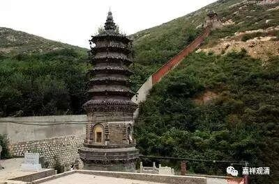

##  《微课堂佛教史》375·1 

好，我们继续佛教史，现在讲禅宗史。 

我们已经来到了宋代，就佛教而言，整个宋代基本上是禅宗一家独大。在这禅宗一家独大的格局当中，如果一定要说的话，天台宗可以算是有过中兴，是因为受到了日本回流的经典的影响。在此之后，中国佛教史基本上就等于中国禅宗史。 

前面我们讲了，五代最后一位、宋代第一位的大师是永明延寿禅师，其实比较重要的 还是他的“ 四料简”。可问题是 ，“ 四料简”究竟是不是他的也很难说，或者说未见得是他的，只是后来往前推的时候都说是他的。 

永明延寿禅师的传记当中早期的放生的故事，据现在的研究也是后期的杜撰，实际上并没有这个故事。不过，你只要会讲故事，大家总记得住。就像玄奘法师记得的人少，而唐三藏大家都记得，如果不是因为《西游记》，玄奘法师几乎是没人知道的。 

我们现在继续宋代的禅宗史，来讲一讲首山省念禅师，首山是他后来待的一个寺院。 

我们可以发现，在这段时间有一个情况。前面我们讲过永明延寿禅师，永明就是现在的净慈寺，他在净慈寺是第二代，是吧？算是开山的第二代，但是在灵隐寺的中兴，就算是第一代。那个时候很多的寺院都是新开的，包括前面讲的雪峰义存禅师、玄沙师备禅师、云门文偃禅师、法眼文益禅师……他们的寺院都是新的，他们都是开山的第一代。那么，首山省念禅师也是一样的。 

首山省念禅师是临济宗的，在临济宗的传承当中还蛮重要的一个人物，属于承上启下的人物。我们讲临济宗后来分出杨岐方会禅师和黄龙慧南禅师， 这样“ 五家七宗”就凑全了，而杨岐方会禅师和黄龙慧南禅师都是从首山省念禅师门下开出来的。 

首山省念禅师的师父是风穴延沼禅师，而延沼禅师也是风穴寺的第一代禅师，也就是风穴寺的开山祖师。风穴延沼禅师的师父是南院慧颙禅师，南院也是一个寺院的名称。南院慧颙禅师是兴化存奖禅师的弟子，兴化存奖禅师的师父就是临济义玄禅师了。 

前面我们讲过，临济义玄禅师在他的晚年时期遇到了唐武宗灭佛，那么我们现在讲的风穴延沼禅师和首山省念禅师后来弘扬佛教、开山传法的地方，都是在中原一带，在汝州，在今天的河南平顶山市。前面讲过，此时的佛教在中原一带受到两方面的影响：一方面是唐武宗、周世宗灭佛的影响；另一方面是后来五代时期战乱的影响。 

在五代时期的北周，周世宗又灭过一次佛，导致佛教的势力很弱，所以后期才会不断地出现新建的寺院。没有这些灭佛运动的话，中原一带佛教的寺院实在是非常多的。而那个时代就大量地出现了开山祖师，背景就是之前的寺院都不在了，所以这些祖师们都要去开山去了。但是在东南那一带情况则不同，比如罗汉桂琛禅师，他待过的罗汉院和地藏院都是原先就有的。 

我们刚才讲的传承顺序是：临济义玄 禅师—— 兴化存奖 禅师—— 南院慧颙 禅师—— 风穴延沼 禅师—— 首山省念 禅师—— 汾阳善昭 禅师—— 石霜楚圆禅师。汾阳善昭禅师，接下去我们也会讲，他也是一位非常重要的人物，在禅宗的传承史上，名气也非常大。后面的石霜楚圆禅师也是名气非常大的一位禅师，石霜楚圆的禅师门下就分出黄龙慧南禅师和杨岐方会 禅师，“ 五家七宗”到这里算是就齐了。实际上“七宗”的这两 位—— 黄龙慧南禅师和杨岐方会禅师，都是临济宗的。由于临济宗后来又出现了这样几位大师，所以后期直至现在，禅宗里面，临济宗的势力是最强的……

