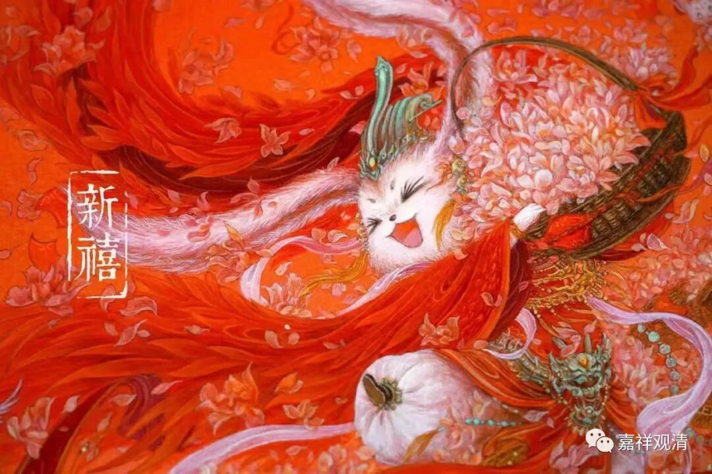

##  村里最靓的仔&天价彩礼 

年前，木匠、电工、瓦匠们纷纷来庙里找我结账——这是每年过年的保留曲目了。也有的年后来寺院结账，一般大头都是年后来……

张三和李四希望我最好都给五块、十块的零碎钱，因为 ——要打麻将。 各数了 一塑料兜给他们，他们这几天一定会是村里麻将桌上最靓的仔！ 李四的孙子、孙女们都好大了，但是麻将瘾却极大，前段时间因此夫妻矛盾爆发，双方大打出手，他把一根手指头给打骨折了 ……却依旧牌瘾无限。 村里人都当笑话看。 

阿 Q 这次要结的账比较多，也很着急，似乎一刻也拖不得——阿 Q 的儿子属龙的，今年都三十五了，还没成家，家里比较着急。去年年底儿子刚相了亲，对方要 38 万的彩礼。果然××省的彩礼高啊。经济学家说，“××省的彩礼高”是因为： 1 、新生儿男女比例失调； 2 、环××经济发达带，把本省的适龄女青年都“带”走了。“彩礼高”的事儿我以前光是听说，这次见到实例了。有时间可以去村里和大家聊聊，做个小小的“实证研究”，哈哈。 

几年疫情，世界改变了很多。今年，很多阳了的和没阳的老居士都不敢来寺院，问了一下，其他地方的寺院、道观也差不多情况。据说福建有些地方已经差不多恢复了，其实我颇为怀疑这个消息的准确程度——可能民俗活动有恢复，人群聚集却未见得多。这里的民俗活动也基本恢复，县里面舞龙的队伍也上街了。 

过年，身体也恢复差不多了，稍微聊点鸡毛蒜皮，祝大家新年吉祥，福慧增长！ 

