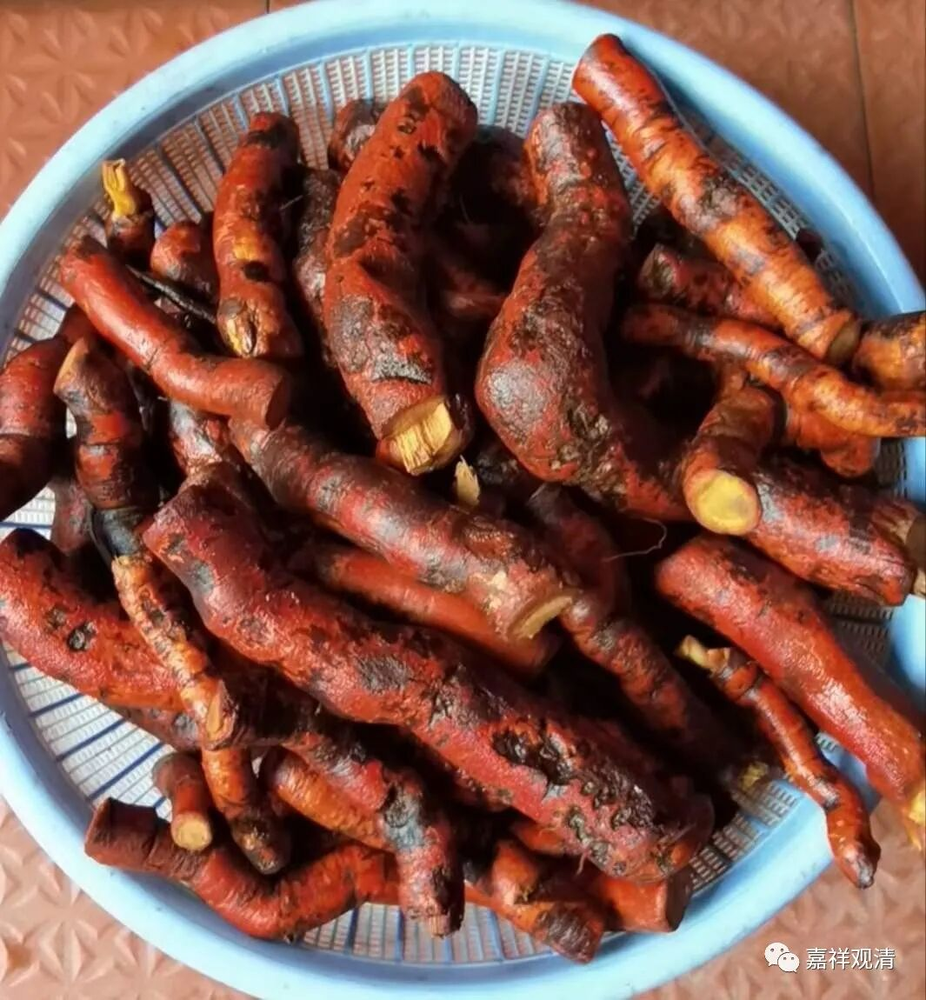
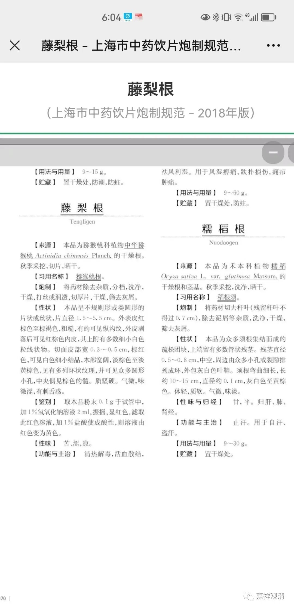
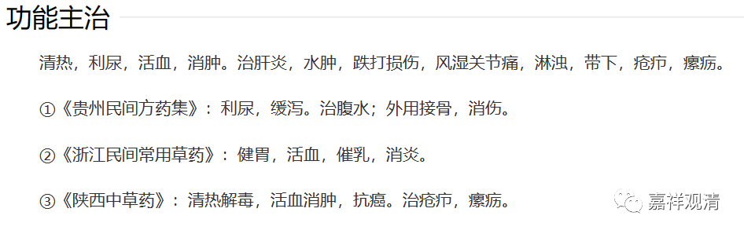
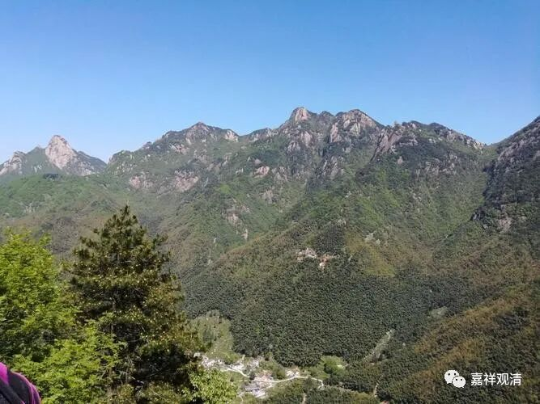
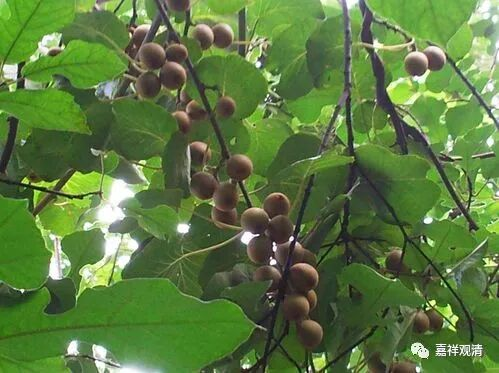

##  猕猴桃根 

有人问起，有人好奇，索性在这里一并回答了。 

一 

猕猴桃根，就是平时我们吃的猕猴桃的根，又叫藤梨根。木生和山下的医生说晒干了泡水喝，能抗癌，当地人和灵芝一起泡，当神药、补药用的。我问了药量用法，村里医生说一次可以用到 250 克，我估计那是鲜药的量，饮片的话，这个药量太大了，不过也说明基本不拘用多少量。 

查了一下药典，大家看看——

上海的《饮片规范》里没提到抗癌作用，不过在陕西的《药典》里提到了——

我让木生砍了很多猕猴桃根来。接下来洗净、切片，晒干。有需要的可以私聊……

二 

我跟老胡说：“这东西又叫‘藤梨根’，是不是吃起来像‘梨’？我们把皮 去了吃吃看！”

说干就干……老胡吭哧一口，涩涩地麻嘴，赶紧吐了……

顿悟！——藤梨根，不是“藤的根”像“梨”，是指“藤梨” 的根，可能猕猴桃又叫藤梨！ 

上网一查，果然，猕猴桃又叫藤梨，还叫猴仔梨，现在又叫奇异果，猕猴桃这个名字还是李时珍给起的。 

猕猴桃、猴仔梨这个名字还真的可能和猴子有点关系。以前我们在九华山后山，住山的 MX 师，他的茅棚边上就有几棵猕猴桃，常常是还没熟透就被山里的猴子吃了，最后就不等它熟了，先摘了放在米缸里，慢慢地捂熟。 

三 

我们山上也有很多野生的猕猴桃，以前夏令营孩子们在路边可以摘很多。 

