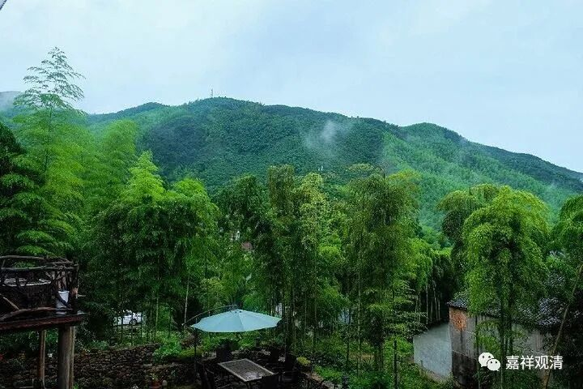

##  微课佛教史364·2 

雪窦重显禅师在灵隐寺待了一段时间，后来被学士曾会发掘出来以后就得到了灵隐寺的方丈珊禅师的青睐，觉得这个人挺不错的，还挺低调。另外呢，他要出世，去做住持。他本来就有士大夫阶层的好友，看样子是可以的。然后珊禅师就推荐他去苏州洞庭湖（太湖）翠峰寺做住持。 

曾会当时是学士，后来官也做得比较大。我们前面讲过，雪窦重显禅师在淮河和曾会见过面，也是曾会把他从灵隐寺的千名禅僧中拔出来的，是吧？就等于是因为曾会的关系，他从一个小和尚就变成了一位住持。后来曾会去了宁波，在他管理宁波期间，就把重显禅师也请到宁波，请他到宁波的雪窦山资圣寺担任方丈。 

关于雪窦山，我们前面讲到过一位人物，就是契此和尚，是现在的大肚子弥勒菩萨的原型。所以现在有个说法，说雪窦山是中国的第五大名山，成了弥勒菩萨的道场。雪窦山本身就比较有名，也是一个大丛林，曾会就请雪窦重显禅师到那里去开法，当时就号称 为“ 云门中 兴” 。 

前天我们讲过，汾阳善昭禅师著有“颂古”，就是把之前的禅宗公案先讲一遍，然后来一首诗重颂一下。这种文体，汾阳善昭禅师可能是最早使用的，而雪窦重显禅师也喜欢作这个“颂古”，在他的后面不远的时代，投子义青禅师也作过“颂古”，再包括后来的《碧岩录》等等，这些“颂古”就越来越多了。 

禅宗里面有个很有趣的现象，本来禅宗是说“不立文字，教外别传，见性成佛”，是吧？但是你现在去看，比如说 佛光山出了一个《禅藏》， 洋洋洒洒一大部—— 禅宗说是不立文字，文字还特别多。说实话，这是有原因的。 

第一，禅宗的不立文字，它确实不是那种非常正统的文字，或者说非常正统的经论形式的文字就没有，或者基本上没有，很少见。在禅宗的五家七宗当中的个别几位人物，会有比较正统的著作型的作品。相对来说，禅宗的著作型的作品是非常少的。更多的是什么呢？就是这种语录，或者讲课的记录——其实也算不上讲课的记录，就是上堂的记录，或者是每次法会上讲的话等等。这些语录会比较多，真正的 作者很认真地自己动手去写的东西，当作著作来写的东西很少，确实少。 

但是由于语录、灯录这些形式的加入，禅宗的文献变得非常非常的庞大。其中还有这一类“颂古”。“颂古”呢，本来可能也就是禅师写写玩玩的，但是由于禅宗本身就很缺少这些比较正宗或者正统一点的文字，而突然之间就有几个人写得相对来说比较正式一点，那禅宗里面就都在背，或者都在学。 

这个事情对禅宗来说，从一定的角度上来说是好事，但是从另外的角度来说，有些人就觉得出问题了，因为这个“颂古”并不重要。而且，当年释迦牟尼佛的时代曾经允许使用各种文字和各种语言去宣扬佛教。如果禅宗变成要能够写颂文才能够学习，才能够做住持的话，对后面的 平常人就会相当麻烦——拦住了普通人的上升通道。 

