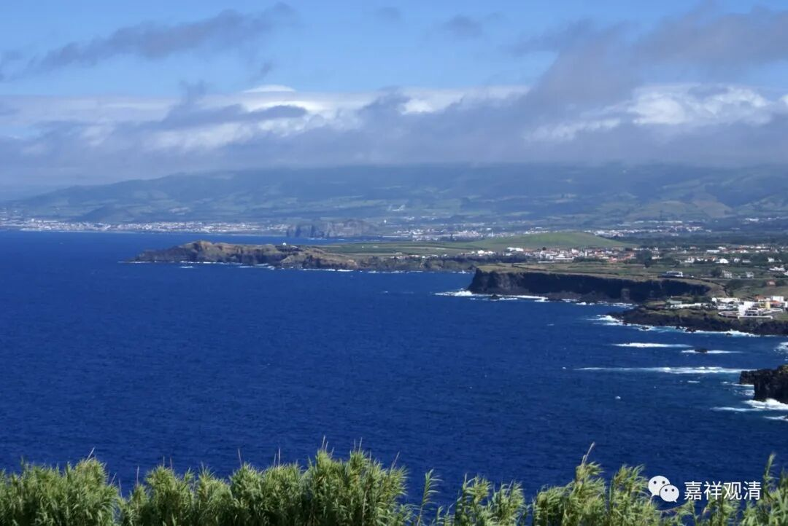

##  微课堂佛教史389·1 

好，我们继续佛教史，讲到了禅宗。 

现在讲到石霜楚圆禅师，又叫慈明楚圆禅师，他是我们前面讲过的汾阳善昭禅师的门下，临济宗这一系传到他这里以后，就开出了黄龙慧南禅师和杨歧方会禅师两家，“五家七宗”的名字到这个时候都出现了。 

那么，石霜楚圆禅师是属于临济宗的。我们前面提到了首山省念禅师门下的汾阳善昭禅师，而石霜楚圆禅师是在汾阳善昭禅师门下的。在慧洪觉范禅师的《禅林僧宝传》当中，有石霜楚圆禅师在汾阳善昭禅师门下开悟的说法，但由于我对慧洪觉范禅师实在是看不上（僧史当中我对于几个人是有点看不上的），所以他的这个记载应该是不太可信的。实际上他是一个文人，而且他是刻意成为文人的，所以我就不用他的记载。 

据说石霜楚圆禅师在汾阳善昭禅师的门下待了十二年，而慧洪觉范禅师说是九年。这个十二年应该是蛮有作用的，而且禅宗在这个时期是非常讲究门第或者师承的，我们从石霜楚圆禅师的故事当中就可以很明显地看出来。接下去我们要谈的几位禅师，包括石霜楚圆禅师，都是亮出了自己的师承从而得到了非常大的帮忙。 

石霜楚圆禅师离开汾阳善昭禅师之后，就去了唐明智嵩禅师那里。唐明智嵩禅师算是他的师叔，因为唐明智嵩禅师也是首山省念禅师的弟子，我们前面讲汾阳善昭禅师是首山省念禅师的弟子，是吧？石霜楚圆禅师在唐明智嵩禅师这里应该是待了一段时间，后来他又一次去了唐明智嵩师那里。 

这位师叔挺提携他的，就给他推荐了内翰杨大年——杨亿，宋代初年的一位名臣，是翰林学士，好像做过知制诰（知制诰就相当于皇帝的秘书），而且做诗也很有名。最重要的是他是《册府元龟》的主编，在当时极富盛名。他又专门整理过《景德传灯录》，所以他对禅宗是有点了解的。虽然并没有说他的师承是什么，但是他对禅宗是有所了解的，他信佛当时大家也都知道，名气也很大。 

这位师叔很给力，等于送给石霜楚圆禅师一个出世的机会 ：“ 你去找找杨亿 。” 然后，石霜楚圆禅师就去拜见杨亿了（拜见能不能算得上？），就去见杨亿。这里就有一段他们两人的对话，我个人觉得这段对话是经过加工的，对话的背后其实没有那么复杂，我们不妨来看一下。 

见面的时候杨亿就说：**“对面不相识，千里却同风。 ”**这是什么意思呢？意思就是说，我们虽然不认识，但感觉是自己人。石霜楚圆禅师就说：**“近奉山门请。”**“近”可能是近来、刚刚的意思；“山门”应该是指佛教、siyuan； 这个“请” 我也不知道什么意思 ，可能是说“我是寺院派来找您的” 。杨亿就说：**“真个脱空。”**可能意思是说你哪里来的（你没有依傍吗？），然后石霜楚圆禅师又说：**“前月离唐明。”**我刚从唐明智嵩禅师那里来。杨亿说：**“适来悔相问。”**早知道我前面就不说了。我说看起来是自己人，果然就是自己人——其实就是这个意思。 

我前面曾经讲过好几次了，后期的禅宗记载出现了这种美化显示的现象，其实平时我们讲话的时候是不会这么文绉绉讲的。你别说和尚之间，就是这些士大夫之间、诗人之间，互相见面也不会这样说话的 ，“**近奉山门请**”“**前月离唐明**”哪有这样说话的，这些文字就是后来美化了。 

意思就是说，一个人来了以后，他一看，就觉得好像是自己人，聊了几句以后呢，一个说 ：“ 我刚从智嵩禅师那里来 。”另一个就说：“ 果然是这样，早知道我也不说了 。” 差不多就是这个意思。明明没有那么复杂，禅宗的后期记载却是太啰嗦了，弄得玄之又玄。真实的见面不是这样的，哪怕诗人和诗人见面也不是这样要互相猜谜的。这里还有一些其他的内容，我们就不讲了。 

