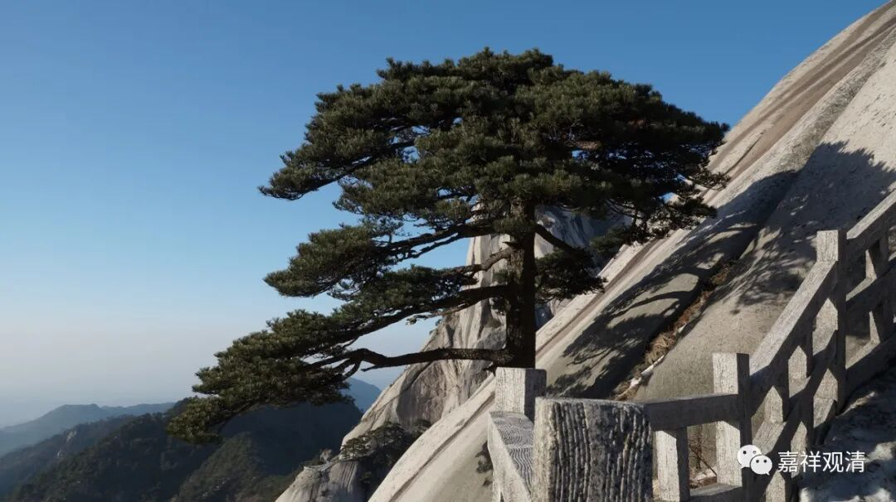

##  微课堂佛教史392·1 

好，我们继续佛教史，现在谈到禅宗，已经谈到了石霜楚圆禅师。 

石霜楚圆禅师的门下有两员大将——黄龙慧南禅师和杨岐方会禅师。临济宗到了宋代的时候就出来了这两支，可以说，这两支的发扬光大导致了后来禅宗的格局出现了很大的改变。 

我们前面讲过，其实差不多到宋初的时期，北方临济这一支是偏安的，好不容易才活下来的。而南方的云门和法眼，适时地跳了出来。这些禅家的风格其实并不一样。南方的这几支从雪峰义存禅师开始都比较和气——文人禅， 禅宗到了宋代的时候就很明显地有文人禅的倾向。而临济这一系在大宋建立以后，就表现出它顽强的生命力，到石霜楚圆禅师之后基本上就是临济一家独大了。 

说实话，当时其它几支都还在的，就是在石霜楚圆禅师、黄龙慧南禅师和杨岐方会禅师的同时代，五家都还在的。但是就是从这个时候开始，其他几支就慢慢地都衰落了，或者说都被临济所取代。 

接下去我们也会谈到，云门和法眼当中的人才，最后大多都被临济吸纳进去了。而曹洞这一支子嗣不长，它传下去的这一支，实际上是临济宗过继过去的，到时候我们会谈，就是从投子义青禅师这一支下来的。由此也可以看出，总体上看临济宗的人才是比较多的。 

后期我们说佛教的禅宗里面剩下的就是“临天下，曹一角”，临济占有了绝大部分的市场份额，曹洞宗占有其中的一部分。其实，在唐末、五代或者宋初的时候，刚开始的说法是“云门天子，临济将军”，就是云门或者云门和法眼这 两系，实际上是更加子嗣绵长或者开广人多。 

我们提到“宗教经济学”的时候曾经说过，在饱和的市场下，一般就是一两个品牌独大，而后期的新鲜的产品比较容易迅速抬头，接力头部位置。云门和法眼二宗成立最晚，而且在他们刚冒出来的时候都受到皇家或者地方势力的扶植，所以宗教市场上突然就异军突起了。 

但临济一脉到后来势大而且绵长，是因为临济在宋初也迅速介入、跻身文人禅，并且不断推出新产品比如“话头禅”，终于和推出“默照禅”的曹洞宗成为禅宗（甚至中国佛教）的代言人。（另外，云门宗和法眼宗的地方性太强了，限制了二宗的“做大做强”。） 

