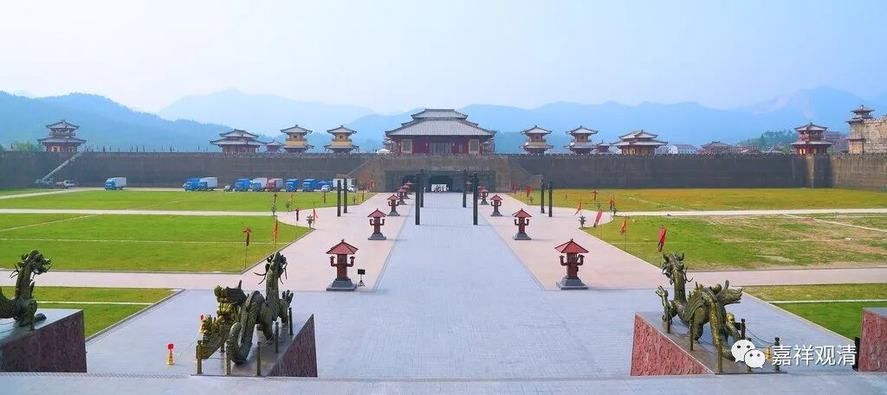

##  微课佛教史392·3 

我们前面提到过的几位法师，早先都是在律寺当中学习过的。之前我们也谈到过，成熟时期的禅寺和律寺的制度 是有点不一样的。既然黄龙慧南禅师在律寺里面待过，那他对于律寺的律行——也就是戒律里面的印度的传统做法，是非常了解的。或者说，对于最真实的印度的寺院规制，至少是有所了解的，因为毕竟是有一个“活着”的制度—— 寺院在那里。 

另外一方面，这些大师们又经常去禅寺参访，所以他们后来领众的时候，对律和禅两方面都比较了解。在这种情况下领众，相对来说也比较擅长管理。我觉得这也是很有意义的。 

那么黄龙慧南禅师在栖贤寺的学习，等于也补上了寺院组织、寺院管理这一课，也就是在律寺那里补上了戒律或者律师的这一门课。黄龙慧南禅师就在这个寺院待了三年，对寺院的一些行止、规矩，包括如何应对接物等方方面面，比如不同的职务应该负责什么不同的事务，都有所了解。 

大家不要觉得这个事情不重要，其实这个挺重要的。比如，对于我来说，我如果算是学问僧的话，比较欠缺的其实就是寺院管理这个方面。可以说，我对于寺院的管理等等，不是很通达，不是很了解。如果要领众的话，确实是需要专门学习、了解的。有些寺院会教育人的话，就会让一个被培养的人担任不同的职务，在不同的领域学习如何领众，而我们这批人是比较欠缺的。 

我们说过，释迦牟尼佛出家前属于 刹帝利武士阶层，所以僧团的规矩制度很多都参考了军规——比如统一制服、统一发型、按资历排序……僧团里的“晋升”模式也有点像军队的模式——要会带兵、要会搞训练……

黄龙慧南禅师这里跟的澄湜禅师，是哪一系的呢？他是法眼宗这一系的，澄湜禅师是法眼文益禅师的法孙。 

后来黄龙慧南禅师又去了蕲（qí）州，去到怀澄禅师那里。怀澄禅师是哪一系的呢？是属于云门系的，在五代宋初比较有名的。怀澄禅师差不多是云门文偃禅师门下的第四代。从年代来说，一个是法眼宗的第三代，一个是云门宗的第四代 （法眼禅师比云门禅师要晚一代），那就差不多。 

黄龙慧南禅师在怀澄禅师这里，也就是在云门系这里，是获得认可的。怀澄禅师让他**“分座接众”**，就是让他带徒弟的，也就是说已经承认你的。用今天的话来讲，承认你是开悟了，承认你有水平的。那黄龙慧南禅师应该就算属于云门宗的人了，对吧？云门宗的祖师级别的人物已经承认他了。但是，他不是临济宗的人吗？这后面还有一个故事。欲知后事如何，且听下回分解。 

今天先讲到这吧，谢谢大家！ 

