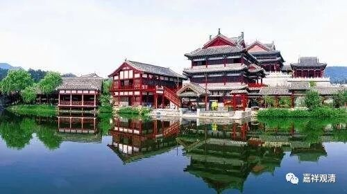

##  微课堂佛教史393·1 

好，我们继续佛教史。我突然发现我这个名字起大了，虽然名字叫作“科学唯物”，但实际上能不能达到是另外一回事情。 

我们现在讲到了临济宗在宋代时候的一位重要人物——黄龙慧南禅师。前面已经讲过了，黄龙慧南禅师早年是在云门 宗和法眼宗门下学习的，甚至在云门这一系学习的时候，怀澄禅师已经跟他分座了——认可他的能力了。 

分座这个概念，最早的来源是《法华经》，释迦牟尼佛讲经的时候召唤了多宝如来，两位佛就一起坐在法座上。后来又在一些石窟当中看到两尊佛坐在一起互相谦让的这种姿势，那就是源自《法华经》的释迦牟尼佛和多宝如来分座的这件事情。声闻乘当中其实也有说到分座的，当年释迦牟尼佛尊重大迦叶，因为他年纪也大了，水平也不错，释迦牟尼佛也分座给他的。 

那么，禅宗当中的分座是什么意思呢？就是承认你开悟了。分座，意思就是在寺院里你可以替我讲经了。也就是说，虽然黄龙慧南禅师此时尚未出世，但已经是以“准出世”的面目示人了，是云门系的。 

那他怎么会转到临济系去的呢？其实这个事情到后来也是出现问题的。那时有一位云峰文悦（喜悦的悦）禅师，他也是汾阳善昭禅师门下的再传弟子，是临济系的。他遇到了黄龙慧南禅师，一看就说：“毁了。”他认为黄龙慧南禅师是有能力的，或者说有天 分的，确实可以看到他是有那个天才的。云峰文悦就说黄龙慧南禅师很可惜，没有遇到真正的师父，师父对他的锤炼不够。从某种角度来说，就是文悦禅师不太认可之前的怀澄禅师对黄龙慧南禅师的结论，觉得怀澄禅师的水平有点不够，耽误了黄龙慧南禅师。 

文悦禅师和慧南禅师是好朋友，有一次他们一起游西山，两人在晚上一起聊天，就像我们今天喝茶一样。那时候应该已经有茶了，他们是不是喝茶就不知道了，就是在一起聊天。 

这种情况也是经常有的，我们以前和一些禅师聊天，可以聊到凌晨两点，然后四点就要起来念经了。我们晚上聊天的时候灯也不开，宋代的时候点的油灯，是要节约的，是吧？打坐以后就聊一聊。我觉得差不多就是这种形式，大家一起出去打坐，然后晚上聊一聊。 

聊的时候呢，文悦禅师觉得慧南禅师有点可惜，就很直白地跟他讲了，说（当然，实际的文字不是这样的）：“你的师父澄公他虽然是名门之后，但是路子不一样。”这个说法其实很委婉了。 

黄龙慧南禅师就问：“哪里不一样？”

文悦禅师说：**“云门如九转丹砂，”**道教里面有“九转还丹”，就是不断地炼汞——以前叫铅汞。外丹，就是炼汞，把硫化汞炼成汞，再烧成氧化汞，再烧成汞，再炼成氧化汞等等，搞九次。“九转还丹”就是外丹，吃下去有用。在这里是个比喻。 

**“云门如九转丹砂，点铁成金。”**我们今天说“点石成金”，是吧？宋代已经在用“点铁成金”这个词了。还有一个地方也有用这个词，“黄山谷点铁成金”，是吧？这一段是在夸云门禅师的。 

然后下面一段的比喻，就有点其他的意思。**“澄公药汞银徒可玩，”**“澄公”就是指黄龙慧南禅师在云门宗师父怀澄禅师。“澄公药”，如果用炼丹来作比方，大家都炼丹，你师父澄公他炼的丹是什么样的呢？举一个比方。“汞银”，就是汞的颜色是银色的，而“九转还丹”的颜色是红色的，氧化汞嘛。“徒可玩”，仅仅就是好玩。**“入煅则流去。”**你要是去烧的话，就都流走了。这是什么意思呢？不成器。“九转还丹”，最后那个氧化汞应该是固态的。而这里说“澄公药”是“汞银”，是汞，那就还没成气候呢，还欠缺修炼，还没有到“九转还丹”的地步。 

这说明文悦禅师是个过来人，他的意思就是说怀澄禅师实际上还欠点火候。他的比喻在这里真的是这个意思，真的是欠点火候的意思。就是说，假如炼丹炼到汞银的时候，那绝对是欠火候，还得要再炼，一定要炼成氧化汞才行。意思就是说欠火候的。 

