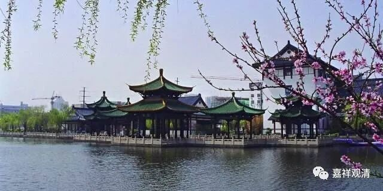

##  微课堂佛教史394·1 

我们继续讲佛教史。 

现在是讲禅宗史，讲到宋代禅宗的临济门下的石霜楚圆禅师，在他之下出了两员大将——黄龙慧南禅师和杨岐方会禅师。 

黄龙慧南禅师原先是云门宗的门下，是云门宗的第五代。但是那个时代并没有“一肩挑五宗”这种情况，应该没有。本来云门宗 内部已经认可黄龙慧南禅师“开悟” 了，但是他碰到一个好朋友文悦禅师，说“你这个不对 …… 你师父水平不够”，黄龙慧南禅师还不高兴了。最后两人分别的时候，文悦禅师还是对他说：“你啊，真的要 赶快 去找石霜楚圆禅师。”

文悦禅师之前就打了一个比方，说黄龙慧南禅师的师父怀澄禅师，就像没炼好的“九转还丹”，还差口气的。前面我们讲过，“九转还丹”就是硫化汞、氧化汞不断地烧啊烧，就是不断不断地煮，煮到最后得是红颜色的。丹药就是红颜色的，为什么叫丹药？丹，就是红。如果你是炼成汞的话，当时称为叫汞银，那就是银白色的。如果是炼成汞的话，那就是半成品。所以文悦禅师比喻说：“你的师父啊，还是半成品，还没有经过最后的一些烧炼。”

那么，文悦禅师就推荐黄龙慧南禅师赶快去找石霜楚圆禅师，那个时候黄龙慧南禅师才三十岁左右。黄龙慧南禅师也可能在心里面是有些怀疑或者什么，至少被他的好朋友这样说了以后，心里面就有点想法，就准备去见石霜楚圆禅师。 

他走在路上的时候听说石霜楚圆禅师已经退休了，不接众了。还另外听说石霜楚圆禅师“遍斥诸方”，就是江湖上点得上名的禅师都被他骂过。黄龙慧南禅师肯定觉得这位大师不太会做人或者说江湖上名声不太好，所以他后来就停下来没去拜见了。 

我们已经说过，当时大家都有一个习惯，就是行脚，腿走得勤快。黄龙慧南禅师后来就去了衡山福严贤禅师那里学习。福严贤禅师是哪一系的呢？是大阳警玄禅师门下的，我们可能不会再专门讲大阳警玄禅师了，他的徒弟我们会讲，但是他在这里有一个比较重要的公案。 

大阳警玄禅师是属于曹洞宗的，是曹洞宗门下的，福严贤禅师也是曹洞门下的。但是大阳警玄禅师门下的这几位都**“不寿”**——活得都不长，实际上大阳警玄禅师这一系在后来都断了传承了，或者说断了子嗣了，没有重要的人留下来。（但仔细看史传的话，其实还有一支传了一两代的。） 

