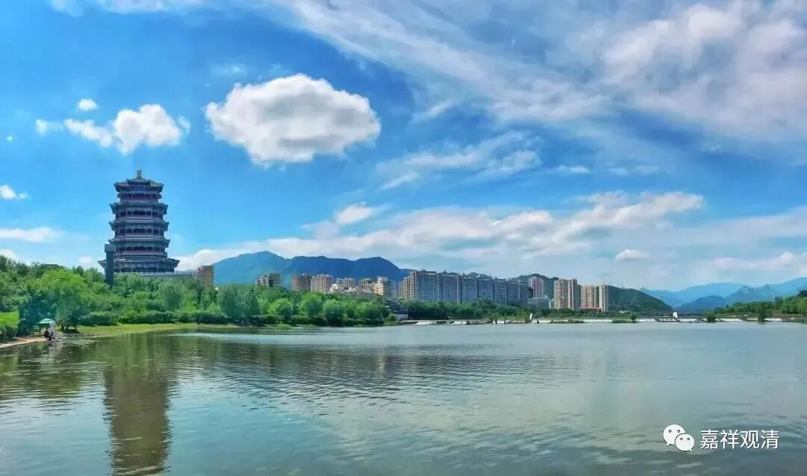

##  微课堂佛教史397·1 

好，我们继续禅宗史，讲到黄龙慧南禅师。 

昨天讲多了一点，讲了黄龙慧南禅师是如何在石霜楚圆 禅师门下获得锻炼而最终成就的。当然，这个成就和我们在教理上讲的成就不一样。说实话，假如我们以旁观者的角度来看，禅宗的某种成就，略相当于后期儒家“陆王心学”的那一系。当然，我只是把它作比方，“陆王心学”是跟禅宗学的。 

我说的打比方是什么呢？就是“满街人皆是圣人”，“人皆可以为尧舜”。禅宗所讲的这个“圣人”，这个“见性成佛”的“佛”，和佛教所讲的释迦牟尼佛圆满成就三十二相、八十种好、智慧圆满等等，是不一样的。如果禅宗的哪个人认为这俩“佛” 是完全一样的话，那大概多少也有点标准混乱，因为很明显的，“见性成佛”的套路在正统经教上肯定是没有能力去解释的 （其实禅宗自己早就声明了——我是教外别传！） 。 

禅宗的成就，应该大致属于学习“开窍”的那种，就是一方面是学习开窍，在佛教或者禅宗这方面开窍了，然后另一方面又和禅定修持 有关，加上了一些禅定的体验。我这里的话讲得多了一点，但是这些东西可能都是需要的。就像有些人问我：“观清师，他们这样到底是初地还是八地菩萨？还是三果、四果啊？ 三关对应什么阶位？”其实禅宗内部的这些说法都很难和经教上对应起来……

很多人一看“见性成佛”，就认为禅宗讲的这个“佛”就是教下所讲的“佛”，实际上意思应该不一样的。禅宗自己也讲了，“我们是‘教外别传’”，是吧？他们所讲的和教下是不一样的，虽然借用了一些名词，但是他们有他们自己的理解。而且据我们看起来，他们的用词确实是非常随意的。 

从上面 这个角度去看禅宗的所谓的“开悟”，大概就能够理解了。 

同样地，类似的词在天台宗当中也有，叫“大开圆解”，就是你在学习到一定程度的时候，突然之间一下子悟了，叫“大开圆解”。如果我们不把“开悟”和“大开圆解”这两个词进行过分的发挥的话，大概就是学 到开窍的意思。开窍以后再去学习也好，再去成佛作祖也好，再去住山也好，他差不多可以自学了。从某种角度来说，可以自学了，也确实形成自己的风格了。 

我个人的解读是这样，当然，也允许大家有自己的解读，我并不是说我就是“唯此一真实”地 定于一尊。从我的理解来说，禅宗的这个“开悟”并没有达到教下的见道，甚至有没有得到加行道可能都是有问题的。这种“开悟”应该更接近于世俗层面的，就是接近于我们一般人的开窍。 

