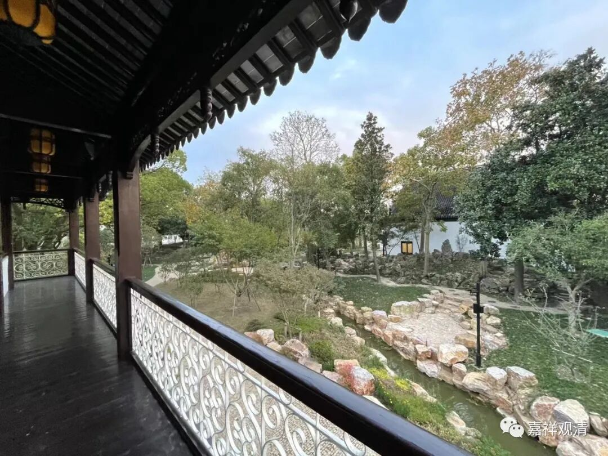

##  微课堂佛教史400·1 

我们继续佛教史，现在讲禅宗史。 

临济宗到了宋代，在石霜楚圆禅师的门下出了两员大将——杨岐方会禅师和黄龙慧南禅师。黄龙慧南禅师门下这一支其实是挺兴盛的，但是到了后来，临济宗再往下传，倒主要是杨岐方会禅师这一支 。当然，杨岐方会禅师这一系也是临济宗到了宋代以后的两大系之一。我师父这一支就是从杨岐方会禅师这一支传下来的——实际上传到现在临济这一宗基本上都是杨岐方会禅师这一支。 

（黄宏慧南禅师的好像没讲完？我再找找……） 

杨岐方会禅师的经历相对来说比较简单，他不像其他的禅师那样走的地方比较多，他是比较踏实的。待会我们会提到我师父以前说的一个事情，不知道是不是杨岐方会禅师。 

杨岐方会禅师家里姓冷，冷暖的冷，在道吾山出家。有些地方说他在九峰山出家，看起来应该是在道吾山出家，但是九峰山和道吾山都和他有关的，这个我们以后再说。 

杨岐方会禅师后来到了石霜楚圆禅师门下，担任监院，监院就是现在的住持，而石霜楚圆禅师就相当于方丈。监院的意思是什么呢？监院就是管理具体事务的，方丈是管理教学的。宋代的方丈和住持（在这里是监院）的职能是分开的，其实后期在理论上是分开的，但早期实际上并不是那样。 

杨岐方会禅师就一直辅佐石霜楚圆禅师，比如石霜楚圆禅师换了地方，他也继续跟着走，继续做监院。在禅宗当中，像监院这样的人才，我们最早说的是五祖弘忍禅师，是吧？他也是属于监院这一类的人才，就是建造寺院或者领众这一系的人才。杨岐方会禅师也是一样，他到其他地方去也都是担任监院的。 

其实他在石霜楚圆禅师门下得到提点的机会、教学的机会并不多，因为事务性的事情比较多嘛。每次要去听法的时候，或者参叩问答的时候，石霜楚圆禅师都会说：**“库司事繁，且去。”**就是庙里的事情还很多，你先去吧。其实这也已经看出来他是个人才了，如果你能够把这些事情都打理得很好，也确实是人才啊。至于在经教上面是不是能够做得出事（讲经、教学）来，反正真正的过来人是能够看得出来的。我们前面已经讲过了，是吧？练武术也是一样的。如果是寺院里面的大和尚，就像我们前面讲过的石霜楚圆禅师这种能够专门训练人、锻炼人的，也是能够发现人才的。 

石霜楚圆禅师就说：“寺院里面的事情多，你先去吧。你呀，将来儿孙多的是。**异时儿孙遍天下在，何用忙为？**”将来你的儿孙多的是，天下都是，现在不急啊。（这算授记吗？） 

