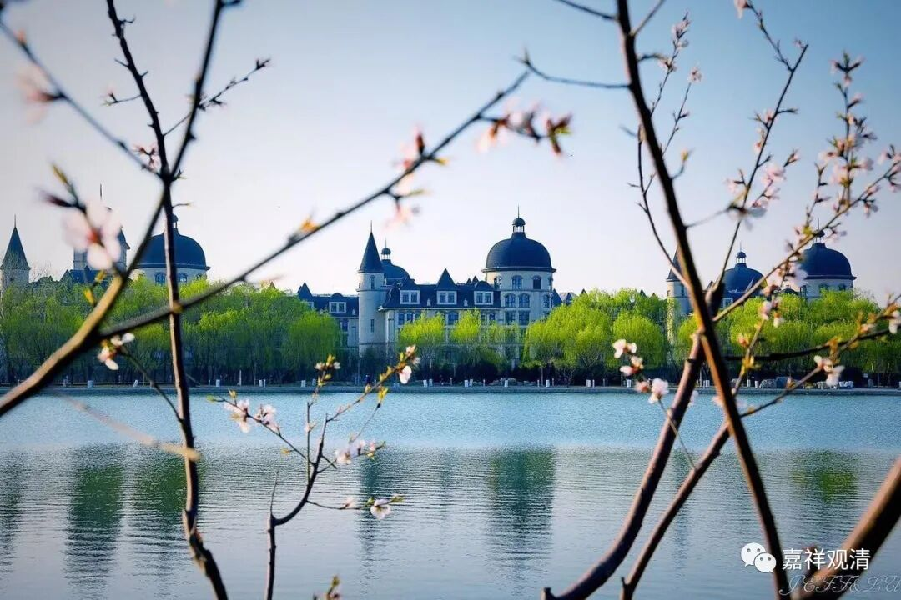

##  微课佛教史411·2 

那么，丛林当中对这个（浮山法远得法）故事还有另外的演绎，内容也大差不差的。就是说他被赶走了以后住到山下，每天在窗口的墙脚下偷偷 听课。最后，叶县归省禅师圆寂之前就说：“站在外面窗口下听法的那个人，你们把他找进来。”浮山法远禅师被带进来以后，叶县归省禅师把 方丈住持的位置传给他了——这个是后来丛林当中一般的说法，刚才讲的是早期文献当中的说法。 

所以，浮山法远禅师在禅宗史上是大家非常敬佩的对象。我师父还专门跟我讲过这个事情，他说：“有这样这样的一位禅师，你知道吗？”他就稍微提了一下浮山法远禅师的故事。我说：“我知道。”我师父也就讲了一下， 说 的不多，反正我知道嘛。“到时候你要这样学习，这样才是弟子。”不过我觉得，这个 实在有点难，有点做不到。就是告诉我我都做不到，别说暗地里考验我了。 

我刚出家第一天，我师父就问我：“能不能受委屈？”唉，我当时就回答说：“受不了委屈。”但是师父并没有因为我说 “受不了委屈”，就没给我“受委屈” 。现在我师父也是老和尚了，当年其实也就四十多岁，就差不多像我现在这样的年龄，就给我讲了这个故事，意思就是说：“你要这个样子，那才是禅宗的人。”

最后老和尚叶县归省禅师在圆寂之前就把法传给法远禅师了，我师父大概也是这个意思。我觉得我扛不住，要做到这个程度太难了，太难了。所以浮山法远禅师也确实是一位被锤炼出来的大师，脾气特别好。好师父遇到好徒弟，好徒弟遇到好师父，都特别难得。 

好，今天先讲到这里，谢谢大家！ 

