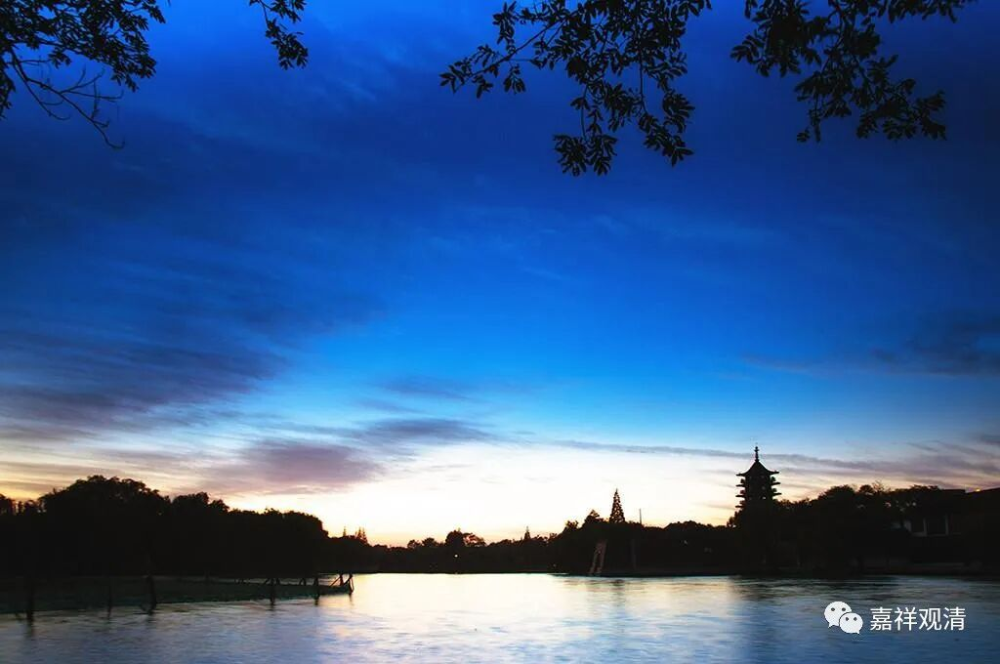

##  微课堂佛教史412·1 

好，我们继续禅宗史。 

现在讲到宋代临济宗的浮山法远禅师。浮山法远禅师是一位（我认为禅宗史上）比较重要的禅师，我们在前面也已经讲了他得法的故事。 

但是，关于浮山法远禅师有一个比较大的问题。我看了一下百度，现在浮山法远禅师的百度词条上，说 他是曹洞宗的第七代祖师——这个不对 ，他不是曹洞宗的，他是临济宗的。 

把他说成是曹洞宗的，估计是曹洞宗的人。为什么会有这样的说法呢？是因为浮山法远禅师曾经帮助曹洞宗传法，实际上是他帮曹洞传下来投子义青禅师这一支，这个事情在接下去讲投子义青禅师的时候会讲到。那么，说他是曹洞宗的第七代祖师，就是让他继承了大阳警玄禅师的法脉。 

但实际上，我们昨天已经讲过了，他在禅宗里面实际的师父，他嗣法所继承的，是谁的法脉呢？他继承的是 叶县归省禅师的 法脉。这个很明确，非常明确。所以，把浮山法远禅师归到曹洞宗，绝对是曹洞宗的人自己干的。浮山法远禅师的临济法脉是极其清晰的，文献上也是非常清晰的。 

之所以会出现浮山法远禅师是曹洞宗的说法，主要是因为投子义青禅师的公案。现在百度上的这个说法是不对的，说浮山法远禅师是曹洞宗的第七代祖师，其实不是的，他非常明确是临济宗的正宗传承祖师。 

我们昨天讲了浮山法远禅师最后得法的因缘和来历，也是很辛苦的。此后，他就代师父传法，但这个时候还不叫出世（世，是世界的世，不是我们现在讲某个人出事了的出事），只是他师父把法传给他了。我们在前面讲过，到了宋代，出世是有一定的“格式”的。 

