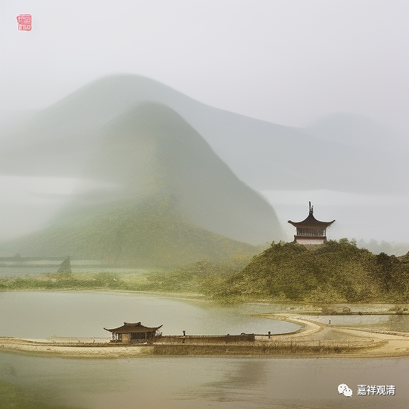

##  微课堂佛教史415·1 

我们继续佛教史。现在讲到北宋时期曹洞门下的投子义青禅师。 

上次拍卖会的时候，我还看到了一本应该是元代的孤本，真的是孤本。后来这本书好像拍卖了三、四十万，拍完以后我就认为这本书的价格肯定还可以再涨，因为很明显那是个孤本，就是投子义青禅师的语录和颂古。 

我们现在再讲投子义青禅师，前面讲了他俗姓李，和李公麟是同宗，好像是叔伯兄弟。那本《投子义青禅师语录》的序， 则是和李公麟、李公寅并称为“龙眠三李”的李冲元写的， 也是当时他们家族里面的一个官员。你们看，这里面又说明了一个情况，就是投子义青禅师是有政治背景的，所以他能够出名也是有原因的。而曹洞宗之前的那几位比如梁山观禅师等等，可能在这方面就稍微欠缺了一点。 

我们前面还讲了投子义青禅师在很年轻的时候就学习了唯识、华严这些。就目前我们所讲的这几位宋代的禅师，以现在人的角度来看，好像寿命都不算太长，都是五十多岁。从这个角度来说，其实这些禅师们出名的时间都挺早的，除了个别的有两个是三十多岁才出家的，其他的禅师都是幼年就出家了，然后都是在三十岁左右出名或者出世了。 

这就和今天的情况完全不一样。前段时间好像是智在师说的吧，还是他引用了哪个人的说法 ？“ 年轻的时候不能出名 。”但是 在历史上不是这样的，在历史上基本上都是二十多岁就出名了。吉藏大师也是如此，二十六岁的时候就已经出名了，因为他们那个时候的平均寿命要比现在短得多，对比现在的人均寿命那基本上是腰斩了，所以三十岁左右就得出名了。这有点像现在的围棋界，以前的围棋界没有二十岁的冠军，这句话是坂田荣男说的。而现在则是二十岁的时候还没出头，这个下围棋的人就没希望了（战老除外）。 这才几年啊……

好，投子义青禅师从华严门下出来，要去找禅宗了。这个时候呢，浮山法远禅师名满天下，也正好“退休”了。如果他已经退休了的话，我们可以理解为他已经有弟子传下来了，那么他就退居了。于是，投子义青禅师就去浮山法远禅师那里跟他学习。 

前一天晚上，浮山法远禅师做了一个梦，梦见抓到一只青色的鸟，结果第二天早上就碰到了投子义青禅师过来，就觉得应该是他了。用我们今天的话来说，可能有点灵异、神异，但是对于当时的人来说，这是正常的思路，就觉得可能就应在他身上了，就非常看中投子义青禅师，而且投子义青禅师也是个有文化的人。那个时候，在出家人当中，如果你是有文化的，那至少已经可以排中上水平了了，就值得培养了。 

