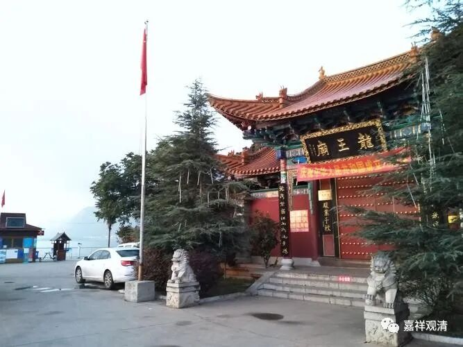
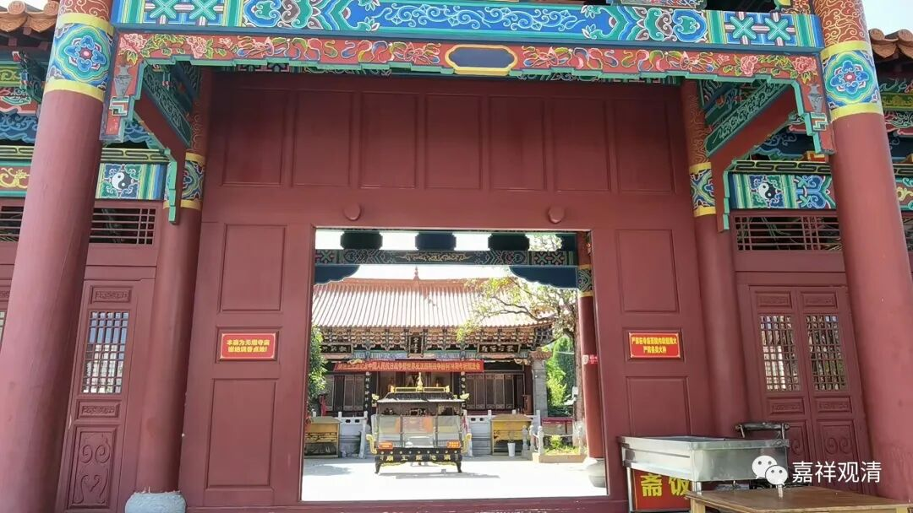
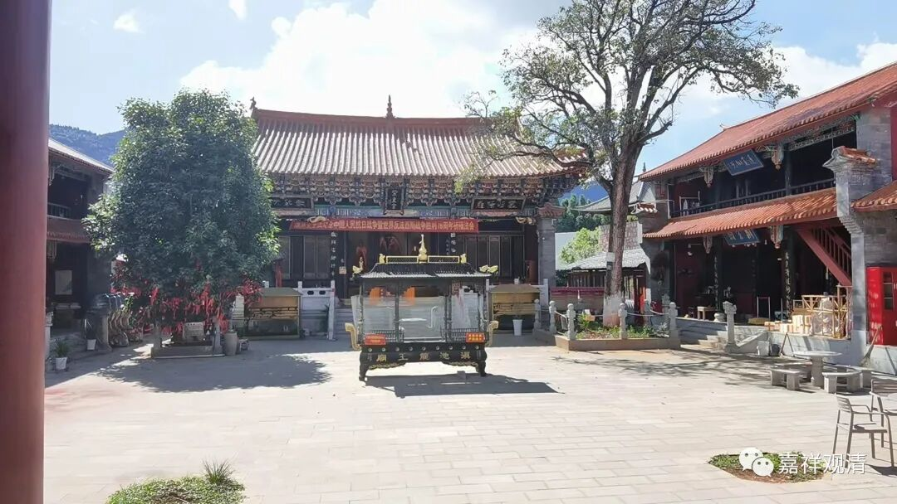
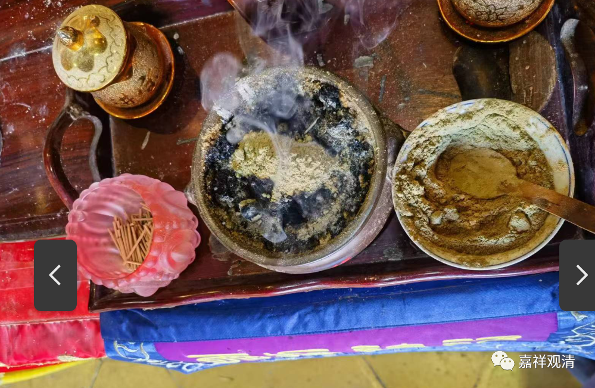
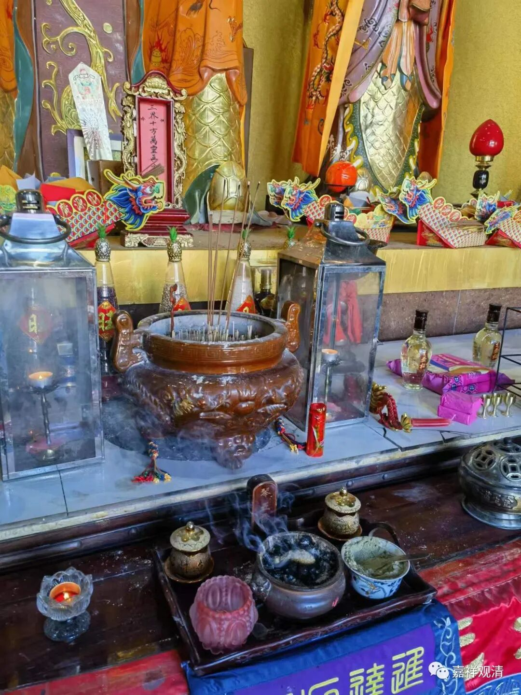
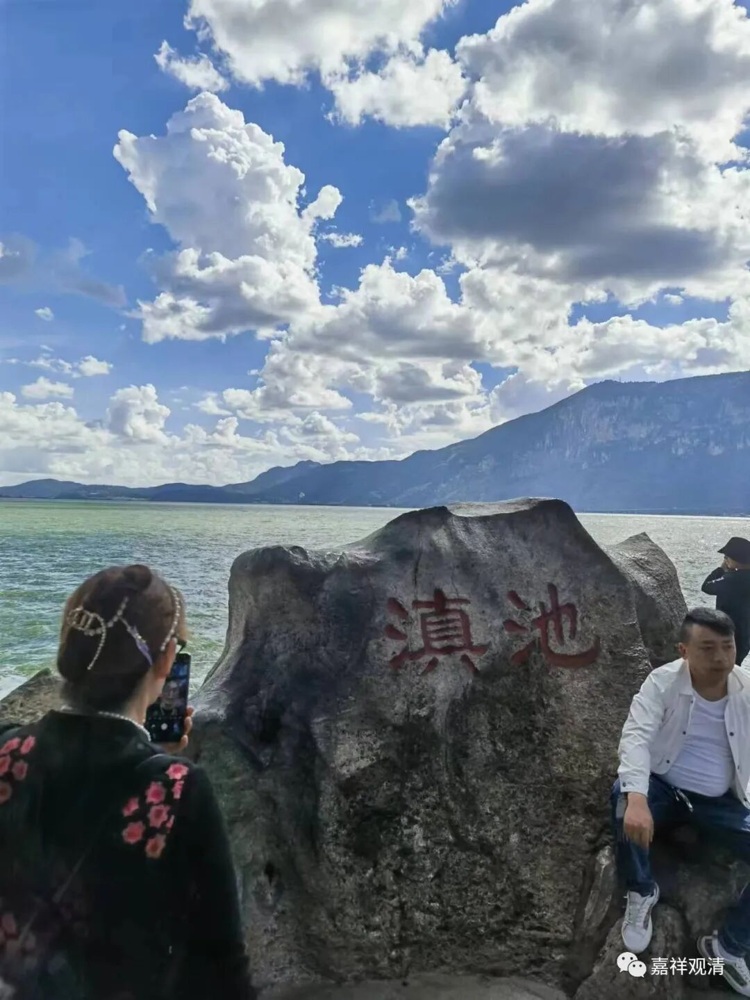
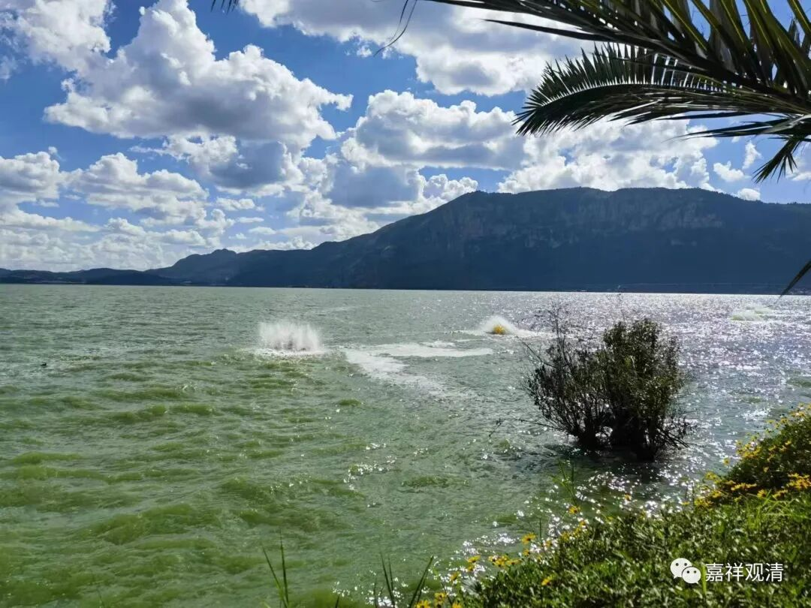
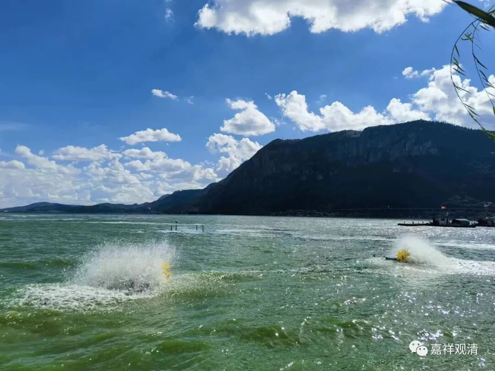
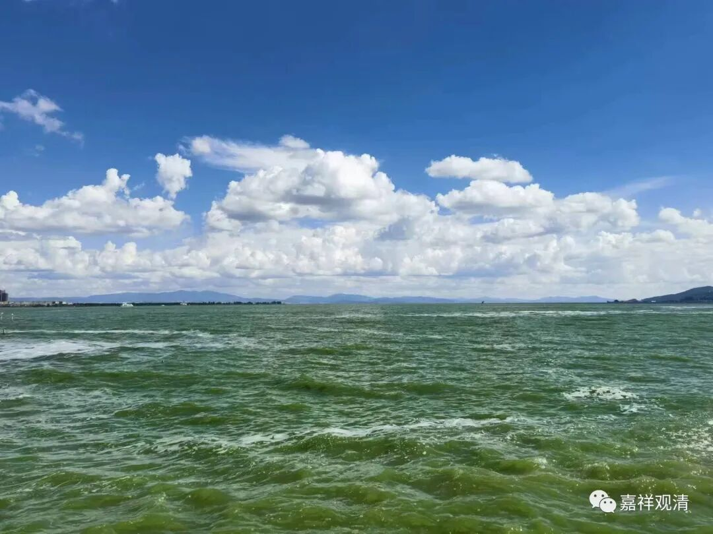
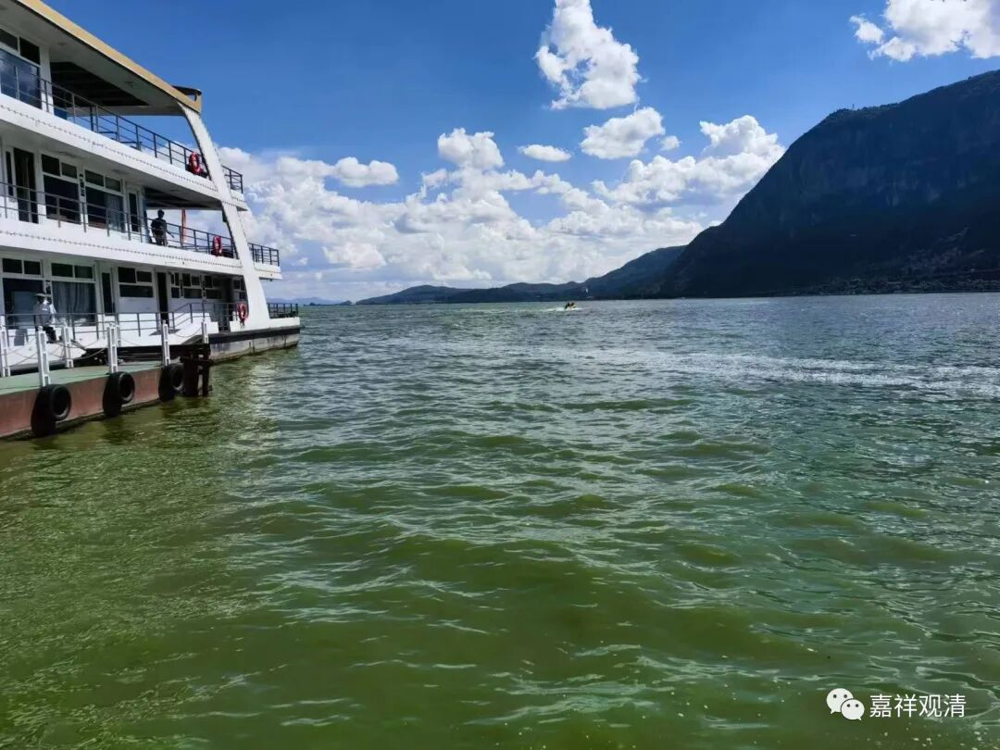

##  滇池西山龙王庙 

昆明，我还专程去了滇池的龙王庙。 

我是打车去的海埂公园西门，司机说，很少有人从那个方向去海埂公园。他不知道，我主要的目的地是滇池西山龙王庙。 

龙王庙在滇池边上，不大，就一个院子，有几个道长……

我向道长“化”了点香（不能说“借”，说借，以后我还得还他）在龙王像前面点上。又去滇池边上丢了点“丹药”——据说龙族好这口。 

##  飞龙在天 

据某专业人士说：“滇池……没有什么大龙王……云南的大龙王在洱海。”

为什么呢？（明明滇池大！） 

答曰：“太浅！”（八卦得这么科学吗？） 

上网一查，果然，滇池面积有 330 平方公里，但平均水深才 5 米，最深 8 米；洱海 252 平方公里，平均水深超过十米，最深 22 米。 

问：那抚仙湖呢？——抚仙湖离昆明不远（昆明东南 60 多公里），平均水深 96 米，最深处 159 米，湖面积 212 平方公里。 

回答说：抚仙湖不佳！（一查，邪门儿！） 

专业人士还是有专业人士的道理……

我们这种麻瓜，只能竖起耳朵，听听就好……

