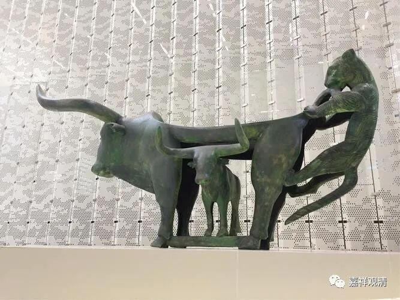

##  云南博物馆（一） 

第三次到云南了，这次有机会还是要逛一逛省博的。 

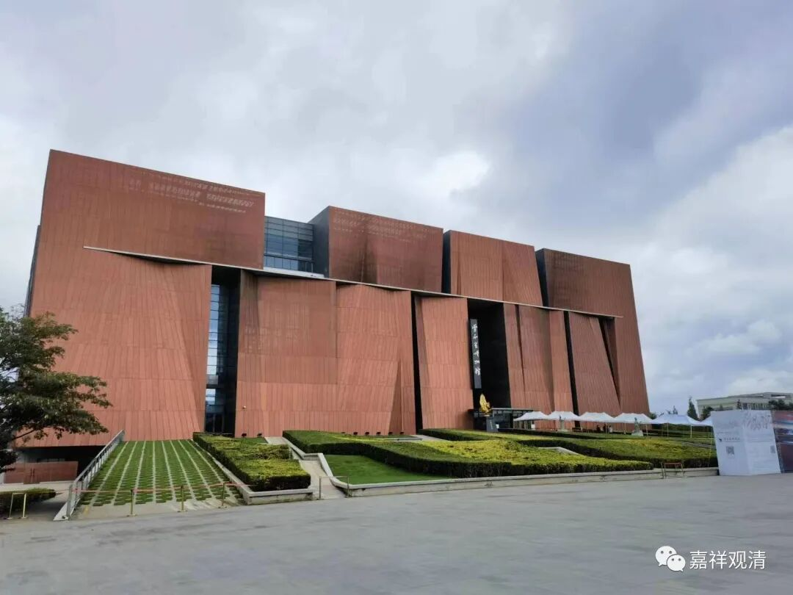

辽西化石科考之旅以后，这些原先不怎么看的地球演化、物种起源、恐龙遗存、人类演变这些内容也开始拖慢我的脚步了……问题是，老了。自小的展板，内容介绍就看不清了，要么凑得很近几乎贴到玻璃上，要么只好先拿出手机拍个照，点开照片放大了看……唉，终于要配眼镜咯。 

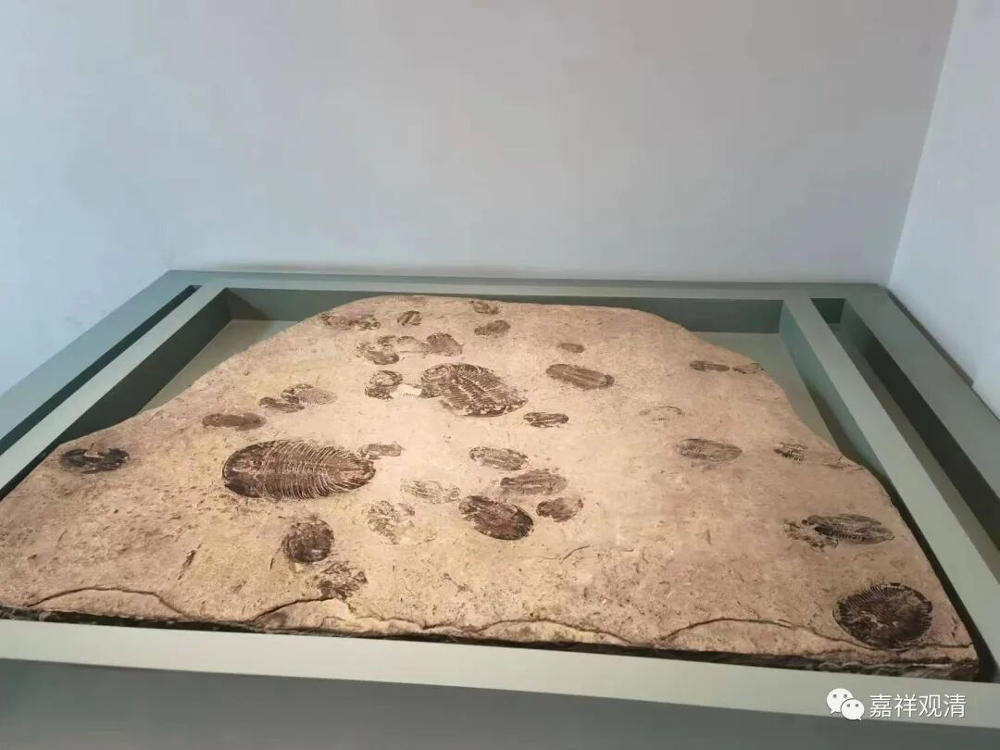

三叶虫化石，我现在也有几个了。但都是单个的，很小。这件又大又多  （我们金牛座视角比较独特）。 

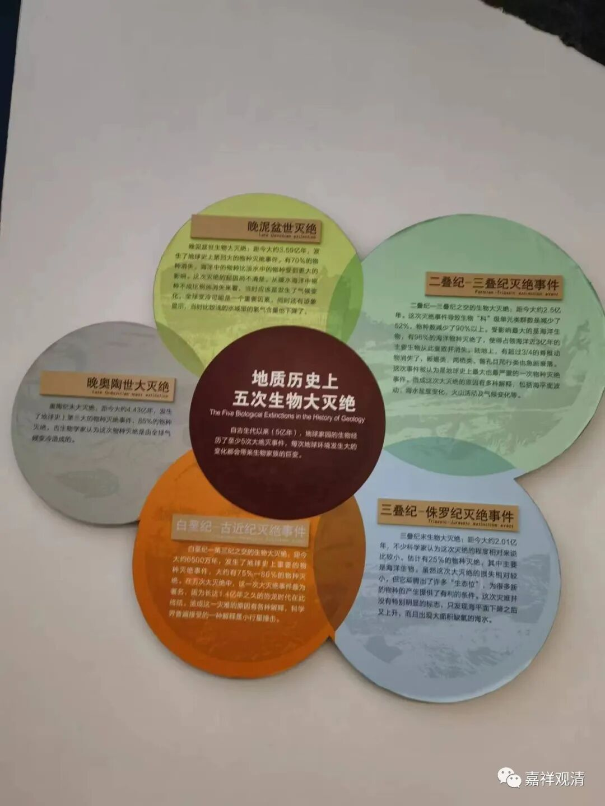

地球上的前五次生物大灭绝。第六次就该是核战了吧。 

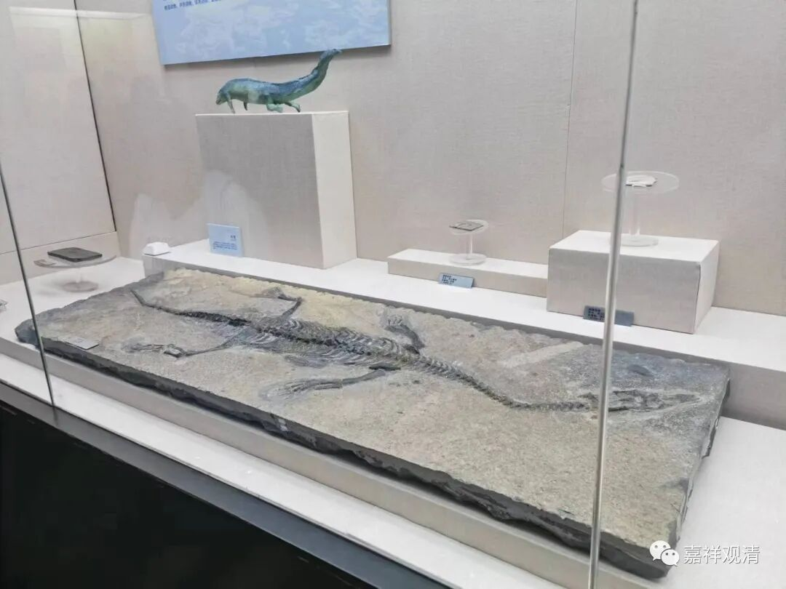

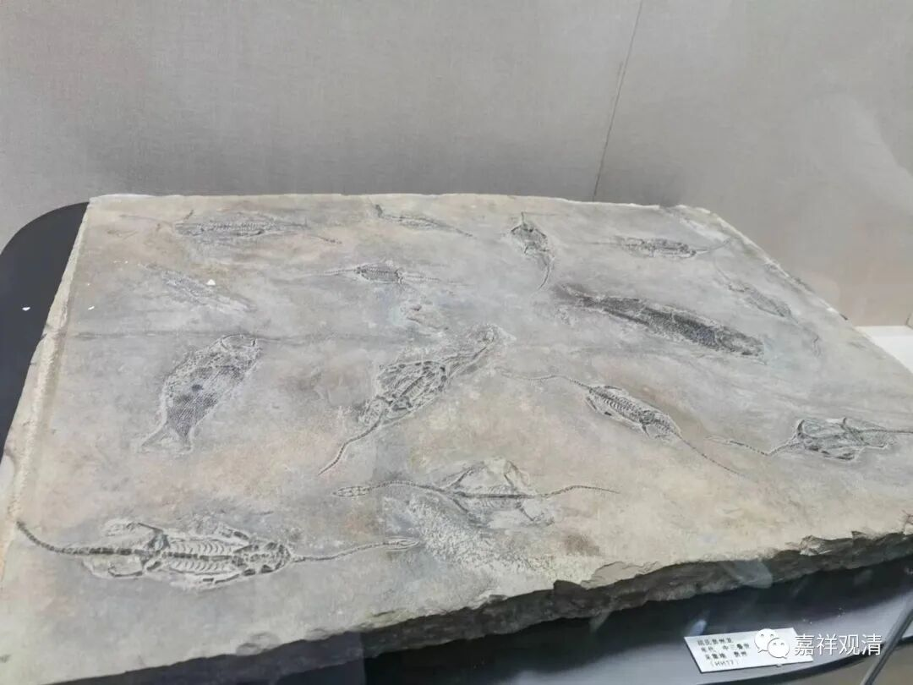

贵州龙。我也有一片小的，不过现在我严重怀疑是假的 

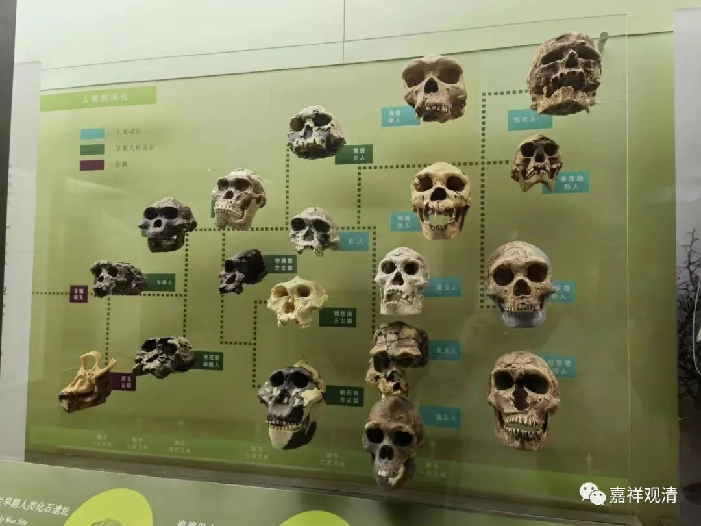

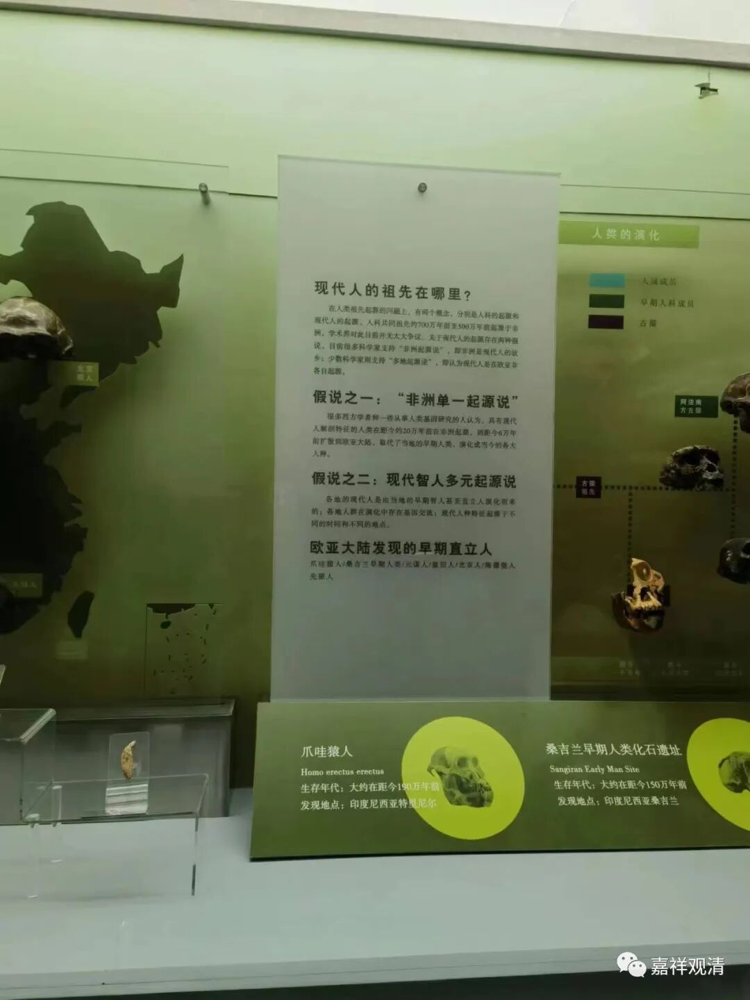

现在都可以用DNA考古来收集证据了。目前好像有多重证据证明人类早期确实是主要从非洲走出来的……

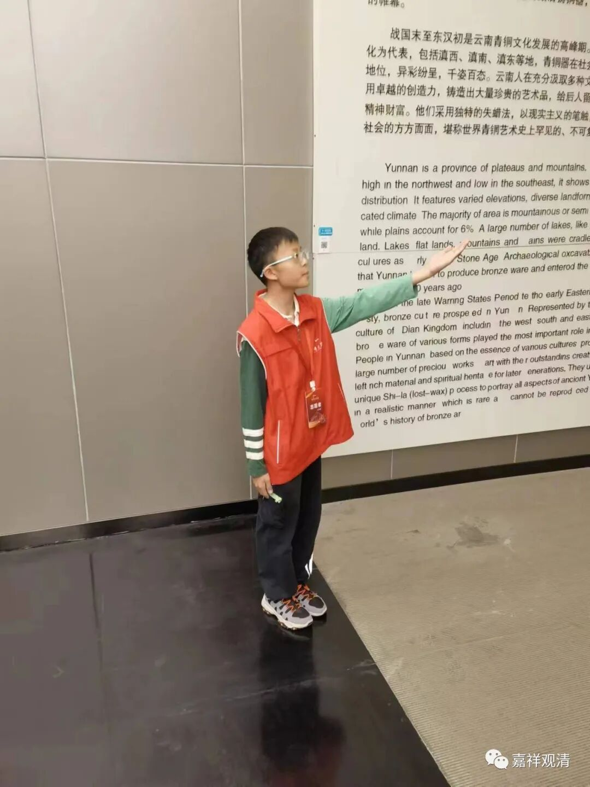

老师带着一队小朋友做讲解员志愿者，他们分几个人讲解一个馆，好像还有“考试”环节。反正在这里，他们比我懂得多。我进来时候租了一个讲解器，所以并没有跟着小朋友们的讲解。 

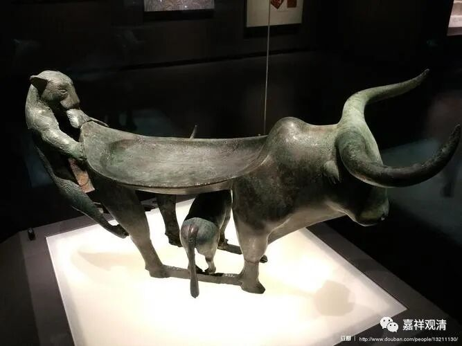

这叫“牛 虎铜案”。 

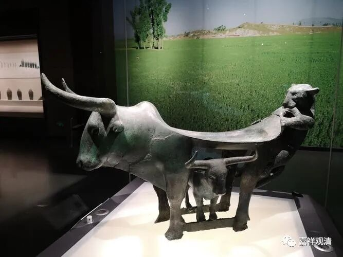

这件文物太吸引人了！ 是云南博物馆的镇馆之宝。 它出土于云南李家山墓葬，是一件古滇国的青铜礼器。牛背 上面凹平的部分是用来放祭品的，据说就是放牛肉的。这件青铜礼器 整体构思极其精巧 ，现代作品的创意也能难如此吧。（说它生动的原因，是真的在视频里看到过狮子捕食的这个动作。嘶，对哦！如果是老虎的话，不是应该咬脖子的吗？这么咬腚的应该是母狮子啊！） 

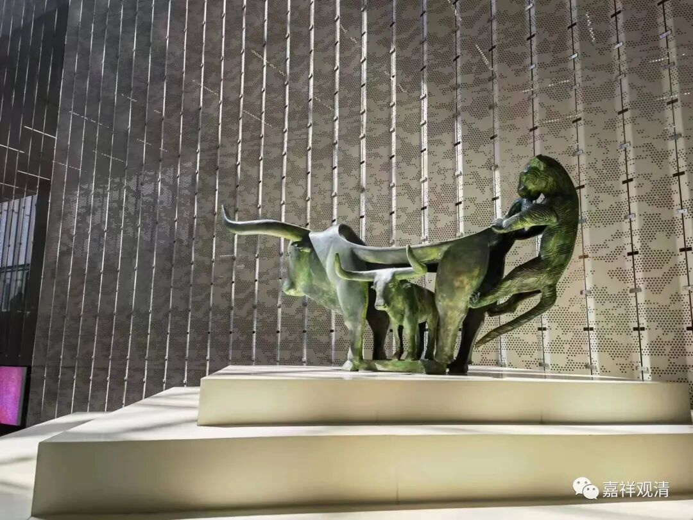

作品太精巧，所以博物馆在二楼做了一个放大版本的。放大了，还是很生动，很震撼。 

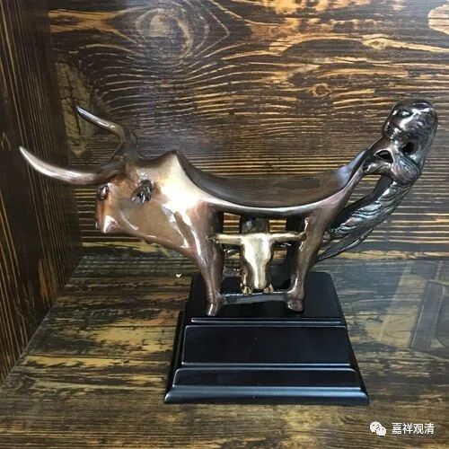

博物馆还做了很多这个版本的礼品。呃，我觉得，虽然这应该是青铜器原有的样子，但是，那什么，我还是觉得做旧一点、带点铜绿会更好看——

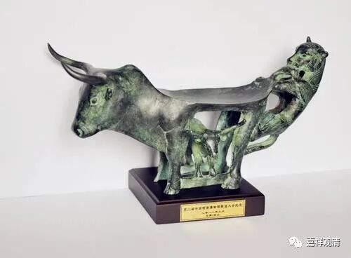

我们中国人都懂包浆，不像外国的有些“文物”……前两天我看一个讲座，二三千年的方尖碑，拿出来，浅浮雕都清晰可辨  ，咱们明清的石碑也不至于这么干净啊！（当然我是外行，专家说了算。） 

……

