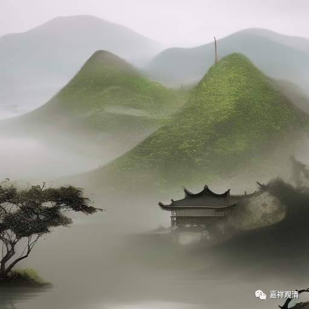

##  微课堂佛教史420·1 

好，休息了两天，主要是出来有事儿，我们今天继续。 

但是过两天很有可能还会停课几天，因为要去朝拜五台山。好，现在继续。 

我们前面讲了禅宗的投子义青禅师，现在讲投子义青禅师门下比较重要的一位人物——芙蓉道楷禅师。曹洞宗的门下后来没有临济宗那么兴盛，所以曹洞门下这些禅师的名气就不像临济门下的禅师的名气这么响。但是我们还是要讲一讲芙蓉道楷禅师和投子义青禅师，这两位都是在曹洞宗当中比较重要的人物。 

芙蓉道楷禅师是投子义青禅师的弟子，也是北宋时期的，山东的沂（yí）州人，家里姓崔。我没有专门考证过，但是大家要知道，山东姓崔的好像有点名门望族。不知道他这个崔是不是名门，也不知道是不是这一家的，我没有专门考证过。当年李世民的意思是说：我们皇帝家如果嫁女儿嫁到崔家，我陪嫁给再多，他们也不给面子 ，好像我们是高攀了。 

芙蓉道楷禅师呢，小时候是学道教的，还专门学过辟谷这些，性子很耿直，很硬的。后来我们也看到了，他确实不给（皇帝）面子。我怀疑——从他的态度来看，很有可能真的是来自于名门的山东崔家，真的很有可能。 

为什么呢？他后来连皇帝的面子也不给，哈哈哈，就是前面讲的道君皇帝宋徽宗。我们前面讲过，宋徽宗曾经把佛教改为道教，把寺院都改宗了。后来芙蓉道楷禅师也碰到了这个情况，当时宋徽宗让他住在净因禅院等等，给他赐紫，送给他紫袈裟，芙蓉道楷禅师不接受紫袈裟。 

关于这个事情有两种说法：一种说法，是芙蓉道楷禅师自己的 文字里面说“我没这个水平，我不接受” 。另外一种说法是说他认为紫袈裟有点不符合律制，怎么说呢？穿紫袈裟，他觉得不正确。 

后来皇帝火了，直接把他抓起来了。你们看看，敢跟皇帝杠，跟宋朝的宋徽宗杠，和他的祖先有一拼啊！所以真的有点怀疑：他是不是那个山东崔家的？ 

那么，芙蓉道楷禅师一开始学的是道教，学习道教以后，他就去辟谷，就觉得道教的套路不能解脱，然后就改学佛教了。这跟我们今天正好相反，我们现在有很多学佛的人，反而倒过来去学辟谷——丢死人了！不过说实话，现在江湖上那么多学辟谷的，他们本来也不是学佛教的，就是叶公好龙，对中国传统文化有点兴趣而已，不多说了。 

