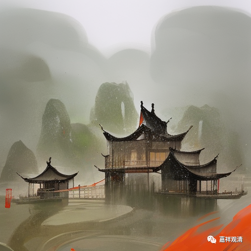

##  微课堂佛教史425·1 

好，我们继续讲佛教史——禅宗史。 

接下来要介绍禅宗史上相当相当重要的北宋时期的两位人物：一位是大慧宗杲禅师，一位是圆悟克勤禅师。 

我们先讲圆悟克勤禅师吧，他是大慧宗杲禅师的师父。圆悟克勤禅师，有些人可能会比较了解，他是谁呢？他在四川成都的昭觉寺曾经担任过方丈，现在他的灵塔也在昭觉寺。 

“圆悟”，是皇帝给他的封号，“克勤”是他的名字。你要是称呼他“昭觉克勤禅师”也行，但是皇帝都已经赐予封号了，一般都会用这个封号。比如说我们前面讲过的法眼文益禅师，“法眼”也是皇帝给的封号，是吧？能叫皇帝吗？好像也可以啊。 

首先，圆悟克勤 禅师是彭州人，也有说他是郫县人的。彭州，我记得是在成都的西北边一点，郫县好像在成都的西边一点，反正两个地方离着也不远。他俗姓骆，就是骆宾王那个“骆”。家里是学儒的，所以很有文化 背景，包括他后来和士大夫们的交往也很多。 

在圆悟克勤禅师交往的士大夫当中，有一位比较重要的人物就是 张商英 （号无尽居士），张商英曾经担任过宰相。前面我们刚刚讲过的芙蓉道楷禅师也和宰相关系不错 ，他和韩琦的关系很好，而韩琦也可以说是宰相——出将入相 ，北宋的名臣。（其实张商英的名气，在佛教圈比在历史圈要大。） 

我发现，北宋的名僧和当时的政坛高层都有比较密切的关系，这种关系（并依靠他而产生的影响的情况）可能要一直延续到明初。我在这里特地点出这个情况，其实是有特殊的深意的。这个情况就等于说明了，直至明初时期中国的佛教地位还都是挺高的。那么，自明初以后出现的情况，就变成了和尚的名声在皇帝或者士大夫那边已经不那么重要了，反而主要是依靠弟子的数量。如果你的实力要靠弟子的数量多，那就意味着你得往下走， 下沉下去，走到民间去……于是佛教一下子就走到民间去了。对佛教来说,朱元璋是个大坏蛋 ……唉，不说他了。 

昨天讲芙蓉道楷禅师的时候我忘记讲一个事情了，就是芙蓉道楷禅师他以前是学道的，那么他对道教就会比较了解，所以他对于宋徽宗提升道教的地位非常不满意，也是与此有关的。我们可以看到，佛教历史上有好几位排斥道教特别用力的法师（比如唐出的法琳大师） ，都是曾经和道教有过很长一段时间或者很多的联系，这些对道教比较了解的法师，往往在佛道之间的决择会非常的清晰。我对道教好像也比较了解——哈哈哈哈，开玩笑啊。 （我曾经也学过一段时间，大概道教的书看得比绝大多数道士要多。）他们道教的经书也没少看，所以对他们江湖上那些东西也稍微了解一点，这就不多说了。 

