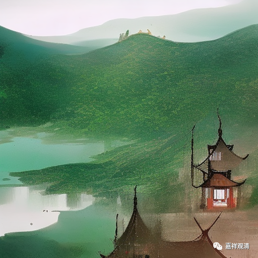

##  微课堂佛教史427·1 

好，我们继续佛教史——禅宗史。 

现在讲到著名的禅匠——圆悟克勤禅师。圆悟克勤禅师的墓在成都昭觉寺，大家如果有兴趣的话，可以过去看一看。 （这两天昭觉寺好像在放戒。随喜他们。） 

我们昨天讲到圆悟克勤禅师在镇江 金山寺生病了——伤寒，这个伤寒不是那种厉害的伤寒，只是一般的伤寒。不过那个时候的伤寒，哪怕只是细菌性的感冒，或者说细菌性的炎症，也已经是挺严重的。或者是更加厉害一点的伤寒菌引起的，那就更麻烦了。说实话，以前的人能够活下来真的不容易，他们都是到处走的，山里面老虎、豹子其实都是很多的。 

那么，圆悟克勤禅师在金山生病了以后，就觉得自己以前所学 还是有问题，五祖法演禅师讲对了，说自己逞嘴皮子没用，然后就发誓：“我病好了，就去找这个老头。”

于是，圆悟克勤禅师在病好了之后就去找五祖法演禅师。法演禅师一看他回来，就很高兴，这个是有原因的。还是这么说，一百年以前的人（我们不单指僧人，就说一百年前的人），文盲率很高的，现在来了这样一个挺有文化的、之前已经参访过很多地方、现在又肯回头认错的人，基本上可以断定是个人才，是个好苗子，即使不成大器，中器肯定不成问题。 

法演禅师就把他留下来，让他担任侍者。 

汉地的侍者是相当重要的职位，比如在禅宗里面，一般侍者就是今后会得法的人。这有几方面的原因：一方面，在法上，侍者经常待在大师边上，可以学到很多东西，那么待人接物和接受锤炼的机会也比较多；另外一方面，在事上，作为侍者，长老待人接物的时候他也都在边上，将来出世也比较方便。所以，汉地禅宗里面的侍者基本上是将来的得法弟子。 

那么，Z地的情况就不一样，Z 地认为担任侍者的话，基本上这个人就“废”了，所以一般来说，格西不是太愿意做侍者的。当然，做侍者的人也不能笨，太笨也不行的。 Z地的侍者，基本上就等于把自己的下半辈子都交给师父了。但如果他是格西的话，教学方面肯定就不能参与了（相当于博士毕业不在教学部门而专门做秘书、干行政了），作为一个格西，如果要对教法熟悉，就 必须要经常地在“五部大论”里面打滚，三、五年不看经论的话，那水平就直线下降。所以在 Z地的话，如果格西毕业担任一位HF的侍者，那基本上学问这条路也就到头了。而在汉地，如果是在禅宗当中做侍者的话，基本上就可以认定这是将来的接班人。 

