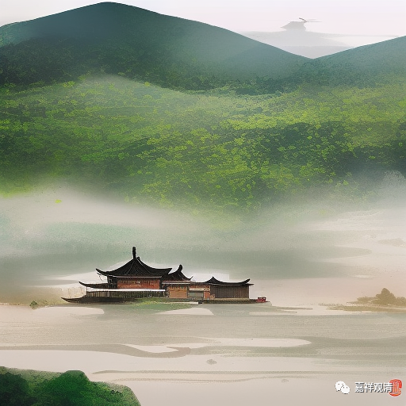

##  微课佛教史429·3 

我们前面讲过，芙蓉道楷禅师是拒绝了宋徽宗的赐号和紫袈裟，那么圆悟克勤禅师的脾气要好一点，他接受了宋徽宗的封赐。圆悟克勤禅师待人接物 是非常温文尔雅的，他手下都没处理过人，的确很温文尔雅（这个词真的很贴切），可以说处理事情很柔软的，很慈悲的。有些人说：“你这样就威势不够。”圆悟克勤禅师回答说：“用不着，不用了，应该用慈悲来涉世。”所以他不像芙蓉道楷禅师这么不给皇帝面子，他是接受了，接受了紫袈裟，也接受了“佛果禅师”的这个名号。 （他的师兄弟们也接受了。） 

后来圆悟克勤禅师又去了哪里呢？去了金陵（南京）的蒋山。《明英烈》当中有个蒋忠（但历史上蒋忠这个人好像是没有的，好像是蒋山的城隍或者什么的）。在蒋山的时候，圆悟克勤禅师门下的弟子多到什么程度呢？多到住不下。 

后来圆悟克勤禅师又去了天宁万寿寺，这个天宁万寿寺不知道在哪里。得到了康王赵构的召见，后来康王赵构做了南宋的首任皇帝。 

等到南宋开国以后，抗金的名相李纲就出面了，保奏他驻在镇江的金山寺。结果金山寺又又人满为患，住不下了。岳飞、韩世忠和金兀术在这附近 干过一仗，是吧？主要是韩世忠、梁红玉在这里——黄天荡，和金兀术大打一仗…… 不知道和他们这几个有没有见过面，地方这么近，碰到的可能性很大的。 

康王赵构后来经过这一带的时候，又召见了圆悟克勤禅师。圆悟克勤禅师就说：“你很孝顺啊。”真会说话呀，二圣还在北方，还没迎回来呢，还说他孝顺。“你以孝治天下，我们以一心统万方。所以呢，我们都差不多，都一样。”这样捧赵构，赵构听了就很高兴，给他赐了“圆悟”禅师的这个名号。 

后来呢，圆悟克勤禅师说要去云居山，朝廷也给了他很多钱，去云居山。再后来又回到了四川，仍旧回到昭觉寺，所以他前后两次待在昭觉寺。再后来……圆寂了。 

今天先讲到这里，谢谢大家！ 

