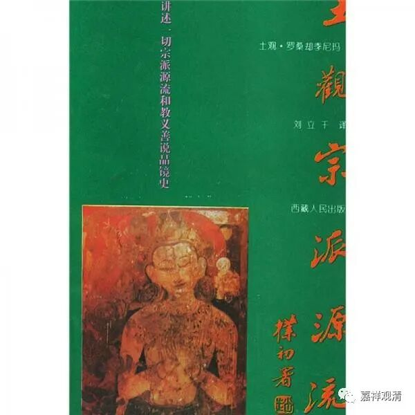
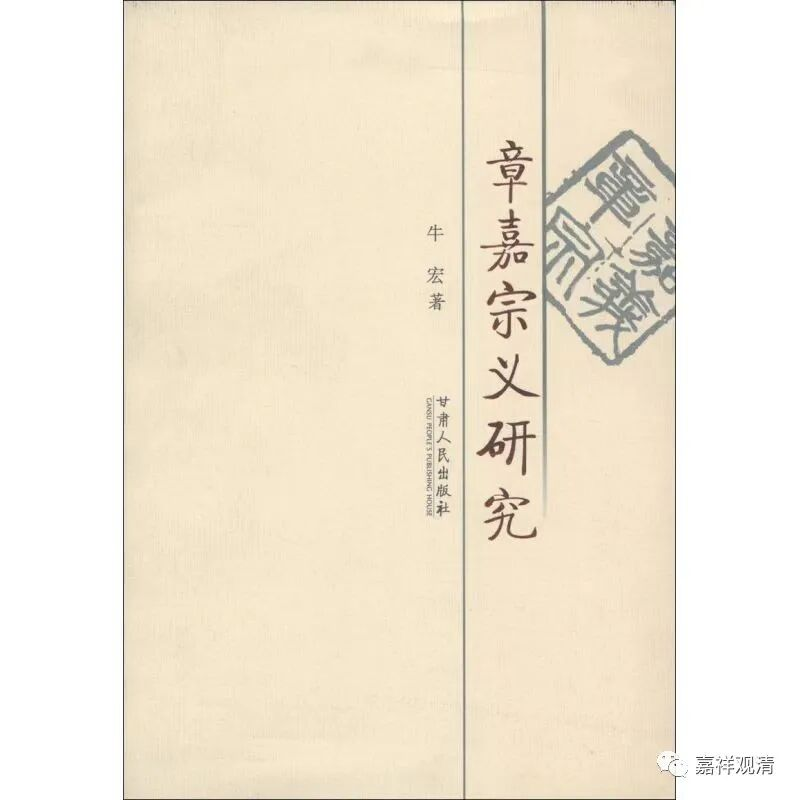

##  “快问快答”之“什么是宗义书”

问：能不能介绍一下什么是“宗义书”？ 

释观清：“宗义书”有可以叫“宗派论”，就是佛教里面一类介绍各宗派教义的纲要书，其实有点类似于今天的“佛教思想（哲学）史”或者“印度思想（哲学、宗教）史”，有的只谈佛教内部的宗派，有的还包括其他宗教哲学派别的介绍。一般我们谈的“宗义书”大致理解为 GL 的教材或者教参的那一类。 

GL 的《宗义书》大致有四个系统： 

1 、法幢吉祥贤（ 1469 ～ 1544 ）的《宗义建立》； 

2 、二世嘉木样·宝无畏王（ 1728 ～ 1791 ）的《宗义宝鬘》； 

3 、卓尼·扎巴协珠（ 1675 ～ 1748 ）的《宗义》； 

4 、福称（ 1478 ～ 1554 ）的《宗派建立》。 

这四本是 GL 系统纲要性的“宗义书”，篇幅适中。是作为三大寺各学院的教材使用的。 

目前这几本都已经有了至少是稿本的译本，前两本各自都已经有好几个译本了。 

GL 系统里还有一些篇幅比较大的宗义书，比如一世嘉木样·妙音笑金刚（语自在精进 1648 ～ 1721 ）的《大宗义》、三世章嘉·若贝多杰（ 1717 ～ 1786 ）《章嘉宗义》和土观·善慧法日（ 1737 ～ 1802 ）的《宗镜源流》（成书于 1801 ）。这三本篇幅很大，学术源头上也很接近，可以理解为是同一个教研室出来的。 

《土观宗派源流》有全译本，法尊法师有节译本《四宗要义》，《章嘉宗义》和妙音笑金刚的《大宗义》都有节译本。 

除此以外，其他宗派也有一批站在各自立场创作的“宗义书”，也有不少已经有汉译本了，这就不是我的知识收集的范围了。 

