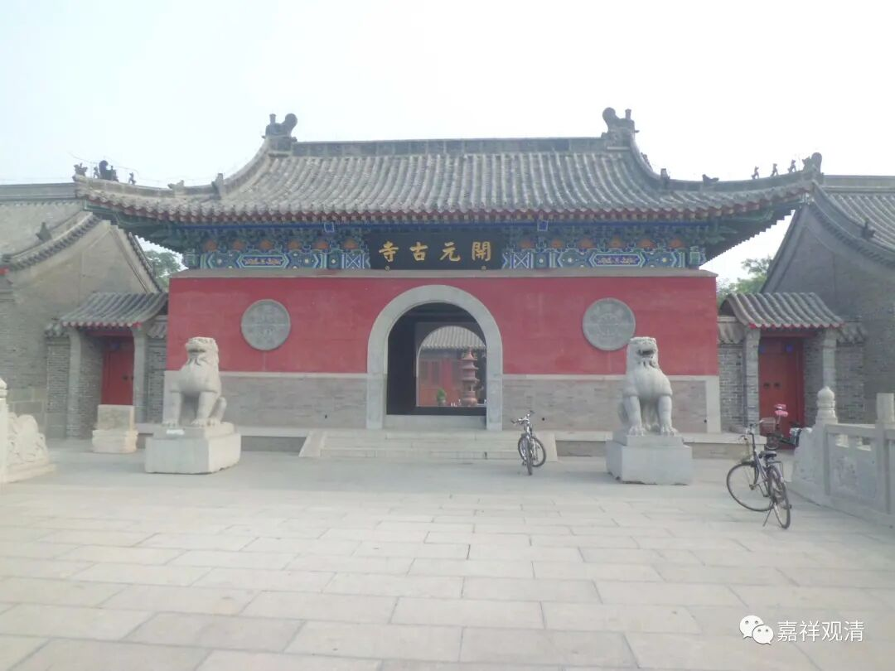

##  邢台开元寺 

##  寺名“开元”知多少？ 

继续聊聊“开元寺”

这几天八卦的气质发动，检索地图，收罗了一堆现存的“开元寺”。 

还有一些地名上存有“开元寺”的名称的，顺便收罗一下。大家如果又发现新的“开元寺”，希望能告诉我，可以跟帖在下面……

以后得空还可以找找“龙兴寺”“真如寺”“龙华寺”“白云寺”，哈哈 

下面列出这几天的成果——45家开元寺！ 

开元寺  |  地址   
---|---  
1  |  泉州开元寺  |  泉州市鲤城区西街 176 号   
2  |  福州开元寺  |  福建省福州市鼓楼区开元路 78 号   
3  |  潮州开元寺  |  潮州市区开元路 32 号   
4  |  正定开元寺  |  石家庄市正定县燕赵南大街 109 号   
5  |  容州开元寺  |  广西壮族自治区玉林市容县东外街 66 号   
6  |  定州开元寺  |  河北省保定市定州市中山中路与中心南街交叉口东南 330 米   
7  |  扬州江都开元寺  |  江苏省扬州市江都区大桥镇三丰村程庄组 120 号   
8  |  扬州邗江开元寺  |  扬州市邗江区方捻线   
9  |  紫竹山开元寺  |  长沙市长沙县高桥镇紫竹山   
10  |  开元村开元寺  |  贵州省遵义市凤冈县   
11  |  济南开元寺遗址  |  济南市历下区开元寺   
12  |  左而开元寺  |  山东省济南市历城区左而村   
13  |  太原开元寺  |  山西省太原市万柏林区小井峪路开元寺   
14  |  成都开元寺  |  延园路东 50 米   
15  |  柳州开元寺  |  广西壮族自治区柳州市鱼峰区柳石路 289 号   
16  |  柳州开元寺遗址  |  柳州市城中区弯塘路 24 号   
17  |  苏州开元寺无梁殿  |  江苏省苏州市姑苏区东大街 179 号   
18  |  许昌开元寺  |  河南省许昌市建安区 007 乡道北 50 米   
19  |  商丘开元寺  |  河南省商丘市睢阳区平原南路南 330 米   
20  |  邓州开元寺  |  南阳市邓州市文化路邓州万豪商务宾馆南侧约 140 米   
21  |  达州开元寺  |  四川省达州市达川区堡子镇   
22  |  内江开元寺  |  内江市威远县 X087   
23  |  乐山开元寺  |  乐山市沙湾区零零一乡道   
24  |  重庆渝北区开元寺  |  重庆市渝北区 S0101 与统景互通交叉口西南方向 1164 米   
25  |  重庆合川区开元寺  |  重庆市合川区 X360 与长老路交叉口东北方向 1815 米   
26  |  重庆梁平区开元寺  |  重庆市梁平区屏锦镇   
27  |  武宁县开元寺  |  江西省九江市武宁县东林乡   
28  |  景德镇开元寺  |  江西省景德镇市珠山区竟成镇   
29  |  上饶开元古寺  |  江西省上饶市广信区田墩镇   
30  |  邢台开元古寺  |  邢台市开元北路 88 号   
31  |  延安开元寺  |  陕西省延安市富县县城，寺坡村   
32  |  延安开元寺塔  |  延安市富县开元路康盛花园西北侧约 220 米   
33  |  福州茶峰开元寺  |  福建省福州市晋安区茶园环北社区 ( 香槟北路东 )   
34  |  咸阳开元寺塔  |  咸阳市彬州市西大街   
35  |  宁阳县开元寺  |  山东省泰安市宁阳县伏山镇堽城坝村   
36  |  德阳中江开元寺  |  德阳市中江县（可能是个村子）   
37  |  泰安宁阳县开元寺  |  山东省泰安市宁阳县伏山镇堽城坝村   
38  |  台州开元寺  |  台州市仙居县田市镇下街村延安路 127 号   
39  |  湖州开元寺  |  湖州市吴兴区开元寺路   
40  |  无锡开元寺（开原寺）  |  江苏省无锡市梅园浒山与朴山之间   
41  |  郴州开元寺  |  郴州市永兴县   
42  |  定西开元寺  |  定西市临洮县河北路古渎医院西侧约 70 米   
43  |  北京顺义开元寺  |  北京市顺义区胜利街道 S201( 通顺路 )   
44  |  荷泽开元寺  |  山东省菏泽市东明县张寨乡新霍寨村   
45  |  台南开元寺  |  台湾省台南市北区北园街 89 号   
……  
1  |  晋城开元寺公交站   
2  |  永春开元寺公交站   
……  
1  |  成都开元寺街   
2  |  衢州开元寺村   
3  |  陇南开元寺村   
4  |  宁阳县开元寺村   
……  
  
欢迎大家一起补充！ 

