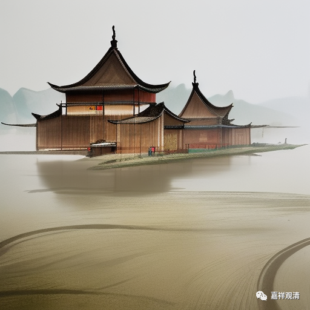

##  微课堂佛教史434·1 

好，我们继续禅宗史，讲到大慧宗杲禅师。 

大慧宗杲禅师去见了张商 英以后，张商英就给他推荐说：“我帮你来介绍圆悟克勤禅师。”因为张商英跟圆悟克勤禅师的关系不错。从前面的背景来说，说不定就是湛堂文准禅师用这个事情来托付张商英的，因为湛堂文准禅师和张商英也算是同一师门的，都是真净克文禅师门下的弟子。 

这个时候呢，圆悟克勤禅师正好去到开封天宁寺。大慧宗杲禅师肯定事先得到了消息，所以他先去了天宁寺，然后圆悟克勤禅师就来了，在天宁寺做方丈，做住持了。 

圆悟克勤禅师就举话头，说云门禅师那个故事：**“僧问云门：‘如何是诸佛出身处？’答云：‘东山水上行。’”**就让大慧宗杲禅师去参。说是大慧宗杲禅师参了一年，也参不出来，想了四十九个转语——其实也未见得就是四十九，就是很多次，四十九实在太多了。多了又多，但是圆悟克勤禅师都不肯，都不同意：“不对。”

待了一段时间以后呢，圆悟克勤禅师又讲到这个话——“如何是诸佛出身处？东山水上行”，他跟其他士大夫交往的时候也在说这个。**“若是天宁即不然。”**这个“天宁”就是他自己，他不是在天宁寺吗？“若是天宁即不然”，如果是我，就不这么回答了。那么人家就问了：“你怎么回答呢？”圆悟克勤禅师说：**“薰风自南来，殿阁生微凉。”**这句话大家可以自己去理解，我就不解释了。 

说是大慧宗杲禅师听了之后，很有感觉，还要来呈上自己的悟境。圆悟克勤禅师就说他不对：**“子虽有得矣，而大法未明。”**还是不行，最后不行。但是呢，你到了这个地步，水平也不错了，可惜什么呢？可惜死于言下，**“但可惜死了不能得活，不疑言句，是为大病。”**要怎么做呢？**“悬崖撒手，自肯承当。”**

然后，大慧宗杲禅师就说：**“某甲只据如今得处已是快活，”**我到这个地步已经行了，**“更不能理会得也。”**你让我再去理解这背后的意思，我大概做不到。这个可能是他的禅境吧。 

圆悟克勤禅师看大慧宗杲禅师这个样子，就给他一个特殊待遇，让他还在侍者寮担任侍者，但是不用干活，没有任务。比如有客人来的时候，他就过来坐着听听。 就是让他随时有机会在师父身边看他待人接物，去体会运用…… 就这样呢，又过了半年。 

