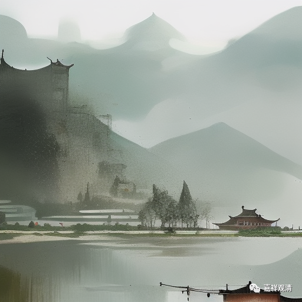

##  “嗯”字禅 

**一**

“（云岩顺禅师）**问**（真净克文禅师）**：新黄蘗住得如何？**

**师曰：甚好。**

**顺云：渠只下得一转语 “好”遂住，黄蘗禅即未梦见在！**

**师因此大悟临济宗旨，顿见南用处。**”

云岩顺禅师问真净克文禅师：最近在黄檗山（黄龙慧南禅师哪里）住的怎么样啊？ 

真净克文禅师：挺好。 

云岩顺禅师（大笑），说：待了那么久，就一个“好”字的认识，（在黄龙慧南禅师哪里）你真是啥都没学到啊！……

**二**

这个嘛，做老师的最懂了。 

讲完课以后，你问：大家都听懂了吗？ 

众：嗯！ 

问：有什么问题吗？ 

众：嗯？ 

问：有什么想说的吗？ 

众：嗯……

呵呵，我也应该学云岩顺禅师道一句：你们这是啥都没听明白啊！ 

（呵呵，以前我也是“嗯……”的那一个。要不“嗯……”，有一个办法——听课的时候记笔记。） 

**三**

这里“渠只下得一转语”的“渠”，就是“他”的意思，在上面这段公案里可以用作“你”。宁波话里这个“渠”还在用，音“及”，也是他的意思。朱熹“问渠哪得清如许”、洞山良介“渠今正是我，我今不是渠”的“渠”都是这个“他”的意思，而不是“水渠”的意思。 

