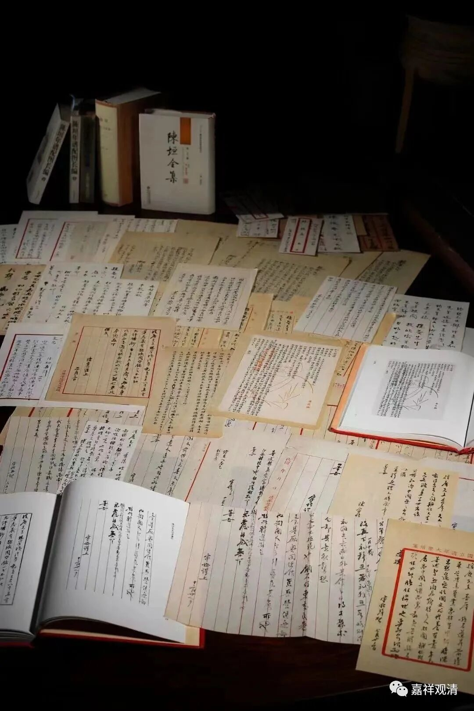
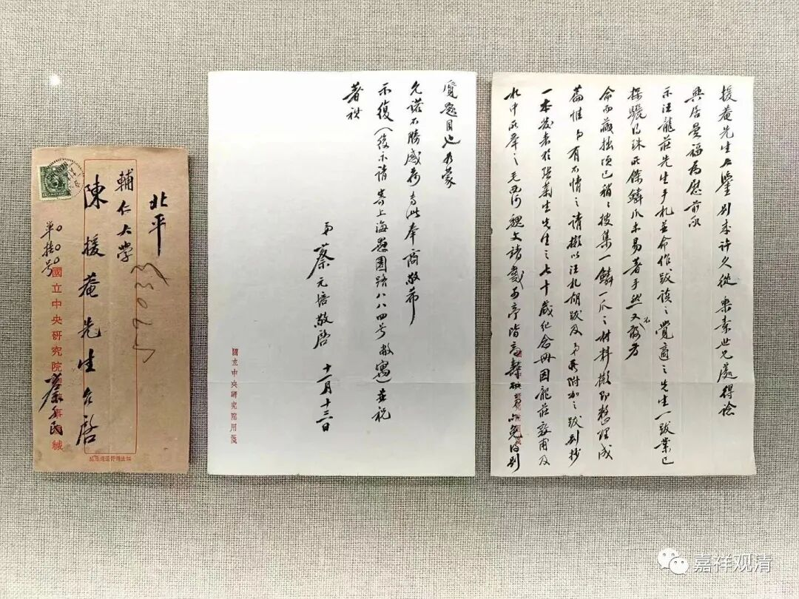
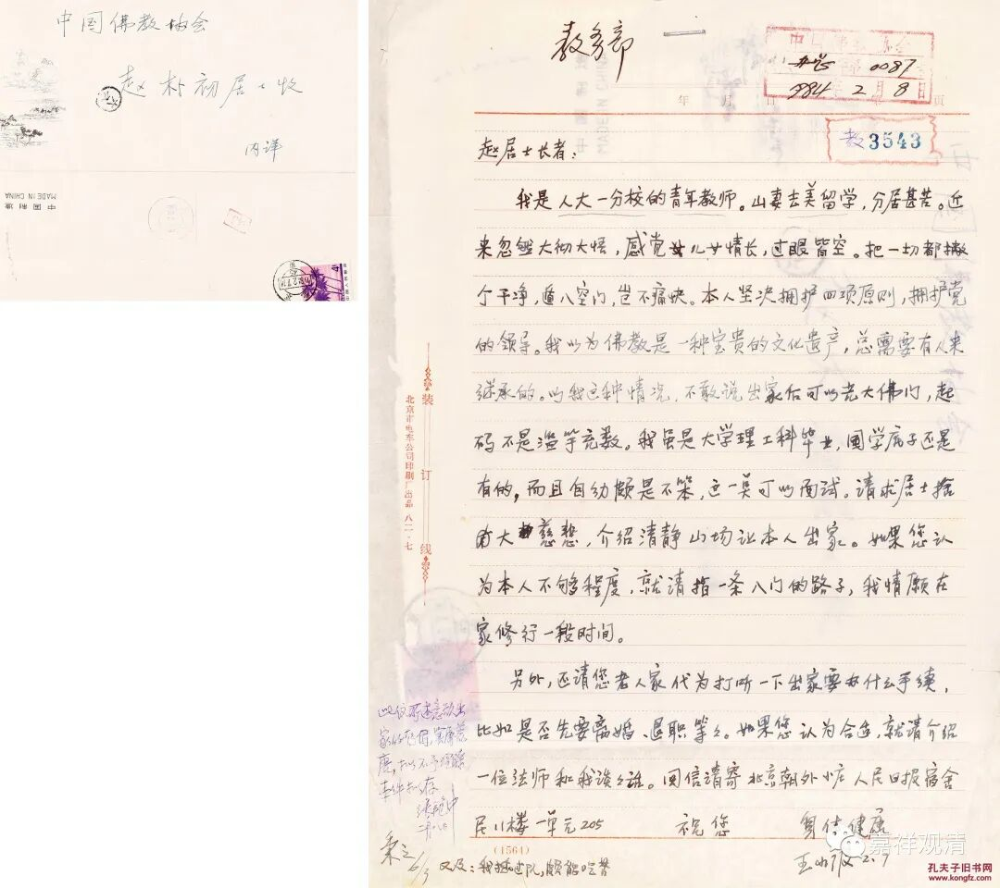
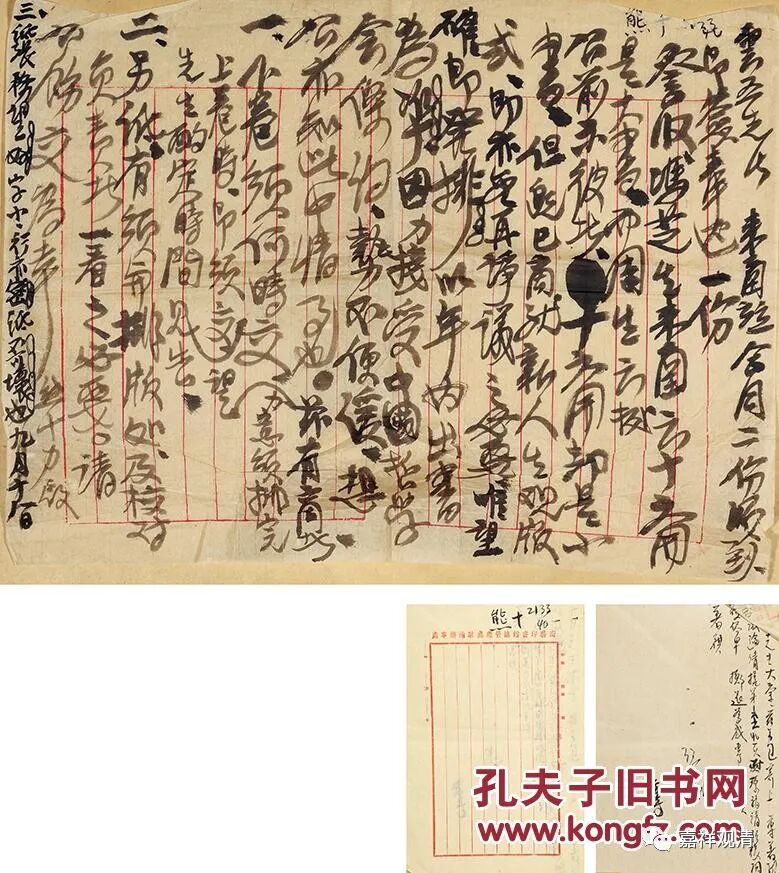
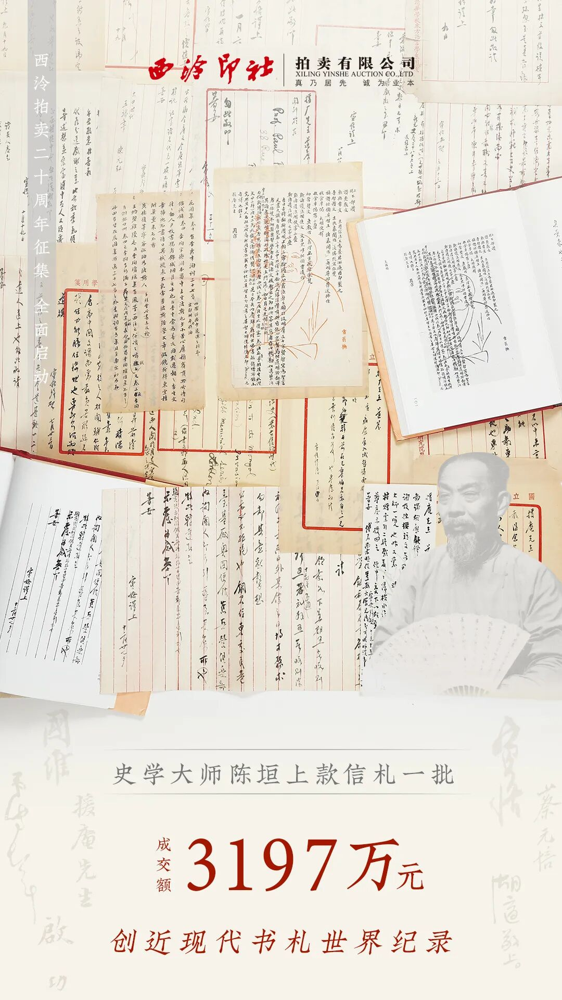
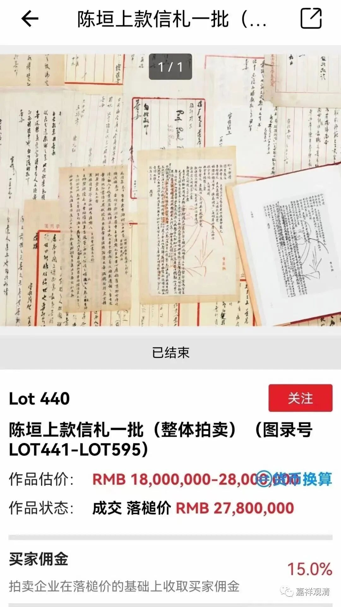

##  创拍卖交易记录 

##  ——现在搞文科的都这么有钱了吗？ 

前两天西泠印社的拍卖会爆了个大料，陈垣先生的一批往来信件整体拍出了三千多万，这是中国近现代书札拍卖的世界纪录了。 

最近名人书札的拍卖比较火，前几天“王小波致信赵朴初”要求出家的信件网络爆火，还上了热搜，起拍价 30000 ，最后拍出了 22 万，加上 15% 的佣金，最后的成交价达到了 253000 元！ 

我还关注了熊十力先生的三封信札，最终三件拍品的总成交价也达到了十八万元。 

这次陈垣先生的往来信件是整体拍卖的，为了保持文献的完整性，西泠印社的意思是这批图录号从 LOT441 ～ LOT595 的信札先做整体拍卖，如果整体拍卖未成交则单独拍卖，最后由深圳藏家举牌以 2780 万元整体拍得，也就是实际成交价为 3197 万，这是近现代书札拍卖上的一个记录了。 

呵呵， 3197 万，现在搞文科的这么有钱了吗？ 

这批陈垣先生往来信件文献价值很高，胡适、张君劢、傅斯年、伯希和、陈寅恪等人都有出现，其中也有涉及《摩尼教入中国考》《敦煌劫余录》等和宗教有关的文献和往来信札。 

这次据说深圳的收藏圈子里也很兴奋，意思是各大拍卖行也应该重视深圳这个市场了。深圳不是文化沙漠。 

正好这两天我也在深圳，硬算是一个巧合了，哈哈。 

