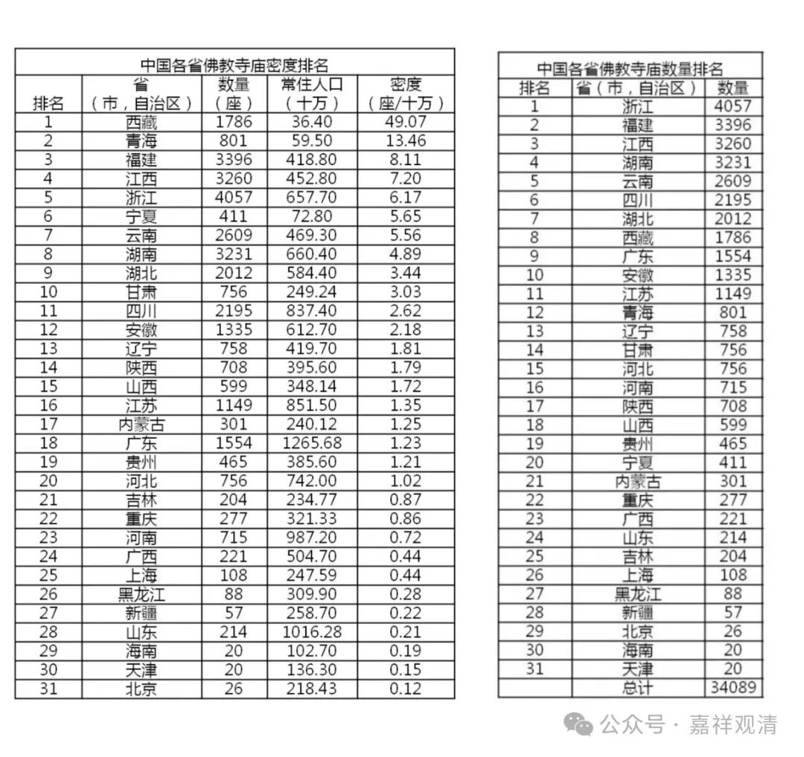
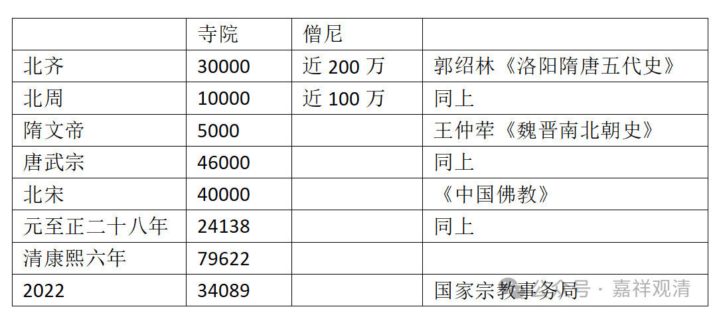

##  数数上海和全国寺院 

最近在用沪语讲上海佛教史，所以翻了翻上海的地方志。 

先说今天的。按 2022 年年底国家宗教局的官方数据，上海共有寺院 108 （好数字），每 10 万人口拥有寺院 0.44 座（第一名西藏，每 10 万人口 49 座，第三十一名北京，每 10 万人口 0.12 座），排名第 25 。全国有寺院 34089 座。 

按，随便翻几本上海地方志看看——

据光绪《重修奉贤县志》，则奉贤县有寺 80 余座；据乾隆《上海县志》，则上海县有寺 103 所；光绪《嘉定县志》录得寺院 35 ……如此，则到清末，在今天的上海境内，大约有寺在 5000 ～ 10000 。（得空我准备全部数一遍。） 

据清代康熙六年记载，则大清当时全国有寺 79622 所。若就今天上海的这些地方志看来，恐怕康熙年间的数字还是低了（也可能是后来经济繁荣了，乾隆以后，那啥也放开了）。 

再查……据郭绍林《洛阳隋唐五代史》记载，北周有寺 10000 余，僧尼近 100 万；北齐有寺 30000 余，僧尼近 200 万……，据王仲荦《魏晋南北朝史》，则隋文帝时全国有寺约 5000 所；唐武宗时有寺约 46000 所，据《中国佛教》，北宋有寺 40000 余，元至正二十八年，全国有寺 24138 所……

做一个不完全统计表，大家看着玩玩吧（以后有机会找资料继续做……） 

寺院  |  僧尼  |  参考资料   
---|---|---  
北齐  |  30000  |  近200万  |  郭绍林《洛阳隋唐五代史》   
北周  |  10000  |  近100万  |  同上   
隋文帝  |  5000  |  王仲荦《魏晋南北朝史》   
唐武宗  |  46000  |  同上   
北宋  |  40000  |  《中国佛教》   
元至正二十八年  |  24138  |  同上   
清康熙六年  |  79622   
中国2022  |  34089  |  国家宗教事务局   
  

