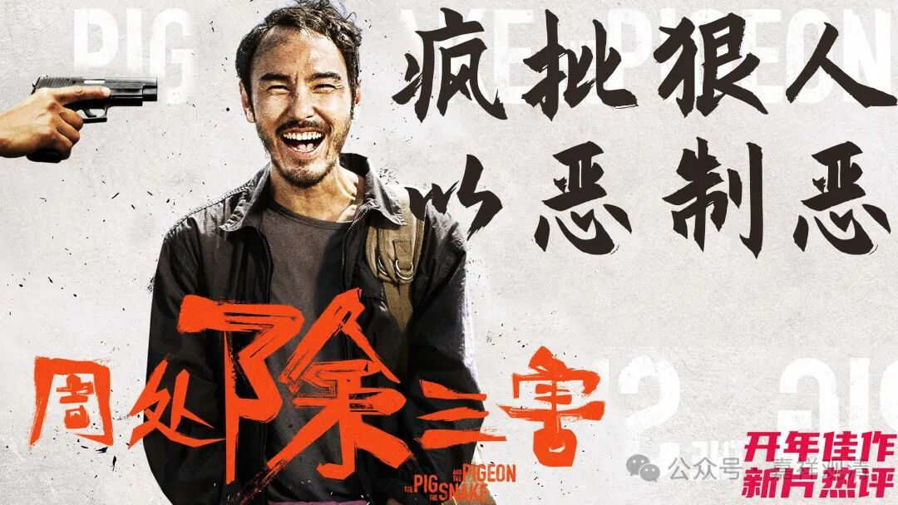

##  民间宗教的邪教化倾向 

顺着昨天说的，我们继续……摩尼教本来是波斯的宗教，按理说应该算不上邪教的，怎么到了中国变成邪教了呢？我觉得因为下沉太过了，太迎合底层了。 

《大明律集解附例》里把白云宗、白莲社、 明尊教并列，和假降邪神者同判，“……首者绞，从者各杖一百，流三千里”。 

这里，“白莲社”大致相当于“白莲教”，“明尊教”就是“摩尼教”。 

可以说，早期的白莲社，和正统的祅教（摩尼教），它们和邪教还是有很大距离的，都算是比较正统的宗教、教派，但这类教、派后期无疑有着邪教化的倾向（而且再也没有回到正统的路上来），某种角度来看，都是“传播太快、下沉太过、教理不彰”所导致的，也就是经常说的“方便出下流”——为了快速传播、发展更多的信徒而导致泥沙俱下，约束能力崩溃。 

这个事情至今都是如此的，我个人的经验来看，只要不学习，一旦传过三代，就会邪教化，从这个角度上说，绝大多数的传承“一世而亡”“二世而绝”反而不是坏事，至少不那么丢人。 

这事儿在“大基督教”背景下也是如此——天主教背景下有着教理解释的向心力而不至于太离谱，一旦放开允许自由解释，那雨后春笋般的“非正统教派”就层出不穷，各领风骚！ 

我的所见所闻里面，大概可以预言，有两个很大的著名佛教团体，在我可以看到的未来（只要我不死的太快）就有可能会演变成邪教，一个主力是中国文化圈的，一个主力在欧美文化圈……发展太快不一定是好事，自我封闭一定是坏事，个人崇拜绝大多数情况下也不是好事！ 

