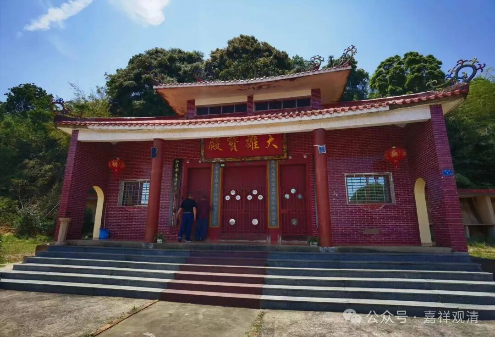
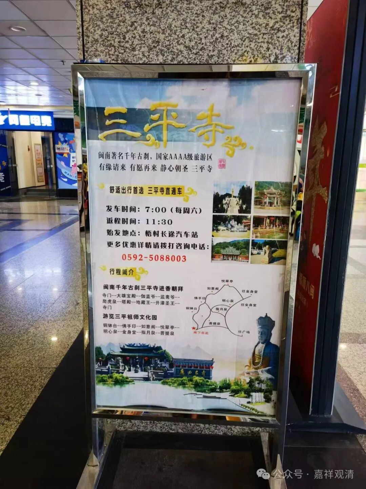
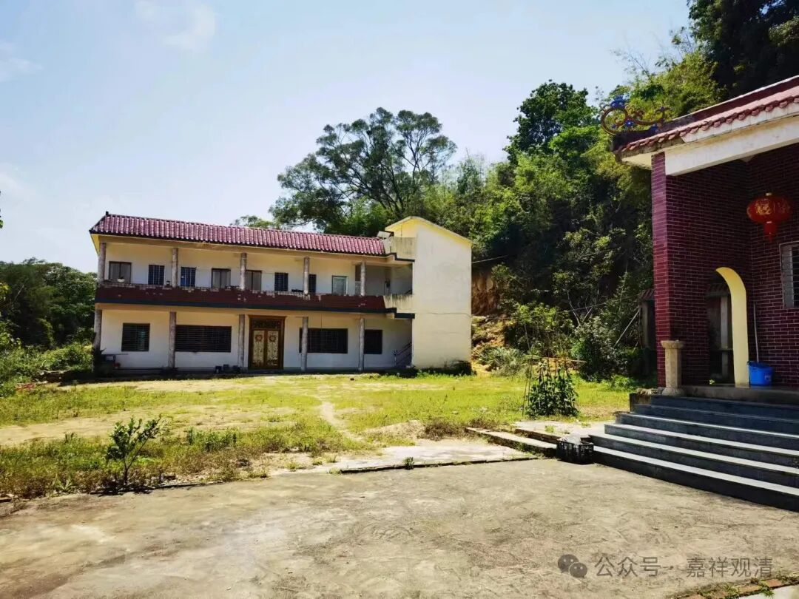
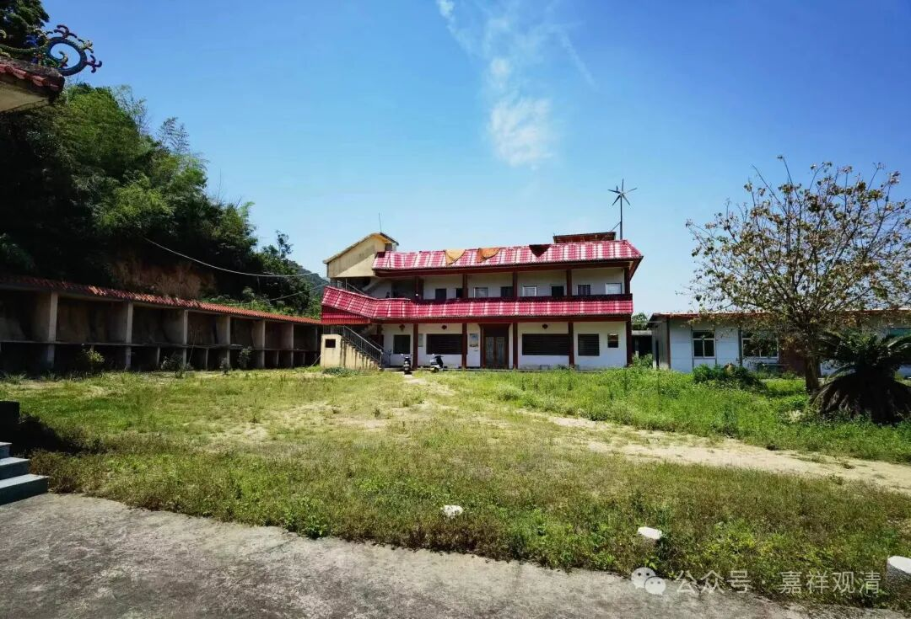
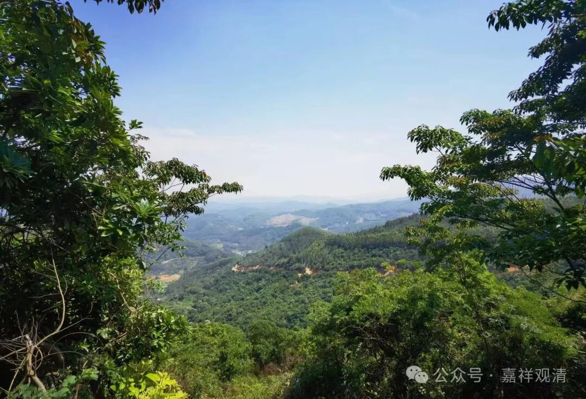
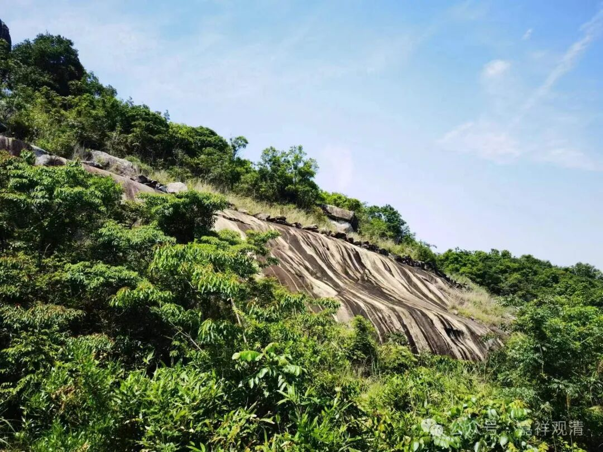
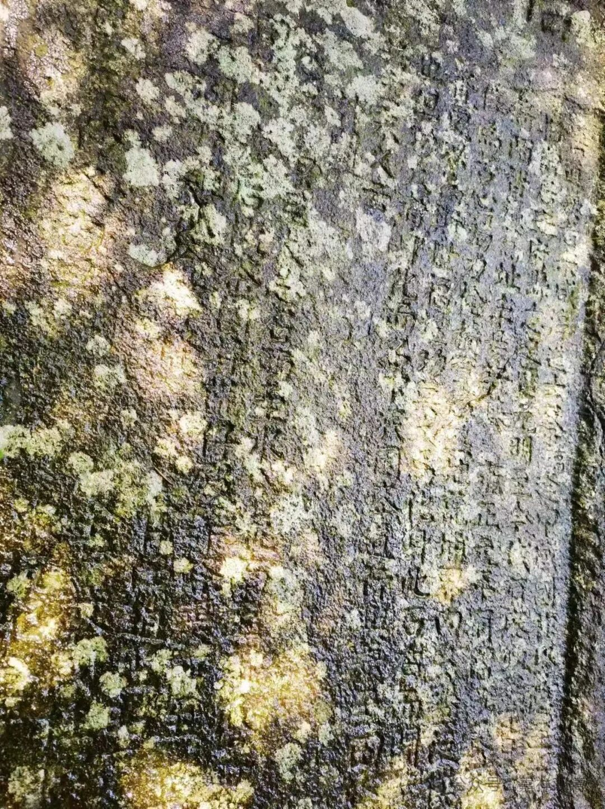
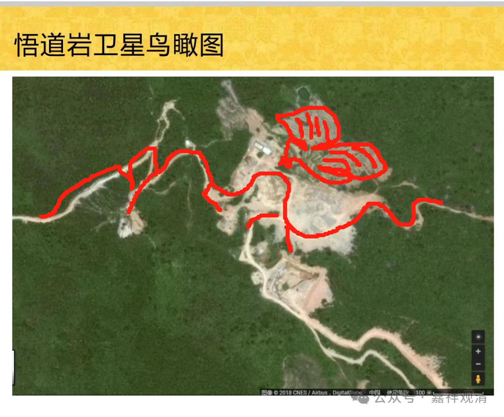
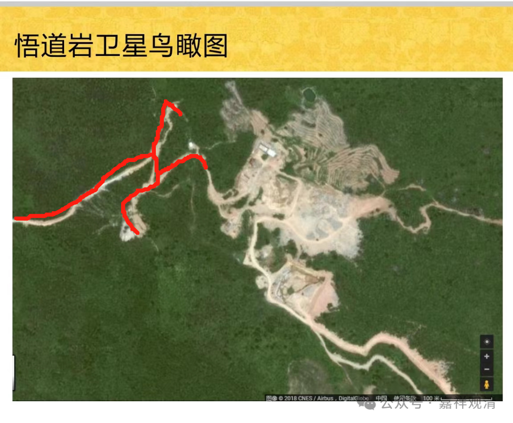

##  漳州悟道岩 

这是我在长途车站看到的广告（车站边上有个素菜馆）——

“三平祖师”也是闽南当地著名的民间信仰……福建的民间信仰有很深的土壤。 

那天去看开漳圣王庙，路过一个山头，想起阿 pia 在漳浦，给他打了电话。果然还在漳浦呢。他第二天来厦门，亲自带我去漳州的一个山上看一个寺院（他原先的寺院给自己徒弟了……他已经退居“二线”了。） 

阿 pia 带我去的，就是这个——

现有的建筑不大，但历史上应该不是小寺院了，寺院叫“悟道岩”（很多寺院叫“啥啥岩”，福建这里特别多，上次还去了一个云霄的“海月岩”，还有个漳浦的“仙峰岩”……以前九华山后山有个“九子岩”），山下有个村镇叫“吾道”，明显是建国后从“悟道”改的“吾道”。 

从山下上山，有两条路，一条新开的近路，已经被雨水冲得沟沟壑壑，完全不能走了，老路是从林子里走的，有一公里多呢。山上为了寺院建设，已经完成了很多土方作业，但实际建筑也就一个大殿，两排小楼。 

寺院有个老和尚，说来了三十年了，单纯看他三十年来仅建的这点小房子，应该说是至少心思没用在造庙上。 

寺院前面有摩崖石刻，漫奂不清了……以后我出来要随身带点纸墨啥的，方便临时拓个碑。 

这是悟道岩的卫星地图，神尼说，“这不是个金翅鸟抓着龙吗？”

我第一眼看到的是螳螂，哈哈，《功夫熊猫》看多了吧 

呃……神尼现在真的是“神”尼了。我说“你现在有文豪和文盲的二向性”，不确定什么时候表现为啥……

下山的路上有杨梅 卖 ，据说这里产杨梅。杨梅里面小虫子多，没敢要，也没吃。 

