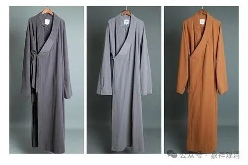

##  给大师买一套僧服 

今天，要给某大师买一套短褂、一件大褂。 

大师虽然不是我见过最胖的僧人，但绝对属于“号外”型的，（我见过最胖的是个上海的和尚，胖得面目狰狞……）曾经有我两个那么重。（当然现在我也，咳咳……） 

简单，这种事情就得上淘宝。 

满以为是很轻松的事，没想到……

第一家，“要足够肥的大褂！……”僧服厂回复！“（我们现有的号码他）穿不了。没有这个尺码！” 

第二家……“ 均码里边最最大号的也不行！最大的只有 45 号！ ”哦 ，我 42 号。以他和我的对比来看……嗯（挠头）  ，那确实不行！ 

看来只有定做了！说是定做要一两个月，一问价格，倒也不贵，而且非常浪漫—— 520 元  。 

问了某大师，大师也笑了，报上自己的身高体重、腰围——身高 175 公分，腰围三尺五，体重 250 斤。（这还是上半年减肥过了的结果。  ） 

厂家回复：定做了不能退！按 43 码的放大，腰围按传统放大八寸，就是四尺三；胸围算三尺五。土黄色。 

 OK 了！ 

我跟某大师说：“你就是个桶型啊！上下一样粗  ”

