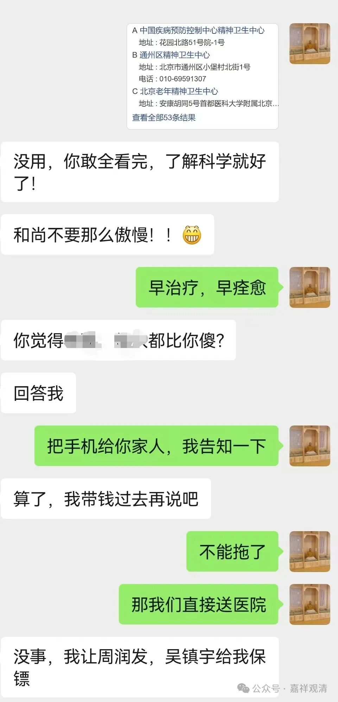

##  末日论漏网之鱼 

今天，有个 2012 年末世论的漏网之鱼找到了咱庙里……

前两天台风肆虐，今天凑巧安徽又有地震，岂不正是“末日景象”？ 

下午，老桂开车上山，很神秘地冲我抬抬下巴，“你师兄来了！”

“纳尼？！师兄？那个师兄？！”（我还以为是翠微寺的师兄们呢！） 

结果他车上下来一个完全不认识的面孔……我比较脸盲，“您是？”

她说了个名字，我完全没印象（十几年前曾有一面之缘）。先给安排了房间，再带她寺院里走走，介绍介绍……

总觉得有点奇怪——为什么不事先打招呼说要来寺院呢？！ 

于是在她吃饭的时候问：“你的网名是……？”

“光明 DM ，你把我删了……”

我突然反应过来，这是个不太正常的末世论者，曾经说周润发、吴镇宇是她的保镖……

她是来这儿躲核弹、准备末日生存来了！（后来听说还打算在“末日”的 D 日之后重新生一个新的中华民族出来……我拍着老周的肩膀说：“兄弟，你的任务有点重啊！”） 

果断决定，立刻送下山——方舟二号真的不在我莲花山啊！ 

老周对我此举大表赞叹——压力太大，这么大任务真的完不成啊！ 

