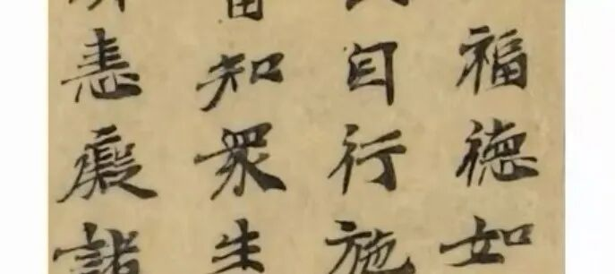
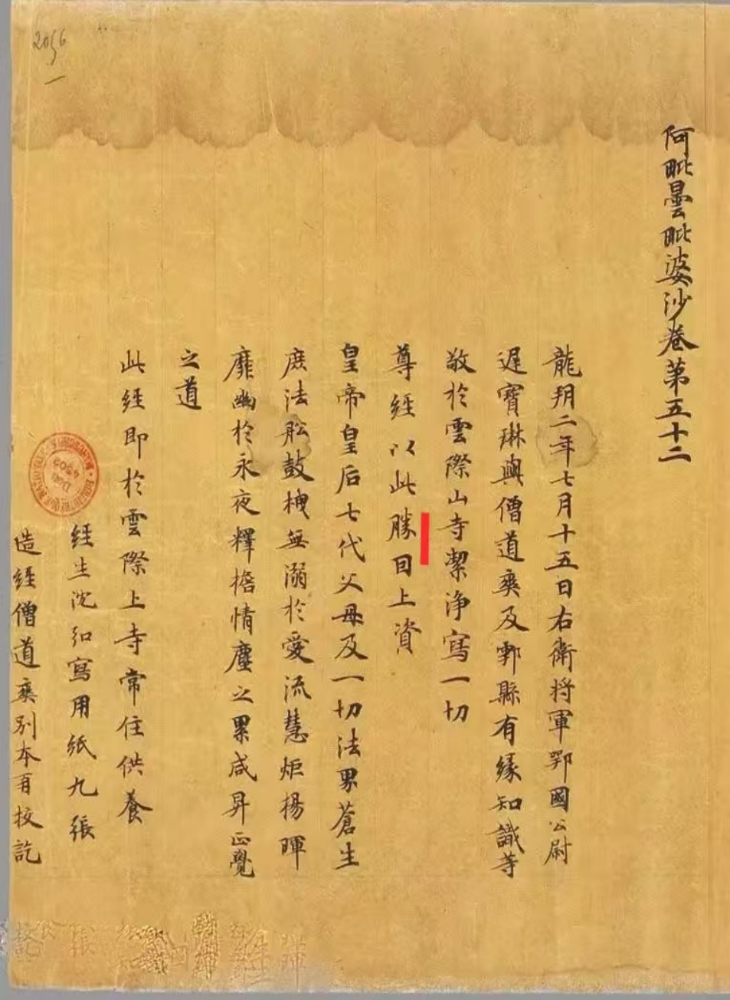

##  《唯识三十颂要释》讲义·006·001 

继续啊  ！  《唯识三十颂要释》  ……

我们看一下  敦煌  本  的文献。 

因为  我们的《唯识三十论要释》  在敦煌本当中  ，  上次讲到  “ 一切种是  因相  ”，  敦煌  本当中这个  “ 因  ”，  和  “目”和“自  ”都很  接近  ，我们看一下  。 

这两段都是敦煌本的写经。 

我给大家稍微看一下  ，可以看出来，这个字确实看起来像  “自”，但实际确实“因”，整理的人不注意的话、不是专门学书法的话就  可能会抄错  。 

当时那些做  《  大  正  藏  》校对、  句读的  人很多就是当时的一些日本的研究生  等等，  你让他们看这个  写经来  录入的话  ，  一般不是专门学书法的  确实分不清  。 

所以这里面看见没有  ：  “ 由能執持此種子故，名  ‘ 一切種  ’ ，是為因相  ”。这个  “因相”，《三十颂要释》作“自相”。  《  大  正藏》  里面写的是为  “ 自  相  ” 啊，这个确实，  在外行看来，  “因” 和  “自” 太接近了。  我们还是改正，  “因相”。 

他们  读  错了很正常  ，  把这个  “因” 读为  “自” ，那很正常啊，但确实不是  自相，  “自相” 在最前面  ，  阿赖耶识  属于是  自相  。这个  阿赖耶识  是自  相，  我们这里是  因相  。这个看见没有？嗯，没问题了吧？ 

我们顺便拿出来说一下。 

