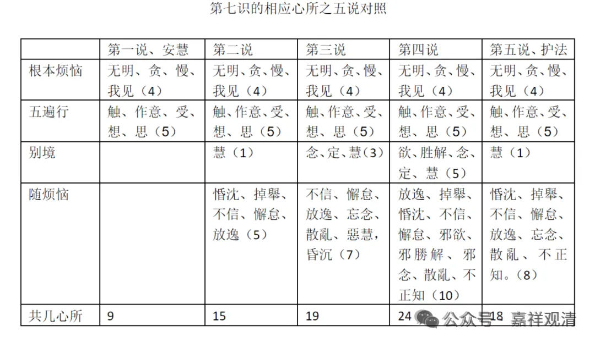

##  《唯识三十论要释》讲义·010·011 

那么以现代  学术的视野  的来理解  ，（  我写过一篇  论文提到）到《百法明门论》的时代这样今天我们熟悉的心所的大致  最后的固定  ，  是很晚  才成熟  的。 

在  《瑜伽师地论》  的时候，这个  心王、心  所  的展开  …… 心  王基本上没问题  ，心所  到底有多少个  咋当时  并没有  直接  固定下来，  甚至  连  “别境心所” 都没有固定下来。  五遍行  心所  在  《瑜伽师地论》  当中已经出现出来了  ，而且是第一次出现，  “ 别  境  心所  ” 的名词  在  《瑜伽师地论》  当中还没有出现，  《瑜伽师地论》里边  “欲胜解念定慧”只被称为“五不遍行”，“ 别  境  心所  ”这个名词  最早出现是在  无著  论师的  《  显扬圣教  论  》中  ……

到了  世亲  的  《  百  法明  门  论  》  基本上把这个  遍行、别境等  五十一  个  心所，  最终固定下来了。 

如果  把六个根本烦恼，把它扩张成十个根本烦恼的话，那就  五十五  个  心所  。 

那  五十  一个  心所  也好，  五十  五  个  心所也好，这种说法  基本上是在  世  亲的后期  的作品中  才固定下来。 

前面所  引  用的  《  集  论  》  是  无著论师  的  作品，  《瑜伽师地论》  两  、三  种说法，一种说  作者  是  无著  ，一种说  作者  是弥勒的  ，一种说前五十卷作者为弥勒，后五十卷作者为无著  。  我的意见呢，略接近最后一种。 

那总的来说，  《集论》《瑜伽师地论》都  是  瑜伽行派的论典里面  比  世亲  的后期的  《  唯识三十论》创作  的时间是要早的  ，  比  《  百  法  明门  论  》  的  创作  时间  也  是要早的。  《集论》《瑜伽师地论》  的很多说法还不是  唯识  的  （世俗眼光下）  巅峰时期的说法  ——按  汉  传唯识  的说法，  护法论师代表的就是唯识的巅峰。 

汉传唯识认为  护法  论师所代表的  是  印度唯识学的  成熟时期  ，  特别在  心  王  、  心  所  等  的建立上  ，护法论师的抉择、  建立  得  是比较成熟的。  作为一个  印度人  ，  他  （护法）  不像我们有那种圣典崇拜  ，  因为  在他眼里，类似《集论》的  作者  这些很多只是比他稍早的同时代人，在  他眼里  看来，  那些经典  的表述  不是不可以  讨论  的  ，所以就像现在我们看到的，当过去的经典和护法的思想有矛盾的时候，  护法说：  “ 我们要在这个道理上  掰  扯  掰扯  ……”

那么护法最后的掰扯就是刚才我讲的  这些  ，  甚至  所谓的  “ 八大随烦恼  ”（  说一切  染污心相应的是八  大随  烦恼  ）也都  是由护法  “ 掰扯  ” 出来的  。 

