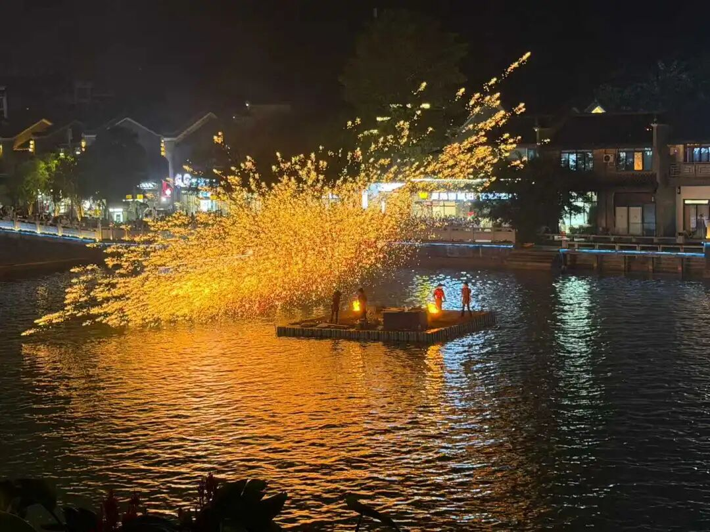

##  《大智度论》说“时”语体版试译稿 

关于“时”的问题，这里可以谈谈。 

问：天竺人说“时”的时候，有两个单词可以表示，即：一、“迦罗” ka^la ；二、“三摩耶” samaya 。佛（经）——此《摩诃般若波罗密经》——中，为何不用“迦罗”而用“三摩耶”呢？ 

答：如果这里用了“迦罗”，你还是会有问题啊！（——你又要说：为什么不用“三摩耶”而用“迦罗”呢？——可见你此问问得没有道理！） 

问：若是为了方便起见，应该说“迦罗” ka^la ！因为“迦罗” ka^la  只有两个音节，而“三摩耶” samaya 有三个音节；音节多了说起话来总要费力些吧！？ 

答：为了要遮除邪执、邪见的缘故，这里只说“三摩耶” samaya ，而不说“迦罗” ka^la 。——因为在外道经典中常用此“迦罗” ka^la 说“时”。 

比如说，有些人（时论外道）主张： 

一切天地间的一切善恶现象皆以“时”（“迦罗” ka^la ）为因！就象《时经》中所说的那样 ： 

时来众生熟，时至则催促，时能觉悟人，是故时为因。 

世界如车轮，时变如轮转，人亦如车轮，或上而或下。 

（他们——时论师——就是以“迦罗” ka^la 而言“时”的。） 

另外，还有些人（胜论师）主张： 

虽然天地间善善恶恶的一切事物不是由“时”所造作出来的（即不许“时”为造作因），但是“时”却是不变因，是真实有的（胜论师许九事实有：地、水、火、风、空、时、方、我、意）。“时”法虽有，微细故，不可见、不可知（不容易被感知）；但是，可以凭藉开花、结果等事实，而推知有“时”的存在。往年今年，久近迟疾，见到现在的果相，虽不能明显见到“时”相，可以由推理而知道有（实有的）“时”。什么原因呢？见果，当知有因。所以说有“时”法，“时”法不坏，是常住不变的实有。 

（他们——胜论师——也是以“迦罗” ka^la 而言“时”的。） 

（所以，佛教经典中通常都取“三摩耶” samaya 以言“时”，而不用“迦罗” ka^la ，这是为了能与外道的用法有所区别，以免有人——特别是那些外道师们——会混淆彼此的时间概念。） 

（问：我以为上述观点似乎像是能够成立的！佛教对此难道有什么评破吗？） 

答：（那我们讨论讨论，看看这些观点能否成立。） 

（最初必须明确的是：依时论师和胜论师所许——不论其许“时”是能作因、或是不变因，就究竟的意义上说，都承认，“时”是“谛实有”、“胜义有”的、有常住不变的性质！这一点必须明确！否则，依世间而随许施设的“时”等的名言，我们也是不必破的！） 

（那么，如果要说到“时”——“迦罗” ka^la ，当不外乎“三世” trayo-dhvanah ，即：过去时 pas/cima-ka^la 、现在时 praty-utpanna-ka^la 、未来时 ana^gata-ka^la 。打个比方吧，）比如，（就以最常见的瓶子来说，）过去世是陶土，现在世为泥团，将来世成为瓶子。（这一点大家应该都没有异议吧？！） 

若说“时”是以常、一为相的话，过去世（尘土）就不能作未来世（的瓶子）。在你们的经书上说：“时”是一个事物！如果时间为“一相”的话，那三世也只是“一相”，也就没有过去（尘）作成将来（的瓶），也不会成为现在世（的泥丸）。 

若说三世是相杂的话，也有过失：过去世（的尘）中并没有未来世（的瓶），所以说，过去时中没有未来时。现在世（泥丸）也一样不在过去世（尘土）中。 

问：你也承认“过去尘土时”，如果有过去世，就必然有未来世、现在世，因此，“时”法是实有的！ 

答：你没听我先前说吗？未来世有“时”、“瓶”，过去世是尘土。未来世的“瓶”不是过去的“时”，“未来时”相中是未来的“时”，哪里有什么“过去的时”呢？因为这个原因，没有你所谓的“过去时”。 

问：怎么会没有“时”呢？一定应该有“时”！现在时有现在相，过去时有过去相，未来时有未来相。 

答：如果那样的话，（就得等于是说，）一切三世“时”都有自相，（各依其自相而成立，）那么，就应该都表现为其自相的“现在”时，而没有“过去时”、“未来时”之说了。即使有“未来之时”，那也不应该叫“未来”，应该名“已来”（有本作“现在”，意义全同）了——因为你许未来时住未来相，既然说“未来时”住在“未来相”上，那么，“未来”已经不是“没有来”、“将要来”，而是“已经来”了的“现在”了。 

所以说，（一切三世“时”都有自相，）这话不对！（不能成立！） 

问：“过去时”、“未来时”不是以“现在”相行！“过去时”以“过去”相行，“未来时”以“未来”相行！所以说，各各法相有“时”。 

答：如果说，“过去时”还要待“过去”才能成立其为“过去时”，那么，此所谓“过去时”早已经不成为“（已经）过去”（的时间了）；如果“过去”不过去，那就没有过去相可得。为什么呢？已经舍其自相了。——此正如《中论·观去来品》所云：“已去则不去”。 

同样的理由，“未来时”也是如此。 

所以说，“时”法非实有，只是依事物的去来相而假名安立的！“时”法既然非实有，又如何能够生初天、地、好、丑以及华、果等等的事物呢？——要之，非但不是由“时”法而生起种种的事物，倒是“因物故有时”呢！ 

就象这样，人们在 “时”相的安立上生起种种妄执。由此，为遮除这类邪见、妄执的缘故，内道在说“时”这一概念的时候，不说“迦罗”，而说“三摩耶”。由于看到五蕴、十二处、十八界种种的生灭现象，而依此安立“时”的名言；离此蕴、处、界以外，绝非另有一“时”相可得 。同样，所谓方、时、离、合、一、异、长、短等等都是如此，唯依蕴、处、界之生灭而安立这种种名言，无有实体。只因凡夫起执著心，认这些假法为实有的，因为这个原因，唯破除其妄执，而不舍世俗名字、语言法。 

问：如果说没有“时”，为什么戒律中，又有听“时食”、遮“非时食”的戒条呢？ 

答：我先前已经谈到了，世间假名安立有“时”，胜义中无“时”相可得！所以，你的问难不成立！此处所说的“听时食而遮非时食”，是律典中的结戒法，在世俗中不能抹杀它的施设功用；但不是第一义上的实有相，因为第一义中，“我”、“法”的实有相尚不可得，所谓“物尚无所有，何况当有时”呢？ 

诸佛世尊制戒之缘起，是为了令佛正法久住、而楷定佛弟子的威仪行持，令僧众和合无诤，（具体说来，有结戒十义，）在这里，没必要再去推求：有哪些是实法？有哪些是“名字”假法？哪些相应？哪些不相应？什么法如是相？什么法不如是相？因为戒律是随顺世俗法而制定的，所以，没有必要在这上面再兴争论！ 

问：那么，在佛法中，提到“非时食”、“时药”、“时衣”的地方，为什么又不说“三摩耶”而说“迦罗”了呢？ 

答：这些都是在律藏中才提到的，毗尼藏，即是同为内道的白衣居士们尚不得听闻，外道又如何能够得以听闻并因此而生起邪执、邪见呢？！佛教其他的经、论是付与流通的，所有人，不论内、外道都能够看得到、听得到，所以要说“三摩耶”（以示与外道间的区别），令听、读者不易生起认“时”作实有的邪见。又，“三摩耶”是“假名”时，（“迦罗”是实“时”），是假借名言而安立的。 

另外，佛法中说“三摩耶”的时候多，说“迦罗”的次数少，说得少的缘故，不应该有什么问题。 

