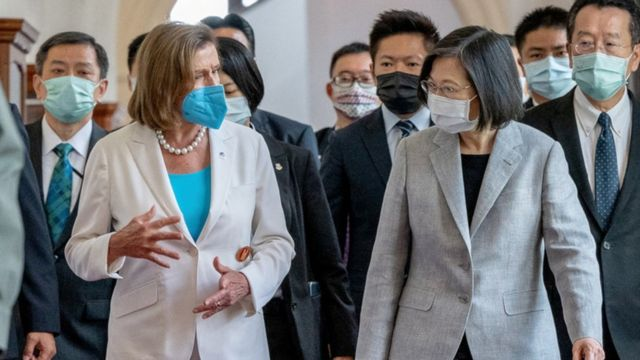
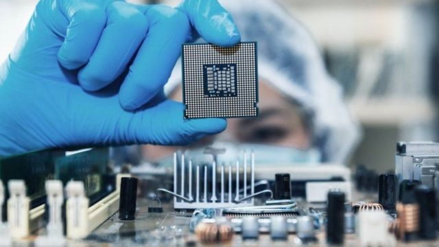
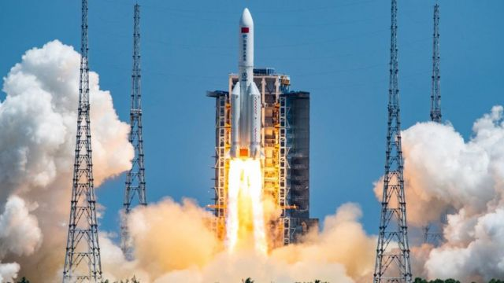
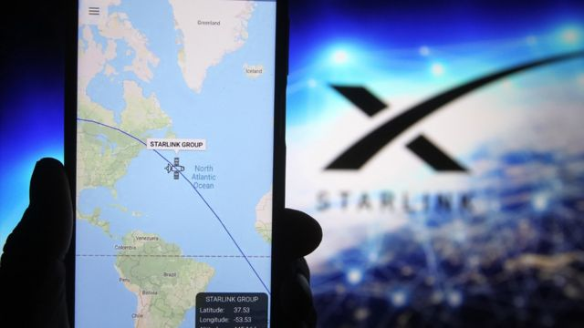
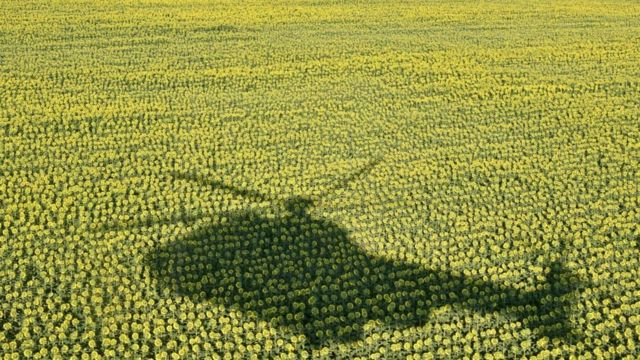

# 佩洛西访台、中国报复军演、半导体大战和本周更多重要故事

#  佩洛西访台、中国报复军演、半导体大战和本周更多重要故事

2022年8月6日

> 图像来源，  TAIWAN PRESIDENTIAL OFFICE / Reuters

**美国国会众议院议长佩洛西（Nancy Pelosi；裴洛西、波洛西）访问台湾，与随后中国大陆的报复举措，成为本周具垄断性的新闻焦点。**

在这次亚洲之行将要结束之际，佩洛西在日本东京说：“他们（中国）也许能尝试阻止台湾访问其他地方，参加其他活动，但他们不可能透过阻止我们到那里去来孤立台湾。”台湾总统蔡英文称，佩洛西来访“展现美国国会对台湾坚若磐石的支持”。

中国大陆发动三天围绕台湾的军方实弹射击演练，并称是“维护国家主权和领土完整的必要和正当举措”。北京同时宣布制裁佩洛西本人及其亲属。

美国批评中方演练“不负责任”，七国集团（G7）、东南亚国家联盟（ASEAN）分别提出批评与劝谕，北京一一反驳。

**刚刚过去的一周，BBC中文** **有关佩洛西访台的报道，以及** **以下新闻内容受到读者的关注。如果你错过了它们，BBC中文带你一一回顾。**

##  1\. 美国议长佩洛西坚持访问台湾 中国军事演练回应

8月2日深夜，一架美国空军波音C-40行政专机降落台北松山机场，身穿粉红色套装，82岁的美国国会众议院议长佩洛西一行先后步出机舱，展开19小时台湾访问行程。

佩洛西此行除了拜访台湾立法院，会晤台湾总统蔡英文外，还与台湾民主活动人士李明哲、居台香港书商林荣基和居台北京天安门学运领袖吾尔开希见面。

中国连夜传召美国驻华大使伯恩斯抗议，又宣布自4日起一连三天，在围绕台湾本岛的六片海域举行实弹射击演练。日本侦测到有中国解放军导弹飞越台湾，落入太平洋水域，也有导弹落入日方划定的专属经济区（EEZ）水域，东京向北京提出抗议。

中国国务委员兼外长王毅在柬埔寨金边出席东盟会议期间，批评佩洛西访台是“狂躁、不负责任、极不理性的行径”，又说“我们不能让丛林法则重新来主导我们的国与国的关系”。

##  2\. 中美交恶下 韩台逐鹿全球半导体市场

> 图像来源，  Getty Images

韩国半导体大厂三星电子（Samsung Electronics）今年下半年开始量产3纳米（台湾译奈米）的半导体晶片（chip，又称芯片）。面对挑战，全球晶片代工龙头台积电（TSMC）也宣布其3奈米制程（泛指晶圆生产加工的过程）将如期于下半年进入量产。全球两大晶圆代工龙头在先进制程的角力进入新阶段。

与此同时，晶片背后的地缘政治竞逐也越来越白热化。美国总统拜登（Joe Biden）上台后力推的晶片法案（CHIPS Act），旨在协助美国半导体产业自给自足，并补助“价值相近”的外国半导体大厂在美设厂，扩展就业机会。

但是，该法案在补助外国大厂的但书（法律文本）上，要求受补助者10年内不得在中国建造新的半导体厂房等。有分析认为，这是美国围堵中国半导体发展的新战略。

##  3\. 中国航天火箭残骸坠落引起警惕

> 图像来源，  Getty Images

上周末，美国与中国官员指，中国长征五号B运载火箭残骸在印度洋和太平洋上空坠落。

中国国家航天局表示，长征五号火箭的大部分残骸在坠入大气层过程中已经烧蚀销毁，并表示太平洋的苏禄海为残骸落入地球表面的位置。

火箭的核心级不受控地回落大气层，已经引出有关太空垃圾的责任问题。

美国宇航局（NASA；美国太空总署）过去曾呼吁中国国家航天局，设计其火箭可以在进入大气层前分解为较小的碎片，因为这是国际惯例。

##  4\. 马斯克和他的星链（Starlink）

> 图像来源，  Getty Images

美国富豪埃隆·马斯克（Elon Musk）的太空技术公司SpaceX本周因两件事情再次受到注目。

8月5日， 韩国首架月球轨道探测器“达努里”号（Danuri；다누리）  由SpaceX“猎鹰9”号火箭发射升空，让韩国迈出自主太空探索的第一步。

此前一天， 澳大利亚传出消息称  ，一块怀疑来自SpaceX火箭的碎片于7月初落入新南威尔士州一处田野。一些天文学者对此感到兴奋，但同时也有其他研究人士警告，要警惕更多同类事件的降临。

SpaceX 已经把数千颗卫星送入轨道，很多人都说自己曾亲眼见到它们在空中闪耀。

这些人造卫星组成星链（Starlink），这个项目的目的是从太空向地球上偏远地区提供高速互联网服务。

##  5\. 俄罗斯盗取乌克兰谷物与葵花的新证据

> 图像来源，  Getty Images

BBC了解到，有重大证据显示，俄罗斯军队在乌克兰的占领区系统性地从当地农民手中掠夺乌克兰的谷物，以及向日葵种子。

我们访问过一些庄稼被夺走的农民，并追踪社交媒体上的私密和公共群组讯息，显示种子从乌克兰境内的俄军占领区南部和东部被运往俄罗斯。

两国是2021年世界两大葵花籽油出口国，乌克兰出售510万吨，俄罗斯则出售310万吨。

现在似乎显示，俄罗斯的油是部分地以乌克兰的种子为原材料生产，而葵花是乌克兰农业的象征之一。

