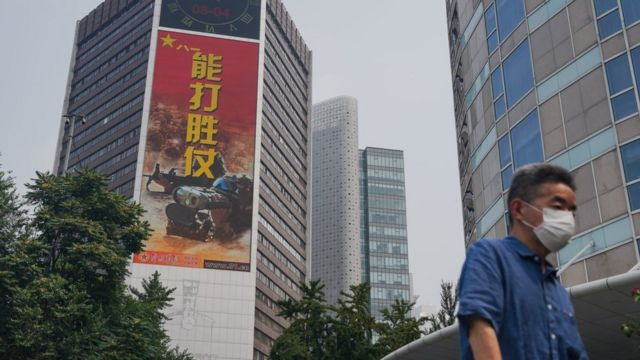
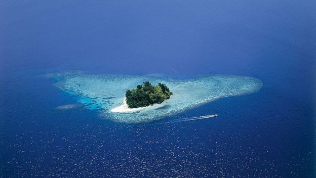
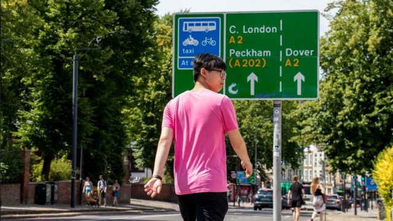

# 台海危机、海南疫情、香港BNO学费问题和本周更多重要故事

#  台海危机、海南疫情、香港BNO学费问题和本周更多重要故事

2022年8月13日

> 图像来源，  EPA

**美国国会众议院议长佩洛西（Nancy Pelosi；裴洛西、波洛西）访问台湾已过一周，中国大陆对台湾的“反制”措施仍在继续。**

中国解放军东部战区围绕台湾本岛举行的实弹演练从三天延长到七天，至星期三（8月10日）“成功完成各项任务”，但军方称仍将“持续开展练兵备战，常态组织台海方向战备警巡”，台海军事紧张会否从此“常态化”备受关注。

美国强烈批评中国反应过激之际，美国“芯片法案”获总统签署生效，华盛顿将补贴相关行业，引发北京“坚决反对”，指责美方抱持“冷战及零和博弈思维”。

政治紧张之余，新冠病毒病（COVID-19）疫情也再次在中国紧张起来，南方度假胜地海南三亚市实施“全域静态管理”，封城禁足。与此前上海等地封城的最大分别是，数以万计外省游客因此滞留三亚。

**刚刚过去的一周，BBC中文** **有关佩洛西访台的报道，以及** **以下新闻内容受到读者的关注。如果你错过了它们，BBC中文带你一一回顾。**

##  1\. 台海危机：中国军事活动要“常态化”？贸易制裁后果有多严重？

中国解放军东部战区星期二（9日）宣布延长在台湾本岛周边海域、空域，针对佩洛西访台而举行的“实战化联合演训”，翌日宣布“成功完成各项任务”，但仍将“持续开展练兵备战，常态组织台海方向战备警巡”。

与此同时，中国国务院台湾事务办公室发表《台湾问题与新时代中国统一事业》白皮书，当中称：“我们比历史上任何时期都更接近、更有信心和能力实现中华民族伟大复兴的目标，也更接近、更有信心和能力实现祖国完全统一的目标。”

佩洛西星期三在华盛顿向媒体记者总结是次亚洲之行。她坚持其访问台湾决定并无不妥，并批评中国以其访问为借口，策动这次军事演练，并称华盛顿不能让北京将其对台高压手段变成“新常态”。

除了“围台军演”，中国大陆还实施了一系列针对台湾的经济制裁措施。随着台海局势的持续紧张，这些措施会否牵连两岸经贸交流，演化成一场“非对称”的贸易战？

##  2\. 拜登签署“芯片法案”对抗中国威胁

> 图像来源，  iStock

美国众议院议长佩洛西访问台湾激化两岸局势，芯片作为台湾的核心产业，也随之站到地缘政治博弈的风口浪尖。

美国总统拜登（Joe Biden）星期二在华盛顿签署《2022年芯片和科技法案》（ CHIPS and Science Act 2022），标志着一项罕见针对单一产业的高额补贴，在历时一年半的酝酿和博弈后，终于生效。

该法案包括对芯片行业527亿美元的补贴、对半导体和设备制造25%的投资税收抵免等扶持政策，关注最多的条款还包括，针对中国芯片产业的排他政策，使芯片企业面临在中美之间“选边站队”的难题。

中国商务部则批评说，部分条款限制有关企业在华正常经贸与投资活动，将会对全球半导体供应链造成扭曲，对国际贸易造成扰乱。中国驻美大使馆也表示，中国对此“坚决反对”，称这让人想起“冷战及零和博弈思维”。

##  3\. 美国副国务卿到访所罗门群岛

> 图像来源，  Getty Images

美国副国务卿温迪·谢尔曼（Wendy Sherman；舍曼）上星期天（7日）到访南太平洋岛国所罗门群岛（Solomon Islands），会晤该国总理索加瓦雷（Manasseh Sogavare）。 美国国务院称  ，双方讨论了提供新冠病毒病疫苗、应对气候变化和旅游投资等议题。

这里距离最近的一片大陆也有几百英里——这个由900多个小岛组成的群岛，人口不足一个美国西雅图市，但是一个南太平洋的小国已经变成美中争霸的新前线。

据观察中国的人士指，北京至少在近15年里一直在取悦太平洋诸岛国，给予它们的国家元首贵宾待遇，并试图签署基础建设和军事协议。

##  4\. 新冠疫情：中国旅游热点三亚封城 8万游客滞留

新冠疫情发酵两年多，不少国家已经恢复正常生活，但中国仍然维持严格的清零政策。近日，海岛省份海南爆发疫情，旅游城市三亚自上星期六（6日）起实施全域静态管理。

海南是中国旅游大省，三亚更是著名的旅游城市之一。突如其来的封城让不少旅客猝不及防，官方数据称有8万多名外地旅客滞留。

同样在本周，山东临沭县宣布在星期三开展全员核酸检测和模拟局部封锁，以参加其上级临沂市要求的“全市全员核酸检测‘大比武’活动”，在社交媒体引发争议。

香港特区则宣布从星期五（12日）起，将酒店隔离时间由七天缩短至三天，另外还需四天家居医学观察。此前多个外国商会曾就香港紧跟北京“动态清零”政策继续实施入境隔离措施表达不满。

##  5\. 香港BNO移民英国遇上学费难题

> 图像来源，  BBC News Chinese

“哇！ 我取得了LSE的Offer！”今年初夏，17岁的在英香港学生李家俊，得悉获伦敦大学政治经济学院（LSE）法律系的有条件录取通知后，在诺丁汉的家里尖叫起来。

不过，出身草根单亲家庭的他，恐怕会因无法支付高昂的国际生大学学费，眼睁睁看着9月入学美梦化成泡影。

像李家俊这样，经英国国民（海外）BNO签证移英的港人，由于没有预永居或永居身份，也未连续在英国居住三年, 不符合享有每年上限9250英镑（约8.8万港元）的英国本地生学费资格，亦不得申请任何政府贷款和资助。若入读三年本科课程，根据LSE最新公布的外国学生年度收费水准，每年仅学费就高达2.3万英镑（约22万港元），甚至可能更高。

月前，英国多名国会上议院议员、跨党派下议院议员、学者和公民团体成员联署去信，促请政府让BNO港人享有与本地生同等学费待遇。但政府至今未见有实际回应，而联署倡议也受到部分港人和华人社群的异议。

##  6\. 中国“烂尾楼”危机：西安百余人栖身无水电的公寓楼

在中国西安的一个住宅小区里，有百余人长期住在未完工的公寓楼内。他们购买的预售商品房，因开发商负债成了“烂尾楼”。

中国房地产债务危机蔓延，这种情况在多地出现。尽管没有厕所，也没有水电供应，但这些业主表示，他们已无处可去。

BBC记者麦笛文（Stephen McDonell）到西安接触了这些业主。

##  7\. 美国FBI搜查特朗普海湖庄园

美国前总统特朗普（Donald Trump）表示，联邦调查局（FBI）突袭了他在佛罗里达州的住所海湖庄园（Mar-a-Lago），特工还打开了一个保险箱。

据报道，星期一（8日）的搜查与针对特朗普处理官方文件的调查有关。

特朗普在声明中说：“这对我们国家来说是黑暗时期，以前从来没有这样的事情发生在美国总统身上。”

联邦调查局和美国司法部都没有对报道的搜查发表评论。

