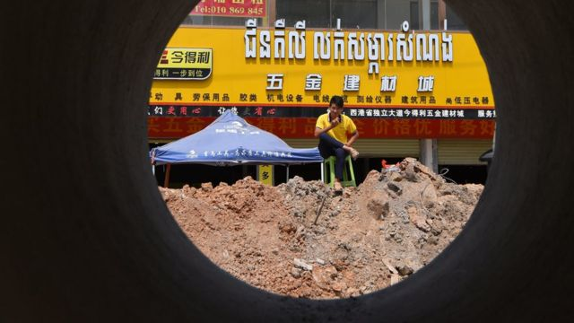
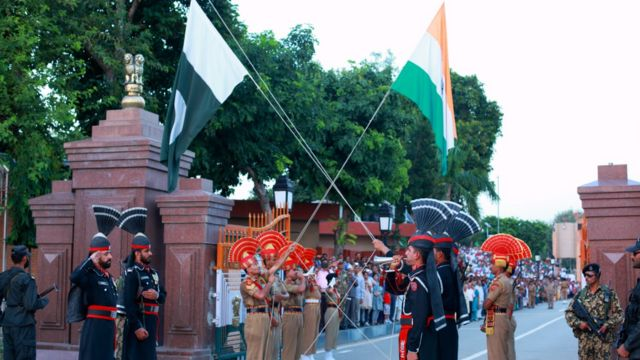
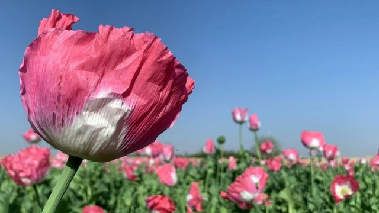

# 柬埔寨诈骗、台海紧张持续、香港教师移民潮和本周更多重要故事

#  柬埔寨诈骗、台海紧张持续、香港教师移民潮和本周更多重要故事

> 图像来源，  AFP

**台湾与中国大陆关系这一周继续在多方面成为新闻焦点。**

大量台湾人怀疑被骗至柬埔寨从事电信诈骗，甚至被人口贩运集团转卖到周边国家，民间估计人数达数千人，他们在当地的遭遇耸人听闻。台湾警方设法劝导不要前赴当地，大陆称将“积极查找并解救相关人员”，香港与澳门分别公布有居民怀疑受害。

又一个美国国会代表团着陆台湾，中国军方再次宣告在台海举行演练，又宣告新一轮对台制裁，台北则回应称制裁无效。

这一周也是塔利班重掌阿富汗政权一周年，和印巴分治75周年。两场政权更迭的背后均有着残酷的血腥冲突。

**刚刚过去的一周，BBC中文** **有以下新闻内容受到读者的关注。如果你错过了它们，BBC中文带你一一回顾。**

##  1\. 台湾青年被诱骗至柬埔寨：两岸紧张下救助困难

“他是邀请做游戏客服运营，给我的薪资是1500到1800美金一个月。他们给我的图片是类似于饭店级的房间照片，工作环境。”

这就是台湾人杨维斌搭上网上假冒招聘活动的开端。“从第二天我就知道我来错地方了，就是这个地方可能非常危险，不是我想像的那样。”

像杨维斌这样的台湾人来到柬埔寨后失去人身自由，已非个别事件。台湾媒体一度传出有约4000人在柬埔寨“失踪”，台湾警察部门驳斥有关说法，但仍证实至少120人在当地未能联系。警察专门到机场拦查和劝返准备赴柬埔寨的民众，引来在野党派嘲笑，同时批评执政民进党营救不力。

台湾人被诱骗至柬埔寨的消息被当地媒体广泛报道之后，香港特区保安局与澳门特区司法警察局也证实有港澳居民疑似被骗往当地。

中国外交部发言人汪文斌8月18日对此评论称，中国将“全力维护包括香港同胞和台湾同胞在内的海外中国公民安全与合法权益”。

不少评论指出，柬埔寨洪森政府多年来遵从中国大陆的“一个中国”政策，台湾无法在柬埔寨设立代表机构，增加了救助滞留台湾民众的难度。

##  2\. 再有美国国会议员访问台湾 北京再次军演又提制裁

美国参议院外交委员会亚太小组主席埃德·马基（Ed Markey）连同众议员加勒曼帝（John Garamendi）、鲁文索（Alan Lowenthal）、贝耶（Don Beyer）和罗德薇（Radewagen）本周抵达台北，是众议院议长佩洛西（Nancy Pelosi；裴洛西、波洛西）近两周前访台后，又一支美国代表团到访台湾。

台湾外交部称：”在中国持续升高区域紧张情势之际，美国国会再度筹组重量级访团来台，展现无惧中国威胁恫吓的友我情谊，并彰显美国对台湾的强力支持。“

中国迅速宣示不满。解放军8月15日宣布在台岛周边海空域组织多军兵种联合战备警巡和实战化演练，中共中央台湾工作办公室16日宣布对七名台湾政治人物施加制裁。

美国第七舰队司令卡尔·托马斯海军中将（Vice Adm Karl Thomas）称，对中国的行为不能视而不见，必须对中国解放军导弹飞越台湾上空的决定做出挑战。

##  3\. 香港移民潮席卷教育界 三位老师谈去留抉择

2020年6月30日深夜，中国《香港国安法》实施。香港不少教师目睹政治及教育环境的急速变化，深受压力，忧虑触犯“红线”，有人认为继续在香港任教不仅“违背自己的专业与良知”，也可能惹上官非，自我审查及寒蝉效应令他们意兴阑珊。英国推出“香港BNO签证”协助港人移居当地，促使不少老师辞职移民。

离职潮就此出现。根据香港特区教育局2022年5月份统计，2021至2022学年公营及直资中小学教师流失人数达4050人，较上一学年急升70%，创近年新高。数据也显示本学年新聘教师人数增加33%至3790人，推算平均每14名教师便有1人是新晋教师。

BBC中文采访了三位香港教师，谈谈他们离开与留下的选择。

##  4\. 马来西亚大型地产项目"森林城市"疫情下宛如“鬼城”

在马来西亚与新加坡交界的柔佛海峡（Selat Johor），一排排住宅楼在人工岛上拔地而起，却大多无人居住，宛如“鬼城”。

这个名为“森林城市”的豪华楼盘主要由中国房地产巨头碧桂园开发，最初预计约有70万人将在这里定居，但在开工八年后，据估计只有约2000人在这里落户。其中许多是开发商员工、国际学校学生和家属。

不过，碧桂园表示，这个预期20年建成项目的进展开发进度一切正常。

碧桂园太平洋景公司说，随着经济活动恢复和旅游禁令解除，期待“森林城市”再次蓬勃发展。

##  5\. 印巴分治75年 回顾血腥过程

> 图像来源，  Getty Images
>
> 图像加注文字，自1959年以来，印度和巴基斯坦边境瓦加哨卡的两国边防军每天傍晚同时举行降旗仪式。瓦加哨卡在阿姆利则附近。

1947年8月，英国同意印度独立。最后一任总督路易斯·蒙巴顿勋爵将日期定在8月15日。

当天，英属印度被分割为印度和巴基斯坦邦。其中，东巴基斯坦后来成为孟加拉国。

当时，印度人口中约有25%是穆斯林，其余的主要是印度教徒，另外还包括锡克教徒，佛教徒和其他少数民族宗教的成员。

这种状况导致不断升级的暴力冲突，约有1500万人流离失所，估计有100万人丧生。

自那以后，印度和巴基斯坦一直处于敌对状态。

##  6\. 阿富汗塔利班上台一周年的变与没变

> 图像来源，  Getty Images
>
> 图像加注文字，2021年的主要收获季节，鸦片产量有所增加。

一年前，外国军队匆忙结束了从阿富汗的撤军，塔利班迅速进入首都喀布尔重新掌权。

作为新上台的塔利班政府的发言人，扎比胡拉·穆贾希德经常召开记者会，代表政府做出了不少承诺。

一年后的今天，来看看塔利班政权是否兑现了它所做出的承诺。

##  7\. 被伊朗悬赏百万美金追杀30年的作家鲁西迪

现年75岁的印裔英籍作家作家萨尔曼·鲁西迪（Salman Rushdie）8月12日在美国纽约州遇刺后情况危急。刺杀他的男子被指控谋杀未遂。

鲁西迪的经纪人安德鲁·怀利（Andrew Wylie）在袭击后曾表示，鲁西迪手臂神经被切断，肝脏受损，可能会失去一只眼睛。

鲁西迪多年来一直面临死亡威胁，因为他的小说《撒旦诗篇》（The Satanic Verses）被一些穆斯林视为亵渎神明。

美国总统拜登（Joe Biden）在一份声明中表示，他对这起“恶性袭击”感到“震惊和悲痛”。

