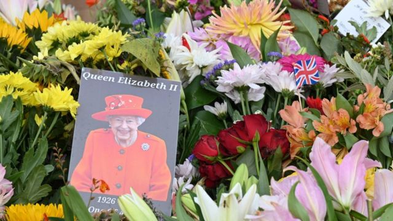
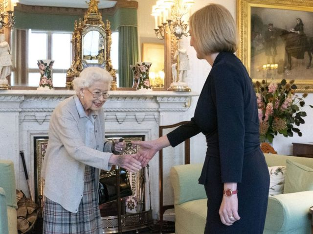
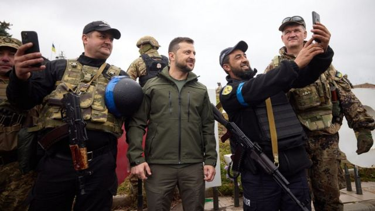
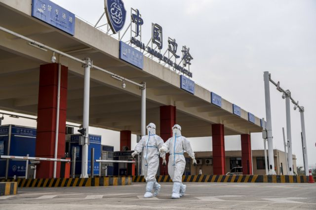

# 英国女王逝世、乌克兰反攻、中共二十大和本周更多重要故事

#  英国女王逝世、乌克兰反攻俄罗斯、中共二十大和本周更多重要故事

> 图像来源，  PA Media

**英国女王伊丽莎白二世（Queen Elizabeth II）9月8日在苏格兰巴尔莫勒尔（Balmoral）逝世，享年96岁。**

女王1952年登基，在位七十年，是英国历史上在位时间最久的君主，一生见证了世界的巨大变迁。

她的长子，查尔斯，成为英国国王查尔斯三世（King Charles III），以及英联邦其中14个成员的君主。

女王的国葬仪式将于9月19日举行，她将长眠温莎城堡。

**过去** **数天** **，BBC中文** **有关英国女王逝世的消息，以及以下** **新闻内容受到读者的关注。如果你错过了它们，我们带你一一回顾。**

##  1\. 英国女王伊丽莎白二世逝世 国王查尔斯三世登基
 英国伦敦白金汉宫9月8日发布公告说  ：“女王今天下午在巴尔莫勒尔平静地去世。”

新任英国国王查尔斯三世陛下说：“我们哀悼一位广受爱戴的君王和一名深受敬爱的母亲。我体会英国、整个英联邦以及世界各地无数民众因为她的离去而会感到的失落”。

女王辞世前两天执行了她一生最后一件公开公务——任命执政保守党新党魁特拉斯（Liz Truss；卓慧思）为首相。特拉斯说，女王长期是现代英国的“基石”，为国家“提供了我们所需的安定与力量”。

“随着伊丽莎白二世时代的结束，我们伟大国家辉煌的历史上一个新时代开始了，就像女王陛下生前会期望的那样，我们会说‘上帝保佑国王陛下’”。

9月10日，王位继承理事会（Accession Council）确认查尔斯三世为英国新国王。

此前，新国王发表了首次全国电视演说，他承诺，将追随他“亲爱的妈妈”，继续服务生涯。

他向全国人民表示，他对母亲的去世“深感悲痛”，并赞扬她的热情、幽默，以及“总有能力精准地看到人们最好的一面”。

国王承诺，会像已故女王在位70年那样“坚定不移地奉献”国家。

女王灵柩先后停放苏格兰首府爱丁堡圣吉尔斯大教堂（St Giles Cathedral）与首都伦敦西敏宫（Palace of Westminster；国会大厦）供公众瞻仰。在爱丁堡悼念礼仪进行期间，苏格兰警察逮捕并起诉至少两名反帝制示威者， 引发平衡悼念庄严与保障言论自由的讨论  。

女王灵柩由皇家空军飞机从爱丁堡移送伦敦，航班追踪网站Flightradar24表示，该趟飞行有600万人追踪，刷新了美国国会众议院议长佩洛西（Nancy Pelosi）8月份访问台湾的纪录， 成为迄今全球最多人追踪的航班  。

伦敦数以万计民众彻夜排队等候，人龙绵延数公里，等候时间长达数十小时，伦敦当局更因人数过多， 一度暂停排队  。
 BBC全程网上直播西敏宫停灵情况，便利民众隔空瞻仰  。

另据BBC了解，英国下议院议长林赛·霍伊尔爵士（Sir Lindsay Hoyle；贺立绅爵士）因中国对五名英国下议院议员和两名上议院议员实施制裁，拒绝了中国政府一代表团进入西敏宫吊唁女王的请求。

英国与澳大利亚、加拿大、新西兰等英联邦王国（Commonwealth realm）驻华使领机构为女王逝世设立吊唁册或悼念场所。在香港，数以千计民众在9月12日中秋节补假及其后几天冒着酷热天气排队数小时，到英国总领事馆签署吊唁册或献花。

英国女王辞世，牵起了不少香港市民对殖民时期的“事头婆”（港式俚语，意指老板娘）的怀念之情，一些市民形容这是划时代的终结，也勾起他们对1997年主权移交前生活的回忆与缅怀。

BBC中文网在现场访问老中青三代，不同世代对英国女王和港英殖民时代有不同记忆，有市民直言“恋殖”是中国颁布《香港国安法》下的“另类政治表态”。

##  ２\. 英国女王临终前 新首相特拉斯上场

> 图像来源，  PA Media

9月5日，英国执政的保守党宣布选出新党魁特拉斯，接替因丑闻缠身被迫辞职的约翰逊（Boris Johnson）。9月6日，约翰逊到苏格兰巴尔莫勒尔城堡向女王请辞，特拉斯继而觐见女王，获女王邀请组织政府内阁。

按照传统，新首相任命通常在女王在伦敦的官邸白金汉宫举行。女王因行动不便而留在苏格兰接见新旧首相，未料这成为了她生前最后一件公开公务，特拉斯也因此成为了女王任内第15位，也是最后一位首相。

特拉斯现年47岁，2010年当选英国下院议员，曾在保守党三位首相卡梅伦、特蕾莎·梅和约翰逊内阁任职，担任国教育部长、司法部长和国际贸易大臣等，现任外交大臣。

特拉斯行事和装扮都颇有英国第一位女首相“铁娘子”撒切尔夫人之风，因此被认为有志成为“铁娘子”第二。

她在竞选期间一直表示，出任首相后将迅速采取行动对付英国高达10%的通货膨胀率，重振趋于衰退的经济，为英国家庭减轻高涨的能源开支。

在外交政策上，特拉斯承诺会更新英国外交国防综合评估，更注重中国和俄罗斯的威胁。

##  3\. 乌克兰大反攻 俄罗斯否认部队仓惶逃跑

> 图像来源，  Office of the President of Ukraine

俄罗斯入侵乌克兰超过半年之后，战况在过去两周发生了变化。

基辅官员称，乌克兰军队9月10日进入俄军在乌克兰东部的重要补给中心库皮扬斯克（Kupiansk）。俄罗斯国防部随后表示已从附近的伊久姆（Izyum）撤退，以“重新部署”；俄军从第三个关键镇巴拉克列亚（Balaklyia）撤军，以加强在顿涅茨克前线的战斗。

乌军的成果如果保持住，将是4月份俄军从首都基辅周便地区撤离以来最重要的一次胜利。

不过，克里姆林宫发言人佩斯科夫（ Dmitry Peskov ）12日对记者说：“（俄罗斯的）特别军事行动仍在继续，也将会继续，直到完成最初定下的一切任务。”

##  4\. 中共二十大敲定10月举行 “新冠清零”与“闭关锁国”成焦点

> 图像来源，  Xinhua

中国共产党第二十次全国代表大会定于10月16日揭幕，在二十大召开日期公布前，中国历史研究院一份有关明清“闭关锁国”政策的文章在网络引发争议，有网友认为，该文为闭关锁国政策翻案，是要借古论今支持中国目前严格的新冠病毒病（COVID-19）“清零”政策。

这篇题为《明清时期“闭关锁国”问题新探》的文章称，“闭关锁国”不是中国古代既有概念，也不是西方对中国的固有认知，而是晚清中日语言嫁接产生的历史名词，不是对明清时期对外政策的客观描述。

纽约州立大学奥尔巴尼分校政治学教授陈澄接受BBC中文采访时表示，这篇文章全文仅在讨论明清两朝的政策，并未提到这些争议对当代政治经济有任何适用性。但文章在网上引发关注，反映出当前持续的“动态清零”政策下不少中国人的焦虑情绪。

##  5\. 习近平疫情爆近三年来首次外访再晤普京

中共中央总书记，中国国家主席习近平9月14日至16日出访中亚哈萨克斯坦与乌兹别克斯坦两国，并参加上海合作组织元首理事会会议。这是在新冠疫情爆发近三年来习近平首次出访。

在乌兹别克斯坦撒马尔罕，习近平与俄罗斯总统普京（Vladimir Putin）举行会谈。习近平说，世界正在出现近代历史上前所未有的大变局，“我们准备与俄罗斯同事联手，树立一个负责任的世界大国的榜样，发挥领导作用把迅速变化的世界纳入可持续和积极发展的轨道”。

普京则说：“我们高度评价中国朋友在乌克兰危机中的平衡立场。我们理解你们的问题和担心。在今天的会谈中我们将解释我们的立场。”

##  6\. 中国四川受地震与新冠疫情夹击

9月5日，中国四川甘孜藏族自治州泸定县发生里氏6.8级地震，震源深度16公里。截至11日，地震已经造成93人遇难，25人失联。

地震发生前，人口约2100万的四川省会成都因新冠病毒病疫情而进入近乎“封城”状态。一些网上流出的影片显示，在地震导致成都震感强烈之时，有些成都居民却因为防疫封锁政策被阻止逃生。

这在中国互联网上引发了网民的愤怒与怀疑。

