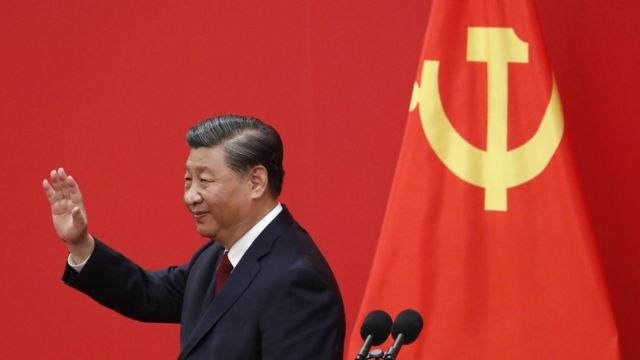
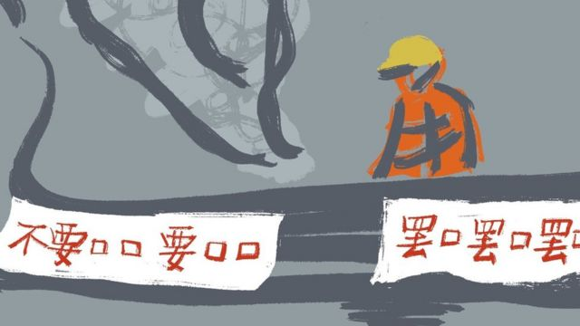

# [Press] 习近平再次连任、胡锦涛二十大“被离场”、英国新首相和本周更多重要故事

#  习近平再次连任、胡锦涛二十大“被离场”、英国新首相和本周更多重要故事

> 图像来源，  EPA

**中共二十大闭幕，习近平一如观察人士预期，第三度当上中共中央总书记。这样一个场合上，前总书记胡锦涛在众目睽睽下，于会议中途被带离会议厅，引起全球舆论关注。**

在英国，国家历史上寿命最短的首相诞生后，换来了新英王任命的首位首相，且是200年来最年轻，兼史上首位亚裔首相苏纳克（Rishi Sunak, 辛伟诚）。

两场令人瞩目的人事更迭外，欧洲民间组织指控中国涉外地下警察活动，北京则严词否认。

刚刚过去的一周，BBC中文以下新闻内容受到读者的关注。如果你错过了它们，BBC中文带你一一回顾。

##  1\. 中共二十大：习近平开启第三任期 胡锦涛退场引人关注

中共二十大闭幕会10月22日在北京人民大会堂举行，随后召开了二十届一中全会，中共中央新一届中央委员、政治局委员及常委名单公布。

二十大闭幕会进行到中途，79岁的前中共领导人胡锦涛在两名工作人员陪同下离场，没有继续参加下半场的大会。官方新华社其后在推特发布英文消息，称胡锦涛“会议期间身体不适，工作人员为了他的健康，陪他到会场旁的房间休息”。

二十大召开前夕，有抗议者在首都北京西北部的四通桥上悬挂横幅，指责习近平是独裁者，并要求他下台。据信他很快被捕。

不久，在推特上，一些抗议视频也在悄然流传。一条影片显示，在貌似上海的一条繁忙商业街，有两名女子夜晚拉开了一条白色横幅与同伴一起前进，横幅上是手写的黑色汉字“不要……要……不要……要……不要……要……”。

二十大闭幕后的本周一（24日），香港警察宣布以《刑事罪行条例》下的“煽动意图罪”嫌疑，拘捕了一名27岁的中国大陆男子。他被指控近日在香港立法会大楼外告示板张贴三张海报，据香港媒体公布的图片，他张贴的内容包括北京四通桥抗议事件的照片和标语。

越来越多的迹象显示，在习近平打破任期惯例以及他不近人情的防疫措施导致民生和经济危机日益严峻，不满情绪迅速升温并蔓延。

> 图像来源，  Internet

##  2\. 中共二十大强调反“台独”，台湾有何反应

中共二十大通过关于《中国共产党章程（修正案）》的决议，“坚决反对和遏制‘台独’”首次纳入中共党章，引起台湾各界高度关注。学者普遍认为中共此举象征意义大于实际，但长远会加剧两岸“边缘政治”，令台海局势升温。

在全球关注台海关系的时刻，BBC中文在台北专访台湾外长吴钊燮，与他就中国大陆“武统”威胁，国际社会“奥援”以及联合国合法席位等议题对谈。

##  3\. 英国换首相：苏纳克挂着数个标签走进唐宁街10号

英国前任财政大臣苏纳克当选保守党新党魁后，周二（25日）前往白金汉宫觐见英国国王，获国王授权筹组内阁，苏纳克正式接替一周前辞职的特拉斯（Liz Truss，卓慧思），就任英国首相。

现年42岁的苏纳克是印度移民的后代，他是新任国王任命的第一位首相，也英国历史上第一位亚裔首相，和英国近200年来最年轻的首相。

摆在苏纳克面前的挑战包括英国数十年来最严重的经济困境和严重分裂的保守党。

##  4\. 中国间谍案与“海外警察”网络接连曝光 北京称信息不实

总部位于西班牙的非政府组织“保护卫士”（Safeguard Defenders）发布报告称，中国两个省份的公安部门已在五大洲21个国家设立了54个“海外警察服务中心”。其中大部分在欧洲，9个在西班牙，4个在意大利。在英国，他们发现有两家在伦敦，一家在格拉斯哥。

报告称，这些服务中心负责进行“说服行动”，目的是胁迫那些涉嫌公开反对中国政权的人回国。

中国外交部称西班牙有关组织的说法“不实”，并称这些都是因应新冠病毒病（COVID-19）疫情而专门设立的“涉侨事务海外服务站”。

##  5\. 字节跳动前员工谈网络审查：“我在做对社会有害的事情”

年少时，曾嘉俊第一次透过VPN在网路上观看到有关“六四”天安门事件的纪录片，对此大为震惊。十年后，他加入了拥有抖音及TikTok等人气社交软体的中国互联网公司字节跳动，成为其审核工具开发团队的一员。

2020年春天李文亮医生过世成为曾嘉俊辞职离开的最后一根稻草，他再也无法接受自己继续成为这个生态系统的一部分。

现居美国的曾嘉俊对法新社（AFP）讲述了他的经历。

