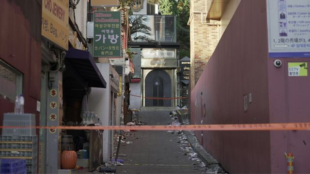
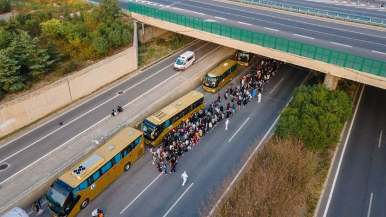
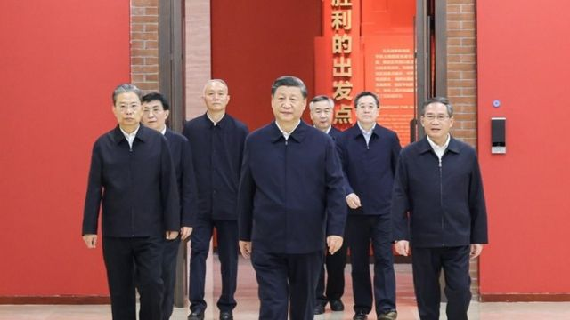
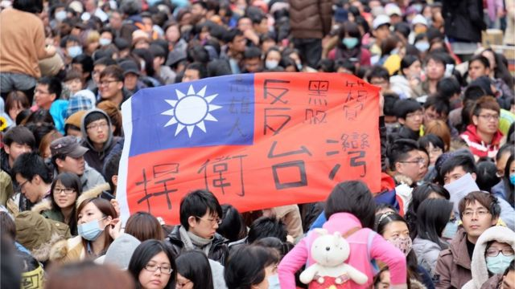

# [Press] 韩国首尔梨泰院踩踏事件、郑州兰州拉萨疫情、中共二十大后续和本周更多重要故事

#  韩国首尔梨泰院踩踏事件、郑州兰州拉萨疫情、中共二十大后续和本周更多重要故事

> 图像来源，  Jiro Akiba/BBC
>
> 图像加注文字，在首尔梨泰院汉米尔顿酒店旁边的这条小巷，156名韩国与外国青年失去了生命。

**万圣节前的周末夜，韩国首尔知名商圈梨泰院传出数十人“心跳停止”的消息，震惊世界。最终，156条年轻生命逝去，警察与政府官员不作为嫌疑曝光，个别警员独自力挽狂澜的事迹也展现在世人面前。**

中国也同样在发生牵涉群众的事情：河南郑州富士康工厂传出因为新冠病毒病（COVID-19）疫情迫使厂区封锁，导致大量工人逃离；西藏拉萨疑似出现罕见的大规模抗议，反对严厉的防疫措施；甘肃兰州一名男童防疫封锁期间未能及时送医抢救而死，引发众怒。

中共二十大举行前，评论人士普遍预期中国将在党代会之后放松社会管制。现在防疫政策似乎没有变化，而其他围绕这场大会的观察与展望在本周继续。

刚刚过去的一周，BBC中文以下新闻内容受到读者的关注。如果你错过了它们，BBC中文带你一一回顾。

##  1\. 万圣节前夕爆发韩国首尔梨泰院踩踏事件 政府遭受强烈质疑

首尔时间10月29日22:22（格林尼治标准时间13:22）左右，韩国首尔知名商圈梨泰院汉米尔顿酒店旁边的一条小巷发生踩踏事故，据韩国行政安全部统计，截至11月4日，共造成156人死亡、195人受伤。

越来越多的证据、专家和一系列官方道歉都指向了明显的失职。韩国总统尹锡悦4日首次公开道歉，称对造成严重伤亡“深感悲痛和歉疚”。

##  2\. 郑州富士康工人出逃、兰州儿童失救、拉萨群众抗议……中国清零政策继续遭遇指责

> 图像来源，  Getty Images
>
> 图像加注文字，有业界人士指出，富士康郑州的两间厂生产iPhone 14 Pro等系列，7天静态管理是否影响iPhone生产有待观察。

位于中国河南省会郑州，全球最大苹果手机（iPhone）代工厂富士康（Foxconn）园区上周爆发新冠疫情，厂区封锁，大量担忧受感染的员工决计徒步返乡，引发全球关注。

西藏首府拉萨从8月底开始就因新冠疫情而被封锁。当地本周传出视频显示，本来已守卫森严的拉萨疑似出现罕见的大规模抗议，反对中国严厉的新冠防疫措施。

甘肃省会兰州一名三岁男童在疫情封锁期间煤气中毒，未能及时获得抢救而死亡，引发公众舆论对有关“过度防疫”的愤怒。专家向BBC中文表示，目前中国大陆因为严控防疫政策而造成的“次生灾害”，可能是比新冠疫情本身更大的危机。

##  3\. 中共二十大后的人事布局与经济前景

> 图像来源，  Xinhua
>
> 图像加注文字，习近平上周率中共政治局新一届常委到延安革命纪念馆。

中共二十届一中全会后，七位政治局常委走上前台。在中共政治框架下，他们被称为“正国级”领导人，备受瞩目。

随着习近平开始他的第三个任期，他面临着与美国持续的贸易战，以及试图阻止中国获得美国高端芯片制造技术的制裁的新尝试。

##  4\. 德国总理肖尔茨访华 疫情以来G7第一人

德国总理肖尔茨（Olaf Scholz）11月4日抵达中国进行一天的闪电访问，与中国领导人习近平会面。他成为新冠疫情发生后首个访问中国的G7国家领导人。

此次访华前，肖尔茨面临来自国内外的批评和担忧。国际关系学者对BBC表示，德国的经济震荡迫使肖尔茨政府面对中国时采取“政经分离”的手段。

##  5\. “九二共识”30周年与台湾电影遭遇香港审查：政治红线越收越紧？

> 图像来源，  AFP
>
> 图像加注文字，台湾许多民众担心，与中国大陆建立密切的经济联系，会损害台湾自身经济，并且加深中国在台湾的影响力。

1992年10月末，台湾海峡交流基金会与中国海峡两岸关系协会在英属香港举行历史性会谈，这次会谈促成了后来的“一个中国，各自表述”， 也就是人们所熟知的“九二共识”。

来到2022年，对于“九二共识”的内涵， 海峡两岸却是渐行渐远，大陆视其为双方沟通的基石，但台湾民进党政府不承认“九二共识”，两岸关系剑拔弩张。

就在“九二共识”诞生30周年之际，接连三部台湾电影未能通过香港特区政府审查。在中国《香港国安法》及台海两岸紧张关系下，此事外界猜测与“台湾主权”问题有关。

