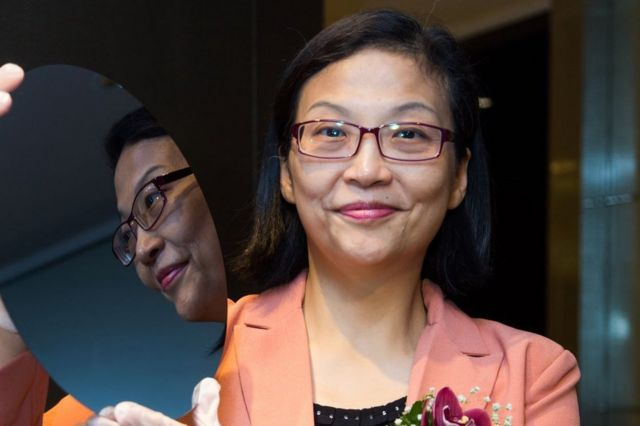
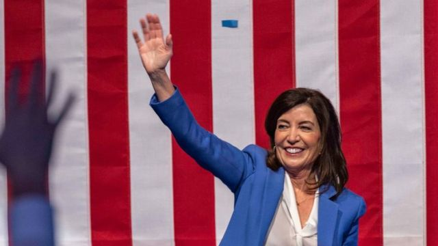
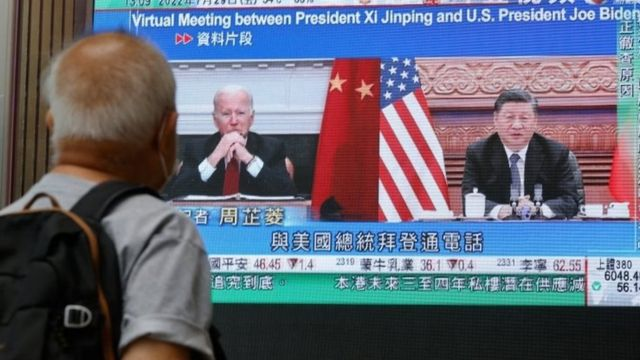
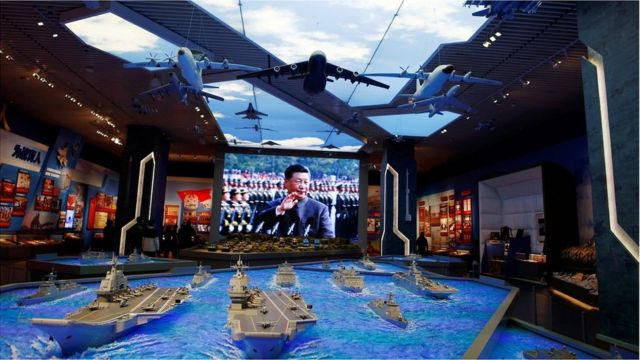

# [Press] 美国中期选举、鲍彤去世、习近平下令“聚焦打仗”和本周更多重要故事

#  美国中期选举、鲍彤去世、习近平下令“聚焦打仗”和本周更多重要故事

**11月的第二周，关键性的美国中期选举进行，将决定民主、共和两党谁将掌控国会权力。除报道选举进程外，BBC中文还实地报道了各级选举当中积极参与助选的华人。**

同样在本周，中国80年代改革派领导人赵紫阳的得力助手鲍彤去世。我们回顾了这个因1989年“六四事件”被捕入狱的最高级别官员的一生。

进入历史性第三任期的中国最高领导人习近平在视察解放军指挥中心时首次表示，要“全部精力向打仗聚焦”，引发外界揣测未来数年台海战争的风险。

在台湾，BBC中文专访了台湾环球晶圆（GlobalWafers）公司董事长徐秀兰，探讨全球晶片大战背后的大势。

此外，我们还会展望即将到来的二十国集团（G20）峰会，分析此次年度峰会的四大看点。

刚刚过去的一周，BBC中文以下新闻内容受到读者的关注。如果你错过了它们，BBC中文和你一一回顾。
 1\. 和台湾“晶圆女王”探讨全球晶片大战背后的险境与牌局 

> 图像来源，  GlobalWafers
>
> 图像加注文字，是台湾半导体大厂中十分少见的女董事长兼执行长，被称为台湾“晶圆女王”。

徐秀兰是台湾环球晶圆（GlobalWafers）公司董事长，被称为台湾“晶圆女王”。这家公司是台湾最大、全球第三大的3吋至12吋专业晶圆材料供应商，营运生产基地遍布台湾、中国大陆、美国、日本、丹麦、新加坡等地。

过去主导环球并购全球许多半导体公司，战无不胜的徐秀兰，却在今年并购德国大厂世创（Siltronic）一案中败走麦城，跌破业界眼镜。

在BBC中文的专访中，我们从这起失败的收购案谈起，了解台湾“晶圆女王”如何看待当下硝烟四起的全球晶片产业和背后的大国争锋，以及这个高度敏感的行业未来会何去何从。

**2.** 美国中期选举后国会重新洗牌可能导致的严重后果 

> 图像来源，  Getty Images

在本届中期选举尘埃落定时，共和党很有可能会至少控制国会参众两院的其中一个。

在民主党控制参众两院两年之后，这个国家的权力对比有可能发生改变。BBC分析了未来两年里美国政治四个非常真实的潜在影响。

更多美国中期选举相关报道：
 3\. 鲍彤逝世：因“六四”事件入狱最高官员和推动中国政治改革的先锋人物 

> 图像来源，  New Century Press Hong Kong
>
> 图像加注文字，鲍彤（左）与原中共中央总书记赵紫阳（右）1986年合影的资料照片。

11月9日，中国80年代改革派领导人赵紫阳的得力助手鲍彤逝世，享年90岁。

鲍彤是推动中国政治改革的先锋人物，也是因1989年“六四事件”被捕入狱的最高级别的官员。

其子鲍朴发表了讣闻，表示父亲安然离世。

鲍彤一直用“中国公民”来定义自己，他孜孜不倦地对中国时政发表看法，到了晚年仍时常接受媒体的访问，希望推动中国走民主自由的道路，受到许多人敬重。
 4\. G20峰会前四大看点：疫情终章、俄乌同台、习拜会面、经济危机 

> 图像来源，  Reuters
>
> 图像加注文字，习近平与拜登7月底的通话气氛因佩洛西访台而显得紧张。

过去三年没法出去旅行？对总统、总理、主席、首相和国王们来说，也差不多。疫情中国际会议纷纷改为线上举行，似乎还省了很多繁复的外交礼节。

然而今年不太一样，全球20个经济影响力最大国家的首脑们，决定亲身赶赴印度尼西亚的巴厘岛，参加2022年G20峰会。

背后的原因或许是，2022年太特别了——全球疫情、俄乌战争、中美关系和全球多地通胀，任何一个问题放在以前，都是大事件，当它们叠加在一起，任谁都会焦头烂额，可能更需要全球政治领袖们坐在圆桌前申明立场、达成妥协，拿出方案。
 5\. 习近平连任后强势下令解放军“聚焦打仗”意味着什么？ 

> 图像来源，  Reuters
>
> 图像加注文字，有台湾学者认为，习近平最新的表态只是换了新的用词，"没有超过以前，没有更具攻击性的言辞"。

习近平首次说解放军要“全部精力向打仗聚焦”，引发外界揣测未来数年台海战争的风险。

在中共二十大上获得第三个任期的习近平，11月8日以中共总书记、中央军委主席、军委联指总指挥身分，视察中央军委联合作战指挥中心。

他身穿新式迷彩军装听取汇报后发表讲话，指中国安全形势不稳定性不确定性增大，要“全部精力向打仗聚焦，全部工作向打仗用劲，加快提高打赢能力，坚决捍卫国家主权、安全、发展利益”。

台湾方面关注习近平的言论是否意味着台海局势即将升温。有学者认为，有关表态是为了确定解放军的忠诚，属政治性行动而非军事行动，台湾不会因此变得更危险。另有专家则表示，不能觉得是“宣传”就轻视危险讯号。

