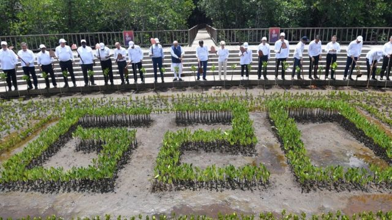
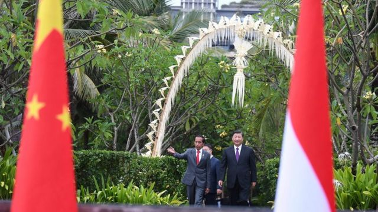
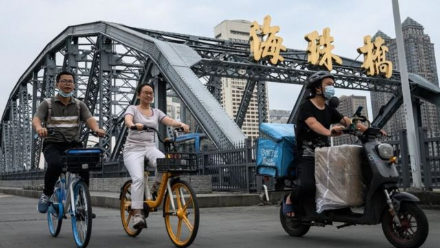
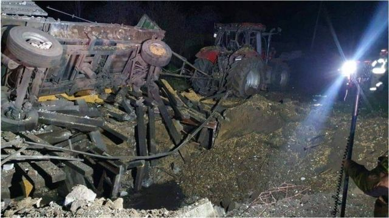
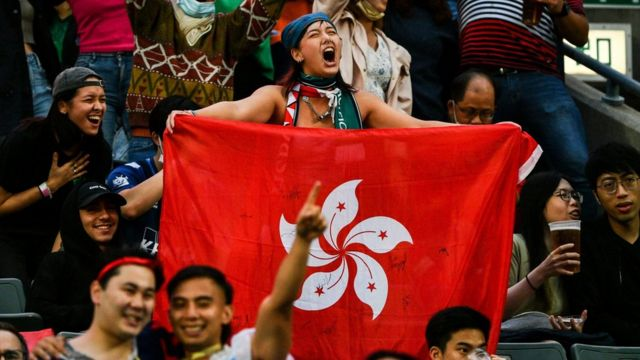

# [Press] 俄制导弹落波兰、习近平G20密集会晤、中国防疫大调整和本周更多重要故事

#  俄制导弹落波兰、习近平G20密集会晤、中国防疫大调整和本周更多重要故事

> 图像来源，  Reuters

**11月的第三周，中国实施二十条新政放松管制后新冠感染者暴增，一些地方出现执行混乱。种种不确定之下，广州有居民不满严格封锁措施，逃离强制封锁并与警方发生冲突。**

乌克兰战事持续，俄制导弹落入北约成员国波兰境内造成两人丧生，引发多方关注。正身在G20峰会的七国集团领导人不得不加开紧急会议。

同样在G20峰会，疫情之下再度出访的中国国家主席习近平展开“外交派对”，与多国领导人会面，但这能够令中国摆脱“国际孤立感”吗？

在美国，中期选举一周后，共和党已经在国会众议院获得了占多数所需的218个席位。尽管优势非常小，但这足以拖延拜登总统未来两年的议程。

香港警方宣布就韩国仁川举行的一场橄榄球比赛开展刑事调查。在这场亚洲七人橄榄球系列赛韩国站男子组中国香港对韩国决赛上，2019年香港反对《逃犯条例》修订案示威的标志性乐曲《愿荣光归香港》被当作中国国歌播放。。

刚刚过去的一周，BBC中文以下新闻内容受到读者的关注。如果你错过了它们，BBC中文和你一一回顾。
 1\. 习近平“外交派对”：G20密集会见11国领袖，中国能否摆脱“国际孤立感” 

> 图像来源，  Reuters
>
> 图像加注文字，这次G20峰会被视为习近平在“二十大”上巩固了国内权力后的亮相派对。

G20峰会期间，中国领导人在三天时间里与11个国家领导人举行双边会谈。峰会结束第二天他飞抵泰国参加APEC，又会见了日本、新加坡、菲律宾三国领导人。

根据中国外交部的发布，G20峰会期间，中国领导人在三天时间里与11个国家领导人举行双边会谈，此外还有联合国秘书长。

从特朗普时代的贸易战开始，中美关系开始呈现“自由落体”态势。外界对中国与西方关系的期待已经非常低。

但是习近平与拜登在G20会面，以及中国表达对俄罗斯态度的转变，似乎成为有望乐观的新进展。

不过有专家认为，这并不代表中国和西方国家之间的紧张关系不会持续，这种关系可能像拜登所说会维持“激烈竞争”。
 2\. 中国疫情持续升温， 防疫措施混乱致冲突和谣言四起 

> 图像来源，  Getty Images
>
> 图像加注文字，中国媒体报道称，广州10月22日本轮疫情以来，所有感染者情况均稳定，无一重型、危重型病例。

中国疫情持续升温， 在不断升高的确诊数下，广州居民反抗严格的封锁措施，与警方爆发冲突。

中国国家卫健委周三（11月16日）公布，周二全国报告新增新冠肺炎病例超过两万例，其中无症状感染者超18000例。

根据官方数据，感染病例和无症状感染者主要出现在广东、重庆、甘肃、河南和北京。

中国国家卫健委下发称为“二十条”的防疫措施优化通知，要求放宽部分措施，但一些地方出现管理混乱。

中国媒体报道，11月14日，石家庄疫情防控指挥部称已取消常态化核酸检测，该市的核酸采样点也在减少，但随后在周二又重开部分采样点。
 3\. 俄制导弹落入波兰境内 拜登称初步认为“不大可能”从俄罗斯发射 

> 图像来源，  Reuters
>
> 图像加注文字，爆炸现场的残骸。

据报道有导弹落在波兰境内靠近乌克兰边境热沃多夫（Przewodów）的一处农庄，波兰证实有两人丧生。

美联社援引三名美国官员的话说，初步评估显示，落在波兰的导弹是乌克兰军队向一枚来袭的俄罗斯导弹发射后落在波兰境内的。

无法公开讨论此事的美方官员在匿名的情况下接受了美联社的采访。早些时候，美国总统拜登已经表示，落在波兰的导弹“不太可能”是从俄罗斯发射的。

由于意外发生在北约（NATO）国家波兰境内，又正值G20高峰会的敏感时刻，此事成为全球关注焦点。G7七大工业国，包含欧盟的领导人已经在印尼巴厘岛召开紧急会议。
 4\. 美国中期选举：共和党以微弱优势赢回众议院 

> 图像来源，  Getty Images
>
> 图像加注文字，凯伦·巴斯（右）在洛杉矶市长选举中获胜。

BBC在美国的合作伙伴哥伦比亚广播公司预测，中期选举一周后，共和党已经在国会众议院获得了占多数所需的218个席位。

尽管共和党在众议院的领先非常小，但这足以拖延拜登总统未来两年的议程。

民主党将在明年1月新一届国会聚集开会时继续控制参议院。

曾希望赢回参众两院控制权的共和党人，在上周的中期选举中表现不及预期。

据哥伦比亚广播公司报道，共和党目前预计将最多赢得众议院435个席位中的223个。

但因为有悬念的选区计票仍在进行中，他们的多数地位可能在几天甚至几周内都无法确定。
 5.韩国橄榄球赛误把《愿荣光归香港》当作中国国歌始末 

> 图像来源，  AFP

在这场亚洲七人橄榄球系列赛韩国站男子组中国香港对韩国决赛上，2019年香港反对《逃犯条例》修订案示威的标志性乐曲《愿荣光归香港》被当作中国国歌播放。

中国香港行政长官李家超证实，香港警察将调查是否涉及“串谋违反《国歌条例》”，警方表示调查范围也将包括有否触犯中国《香港国安法》罪行。港府还约见韩国驻香港总领事抗议。

球赛主办方称这只是人为疏忽，并称已向中国与香港特区政府道歉。香港建制派政团纷纷表态谴责，并称是“严重政治事件”。

