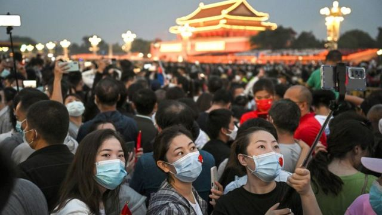
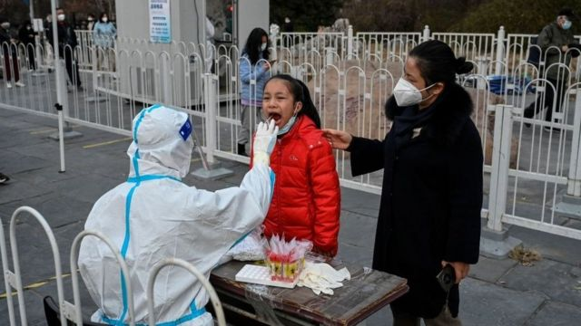
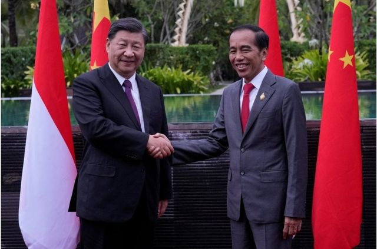
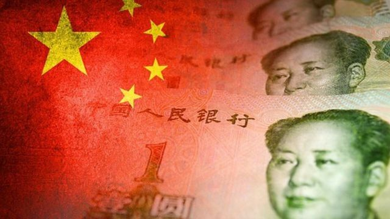
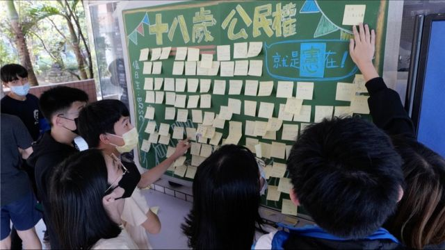

# [Press] 雅万高铁纪行、富士康工厂示威冲突、台湾中期选举和本周更多重要故事

#  雅万高铁纪行、富士康工厂示威冲突、台湾中期选举和本周更多重要故事

> 图像来源，  Getty Images

**11月的第四周，中国各地在放松管控后迎来了疫情反弹，新的管控导致各种抗议声此起彼伏。**

在G20峰会后，中国国家主席习近平和印尼总统佐科在会谈前见证了两国合建的雅加达-万隆高速铁路（雅万高铁）试验运行，BBC中文记现场者亲身了解了这一条铁路。

在中国大陆郑州，全球最大的苹果手机制造基地富士康工厂爆发了工人示威，反对严厉的新冠防疫措施。

在台湾，“九合一”选举之前，BBC中文记者在当地了解即将与选举同步进行的史上首次修宪案“公民复决”，关于18岁公民的投票投问题。

刚刚过去的一周，BBC中文以下新闻内容受到读者的关注。如果你错过了它们，BBC中文和你一一回顾。
 1\. 中国“二十条”实施10天感染激增，分析指民众态度不一社会存在撕裂 

> 图像来源，  Getty Images

中国在发布防疫优化措施"二十条"后，疫情再度升温。中国单日新增病例连续突破两万例，北京、广州、重庆等大城市成为疫情最严峻的地区。

专家对BBC表示，未来几周，这波病毒传播将超过今年早些时候上海的高峰期，而中国老年人疫苗接种率较低，情况令人担忧。
 2\. 雅万高铁纪行：印尼雄心遇见中国棋局 

> 图像来源，  Reuters
>
> 图像加注文字，11月16日，印尼总统佐科（右）与中国国家主席习近平在巴厘岛G20峰会双边会晤期间握手。

11月16日印尼巴厘岛G20峰会后，两国领导举行双边会谈前，中国国家主席习近平和印尼总统佐科通过视频连线，见证两国合建的雅加达- 万隆高速铁路（雅万高铁）试验运行。

雅万高铁，连接首都雅加达和第四大城市万隆，全长142公里，大概相当于北京到天津，或者台北到台中的距离；建成后运行时速将达到350公里，将两地交通时间从三小时缩短为40多分钟。

这条铁路也面临争议，比如预算超支、工程延期等，以及对于环境和社区的影响。BBC中文记者飞抵视频连线的另一端——万隆德卡鲁尔高铁站，然后一路向西抵达雅加达，深入了解这条铁路。
 3\. 中国经济陷入困境了吗？如何脱困？四位专家分享看法 

> 图像来源，  Getty Images

中国经济增长继续放缓，国债规模是经济规模的两倍多，青年失业率飙升，不断反复的新冠疫情封控冲击了经济的方方面面，外国资本在撤离，许多人眼里前景黯淡。

不少观察人士认为，中国经济能否脱困看来在很大程度上取决于它对迫在眉睫的巨额债务的处理。

国际机构预计，2022年中国经济增长幅度将落后于部分亚洲国家，这将是自1990年代初以来第一次。

BBC国际部《调查》（Inquiry）节目请四名专家分享他们的看法——
 4\. 富士康郑州超级工厂爆发示威，苹果此前称iPhone14交货受影响 

网上疯传的视频显示，在中国郑州，全球最大的苹果手机制造基地富士康工厂爆发了工人示威。郑州市昨日（11月23日）宣布主城区25日至29日进行“流动性管理”，此举被广泛解读为“封城”。

视频中成百上千的工人在游行示威，一些人和身穿防疫服的工作人员还有防暴警察发生了冲突。

有示威者表示，他们当中有人遭到了殴打。视频画面中能看到冲突的场景。
 5\. 台湾18岁投票权之争：“被偷走”的公民权这次能讨回来吗？ 

> 图像来源，  BBC Chinese
>
> 图像加注文字，台湾高中生在校內设立连侬墙表达诉求。

台湾是全球少数禁止18岁公民投票的地方之一，今年“九合一”选举期间将同步进行史上首次修宪案“公民复决”，如通过可望增加41万年轻一代选民，这对台湾政治格局有什么影响？ 社会上有少数反对声音，背后反映了什么意识形态之争？

