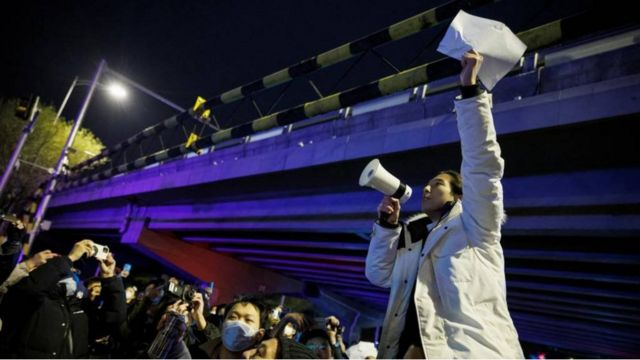
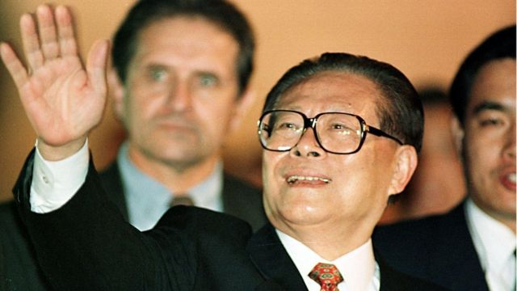
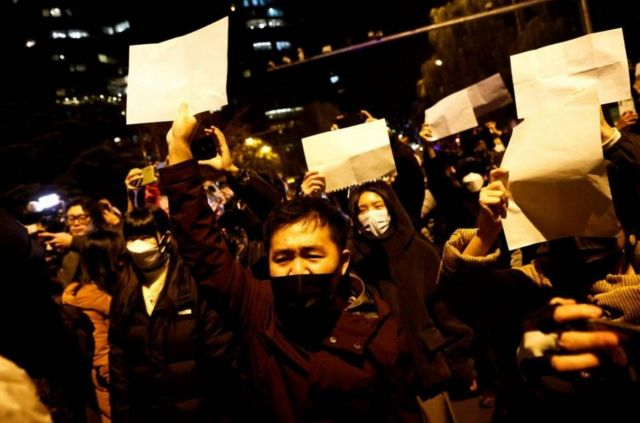
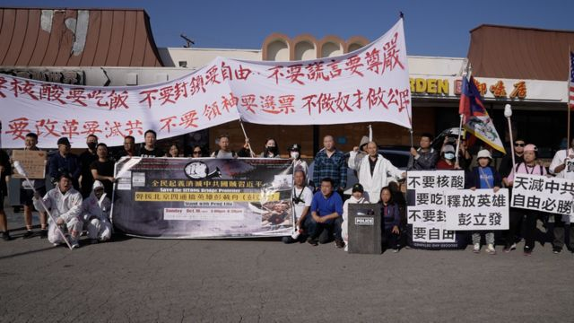
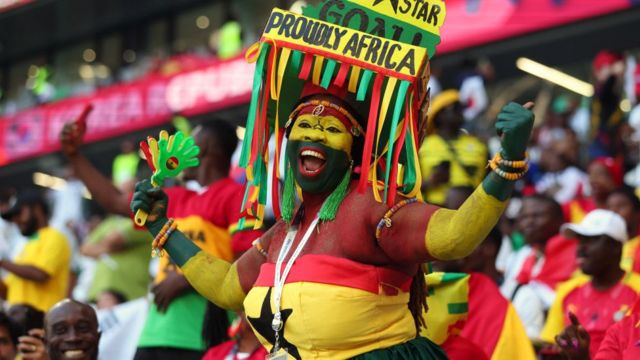

# [Press] 中国反新冠封控抗议、台湾九合一选举、江泽民逝世和本周更多重要故事

#  中国反新冠封控抗议、台湾九合一选举、江泽民逝世和本周更多重要故事

> 图像来源，  Reuters
>
> 图像加注文字，11月28日，在北京，在为乌鲁木齐火灾受害者守夜后，一名男子拿着白纸抗议当局的疫情封控措施。

**11月底至12月初的这一周，中国大陆爆发了反对严格新冠“清零”措施的抗议活动，蔓延到多个城市。在突如其来的罕见抗议中，有人高呼“习近平下台”，“我们要自由、平等、民主、法治”等口号。**

与此同时，卡塔尔世界杯正如火如荼地进行，但是中国观众在公共电视上看到的直播画面，却与世界其他地方有所不一样。

刚结束的台湾九合一选举，民进党丢掉大片江山，身兼民进党党主席的总统蔡英文在选举结果出炉当晚宣布辞去党主席。

周三，中国前国家主席江泽民11月30日12时13分在上海去世，享年96岁。

我们还报道了北京四通桥的罕见抗议，如何鼓舞了许多在美异见华人。

刚刚过去的一周，BBC中文以下新闻内容受到读者的关注。如果你错过了它们，BBC中文和你一一回顾。
 1\. 江泽民逝世：站上中国权力最高峰的红色工程师，享年96岁 

> 图像来源，  Getty Images

中国前国家主席江泽民因患白血病合并多个内脏器官功能衰竭，抢救无效，2022年11月30日12时13分在上海去世，享年96岁。

中国官方媒体新华社在11月30日公布了江泽民去世的消息。自不再担任公职以来，他的健康状况一直是公众关注的焦点，屡屡有关于他病重、病危甚至去世的消息传出，而他每一次公开露面时的状态也会被媒体及公众仔细审视。
 2\. 中国新冠“清零”政策抗议蔓延到多个城市，出现更广泛的政治诉求 

> 图像来源，  Reuters
>
> 图像加注文字，在北京，抗议者举着白纸表达他们的不满。

中国上海周六（11月26日）爆发了反对严格新冠“清零”措施的抗议活动，一直持续到第二天晚上，并蔓延到其他各大城市。

在一些城市，抗议逐渐演变成更广泛的政治诉求。社交媒体上发布的视频显示，有人高呼“习近平下台”“我们要自由、平等、民主、法治”等口号。

在首都北京和金融中心上海，抗议活动持续到深夜。

在中国西南城市成都、中部城市西安，以及三年前新冠疫情爆发的地方武汉，白天也发生了抗议活动。

发布在社交媒体上的视频显示，数百名武汉居民走上街头，一些抗议者被拍到推倒路障，并砸碎铁门。

周六晚，在上海的抗议活动中，有人公开喊出了“习近平下台”和“共产党，下台”等口号。
 3\. 地方选举再次大败后，民进党能否复制2020年大选翻盘的奇迹 

> 图像来源，  EPA
>
> 图像加注文字，蔡英文

台湾九合一选举，民进党丢掉大片江山。在首都台北，提名初期被看好的陈时中被国民党的蒋万安逆转；市政被媒体评比为五星级的大城市譬如桃园、基隆及新竹市都无法延续执政，结果震撼台湾政坛。

身兼民进党党主席的总统蔡英文在选举结果出炉当晚宣布辞去党主席，目前由连任成功的高雄市长陈其迈代理。而在2018年的上一次地方选举仲，民进党同样大败，但在2020年总统选举却获得大胜，这样惊奇的戏码能否重现，各界议论纷纷。
 4\. 北京四通桥事件催生美国年轻华人政治表达 

> 图像来源，  BBC Chinese
>
> 图像加注文字，中国首都的四通桥抗议鼓舞了许多海外异议人士，他们开始站出来公开表达自己的不满。

10月13日，两条反对中国最高领导人习近平和防疫政策的横幅出现在北京西北部的一座繁忙的立交桥上。抗议发生在中共二十大前夕，当时外界广泛认为中共领导人习近平即将获得连任，延续他的权力。

发生在中国首都的这场罕见抗议鼓舞了许多在美异议华人，他们开始站出来公开表达自己的不满。
 5\. 中国央视世界杯转播删减无口罩的观众席镜头 

> 图像来源，  Getty Images
>
> 图像加注文字，中国对世界杯的报道中明显没有出现这样的不戴口罩球迷的镜头。

在足球比赛中，“没有球迷，足球就什么都不是”这句话广为人知，甚至已成为一些评论员的口头禅。但在世界杯期间，中国官媒一直在挑战这一说法。

周一（11月28日），当加纳队在一场经典的世界杯对决中击败韩国队时，中国对这场比赛的报道进行了细微调整，以确保观众不会看到没有佩戴口罩的球迷的画面，也不会看到正从新冠疫情的限制措施中走出来的世界。

在一些比赛中，通过中国央视体育频道（CCTV 5）观看比赛的观众，看到的不是喧闹的球迷，而是主教练的反应。

而当比赛进入尾声时，中国的播出画面明显没有韩国球迷含泪抱头的镜头。

