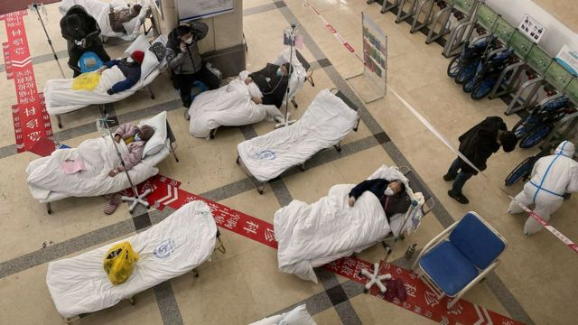
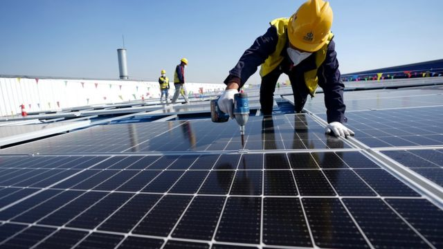
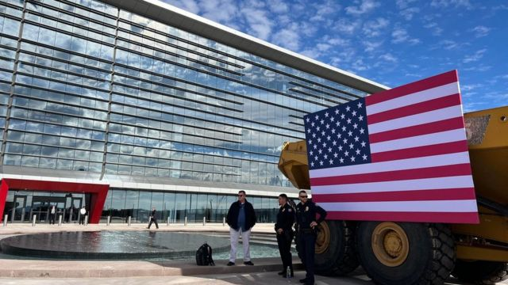

# [Press] 中国新冠疫情、经济展望、世界杯落幕和本周更多重要故事

#  中国新冠疫情、经济展望、世界杯落幕和本周更多重要故事

9 小时前

> 图像来源，  AFP
>
> 图像加注文字，中国大陆多处城市的医院涌入大量新冠患者，与香港3月时的情况相似。

**中国放宽新冠病毒病（COVID-19）防疫管制的“二十条”与“新十条”实施一段时间后，大陆地区出现大爆发的迹象越趋明显。世界卫生组织本周表示，“非常关切”中国疫情，但中国官员坚称疫情“可控”。**

在此背景下，中共中央政治局上周召开了新一年度中央经济工作会议，为2023年中国经济发展布局。会议内容在本周受到舆论关注。

史上首次在北半球冬天举行的国际足联世界杯（FIFA World Cup）在卡塔尔落幕，阿根廷戏剧性击败卫冕冠军的法国，第三度举起奖杯，利昂内尔·梅西（Lionel Messi，美斯）“黑袍加身”成为“球王”。

**刚刚过去的一周，BBC中文** **有以下新闻内容受到读者的关注。如果你错过了它们，BBC中文带你一一回顾。**

##  1\. 中国放开新冠疫情管控后 民间感染大爆发与官方数据相左

据报道，新冠防疫管制放松后，中国的医院挤满了新冠患者。未经证实的消息称，全国感染人数数以千万计，但近日官方公布的每日确诊数字只有数千人。

中国外交部发言人毛宁星期五（12月23日）对外宣称：“中国疫情防控形势总体是可预判、可控的。相信中国人民团结应对，很快将迎来经济社会平稳有序发展的新阶段。”

到目前为止，中国新冠疫苗接种情况未如理想。卫生官员近日表示将加强疫苗接种计划，当中尤其强调加快推进老年人新冠病毒疫苗接种。

##  2\. 中共中央经济工作会议给2023年中国经济展示出复杂信号

> 图像来源，  Xinhua
>
> 图像加注文字，疫情期间，中国出口先受冲击，再攀高峰，又落谷底，经历“过山车”。

12月15日至16日，中国举行中央经济工作会议，每年12月底的这次会议透露来年经济政策基调，包括财政、货币，乃至对房地产、互联网、汽车等重要行业的最新动向，因而备受市场瞩目。

这次会议还有两个特殊背景：10月中共“二十大”后新浮现的四位政治局常委——李强、蔡奇、丁薛祥、李希——出席会议，明年全国人大和政协“两会”上将确认中国新一届经济主官，因而此次是新老交棒的会议；11月底，中国突然放开严格的防疫管控，为当前深陷泥沼的经济带来希望，明年经济将面临全新的环境。

会议给予“稳增长”最高优先级，改变“稳就业”排在第一的情况，并且没有再提“清零”，而称“更好统筹疫情防控和经济社会发展”。此外还增加了“加大宏观政策调控力度”的说法，多位经济学家认为，这意味着明年会有更大规模刺激经济复苏。

##  3\. 2022世界杯落幕 阿根廷再圆足球霸主梦 梅西“登基球王”

上星期日（18日），阿根廷队在2022世界盃足球赛戏剧性地击败了法国队夺冠，在比赛进到互射点球（12码）的阶段时前者以4:2胜出。

阿根廷球王梅西曾说这是他最后一届世界盃。他当选本届最佳球员，神射手则是法国新星基利安·姆巴佩（Kylian Mbappe，麦巴比），有不少球迷形容他与梅西同场是两代球星的射手之争。

赛后各地的阿根廷队球迷大肆庆祝，在法国则有警民发生冲突。里昂有部分民众在法国输掉比赛后向警方投掷杂物，警察则以催泪瓦斯与水车反制。

##  4\. 乌克兰战争300天 泽连斯基旋风式访美获拜登许诺

俄罗斯今年2月24日入侵乌克兰，至本周过去了300天。星期三（12月21日），乌克兰总统泽连斯基（Volodymyr Zelensky）突然到访华盛顿，到白宫会晤美国总统拜登（Joe Biden），并到美国国会发表演说。

这是自俄罗斯入侵以来泽连斯基的首次外访。他表示，乌克兰“面对一切困难……至今仍屹立不倒”，他们“永远不会投降”。

美国已宣布将向乌克兰提供更多支持，包括一个爱国者导弹系统。总统拜登表示，不会让乌克兰独自奋战。

另一方面，俄罗斯总统普京则称，乌克兰的战事不应归咎于俄罗斯，同时指责一些“第三方国家”的政策造成了两个国家的“共同悲剧”。

##  5\. 美中台角力——从军事到科技

> 图像来源，  Ethan LIN
>
> 图像加注文字，台积电在凤凰城的厂房。未来将有大量台湾员工在这里工作，一起到来的还有他们的家人。

两周前，美国总统拜登亲自到台湾积体电路制造公司（TSMC，台积电）在亚利桑那州凤凰城的晶片厂，出席厂房第二期装机典礼。这在本周继续受到讨论。BBC中文访问三位年轻工程师，了解他们各自的盘算。

另一方面，美国国会参议院12月15日通过2023年度《国防授权法案》（National Defense Authorization Act，NDAA），拜登星期五正式签署生效。中国对此强烈不满，外交部批评美方法案“罔顾事实渲染‘中国威胁’，肆意干涉中国内政，攻击抹黑中国共产党，是对中方的严重政治挑衅”，又称其“包含大量涉台消极条款，严重违反一个中国原则和中美三个联合公报规定，向‘台独’分裂势力发出严重错误信号，给台海和平稳定造成严重损害”。

英国诺丁汉大学中国研究学院副教授苏立文（Dr Jonathan Sullivan）对BBC中文分析说，目前白宫认为提高台湾的自卫能力是当务之急，即使这意味着惹怒中国。

