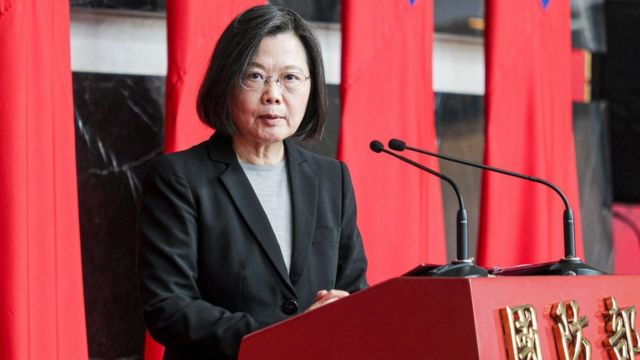

# [Press] 中国重开边境、台湾延长兵役、球王贝利逝世和本周更多重要故事

#  中国重开边境、台湾延长兵役、球王贝利逝世和本周更多重要故事

**中国防疫政策转为“共存”后正值感染高峰期，当局突然宣布明年1月8日开放边境，恢复中国公民出境旅游，多家在线旅游平台随即出境机票、海外酒店搜索量大涨。**

这引发了多国忧虑，恐出现变种病毒造成“疫情海啸”，美国、意大利、日本、马来西亚、台湾、印度、韩国等地相继制定针对中国旅客的入境检测及隔离规定。

在台湾，总统蔡英文宣布延长义务兵役至一年，2024年起生效。她强调备战才能避战，“只要台湾够强，青年就不用上战场”，外界关注有关政策是否会冲击2024年总统大选。

刚刚过去的一周，BBC中文有以下新闻内容受到读者的关注。如果你错过了它们，BBC中文带你一一回顾。

##  1\. 中国开放边境引发多重忧虑 多国对入境旅客加强防疫

> 图像来源，  Getty Images

中国国家卫健委12月26日发布《关于对新型冠状病毒感染实施“乙类乙管”的总体方案》，将“新冠肺炎”更名为“新型冠状病毒感染”，不再强制入境人员接受核酸检测和集中隔离，取消国际客运航班数量管控措施，“有序恢复”中国公民出境旅游。

在中国网民庆祝之际，多国宣布对中国入境旅客进行强制检测。许多观察者惊呼，彷佛回到疫情之初的2020年。当年，新冠病毒最初在中国武汉蔓延，多个国家宣布对中国关闭边境。而两年後的今天，奥密克戎变种毒株正在中国肆虐，以“疫情海啸”为题的报道登上许多国际媒体的头条。

学者指出，中国在凖备不充分丶监管不到位丶缺乏数据检测的情况下过於急速的放开，部分国家做出相应的自卫性防护是可以理解的。

##  2\. 台湾延长义务兵役至一年 蔡英文数面受敌

> 图像来源，  Getty Images
>
> 图像加注文字，蔡英文指，台湾处在威权主义扩张第一线必须加强国防能力。

台湾总统蔡英文宣布兵役改革政策，包括义务役从现行的四个月延长至一年，预计2024年元旦生效，适用于2005年起出生之役男。

国防部将引进美军最新模组化训练模式，增加刺针飞弹、无人机等新式武器的训练，全役期的射击发数不低于800发。另外大幅提高义役薪资，从6500元新台币（212美元；1462元人民币）上调到26307元。

蔡英文两年以来首次接受媒体联访，表示中国在8月军演後对台威逼更明显，这次改革是“无比困难的决定”，但身为总统和三军统帅有责任提升国防战力。

民调显示台湾社会对延长兵役有高度共识，但存在显着的世代差异。外界关注这次决定有否受到美国压力，以及会否冲击2024年总统选举。

##  3\. 中美大国竞争将走向何方？

过去一年，美中关系的主轴是竞争与对抗，但年底两件国内政治大事——中共二十大和美国中期选举——落幕后，两国关系似乎迎来一些转机，习近平与拜登在印尼巴厘岛会晤。

学者指出，双方领导人在顺利完成两件国内大事之后都更加自信，有理由放软身段处理外交事务，加上两国都面临疫情后经济复苏的挑战，"当前合作是最佳时机"。

但降温不代表缓和，分析认为未来一年美中关系并不乐观，双方都表现出言行不一，在台湾问题上也很难走出漩涡，只能是延缓冲突爆发。

##  4\. 日本国防开支猛增三成引国际关注

> 图像来源，  Getty Images

日本政府12月23日通过内阁会议，决定2023年度防卫预算为6.8万亿日圆（约510亿美元），比2022年度预算暴增26.3%，引发各界关注。

首相岸田文雄此前一周在内阁会议上批准三份防卫文件，被指决定了今后五至十年日本安保政策方向，最大的变化是日本拥有“反击能力”。其中，新版《国家安全保障战略》 文件中，首指中国是日本“迄今最大战略挑战”（过去都是朝鲜）。

这引发了区域关注及北京强烈批评。学者预计，日中关系可能会继续恶化，中国应将会视该战略为日本与美国及其他盟国合作“遏制中国的进一步证据”，北京亦可能会增加解放军和在台湾丶尖阁列岛（中国称钓鱼岛，台湾称钓鱼台）甚至竹岛（韩国称独岛）及其周边地区的灰色地带行动，以作为回应。

##  5\. 球王贝利与世长辞

曾率领巴西队三夺世界杯冠军的球王贝利（Pele，又译比利）患癌病逝世，享年82岁。

贝利有登峰造极的技巧和风驰电掣的速度，在此之上还配以球门前那种致命的精准。在21年的职业生涯中，他在1363场比赛中攻入1281球，创造了世界纪录。 其中包括为巴西国家队出场92场比赛，攻入77球。

而在球场下，他致力于倡议活动，为社会中处在最弱势的人们改善生活状况。

1977年，贝利曾跟隨纽约宇宙队到訪中国，与中国国家队在北京和上海各上演了一场友谊赛，让即将迎来改革开放时代的中国民众得亲眼目睹球王的风采。

