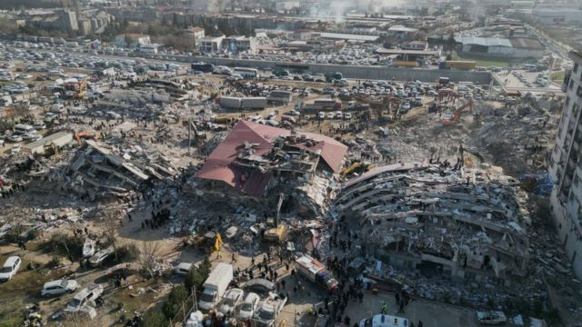
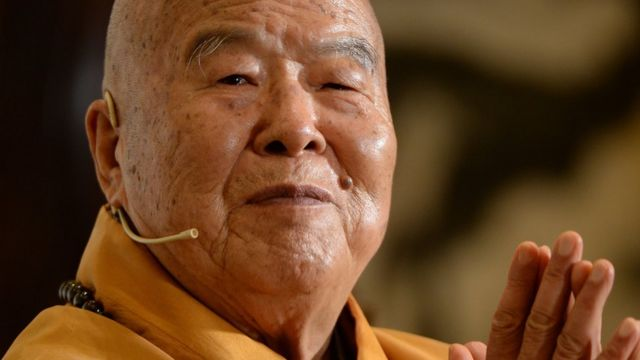

# [Press] 土耳其叙利亚大地震、中国气球、香港国安法47人案和本周更多重要故事

#  土耳其叙利亚大地震、中国气球、香港国安法47人案和本周更多重要故事

> 图像来源，  EPA
>
> 图像加注文字，土耳其、叙利亚两国成千上万房屋在地震中崩塌，无数百姓被困。

**这一周从一场“横跨欧亚”的地震开始——土耳其东南部靠近叙利亚边境地区一天之内发生两次猛烈地震，两国合共超过2万人罹难，灾区人道处境堪忧。台海两岸三地均有派遣救援队伍前赴灾区。**

中国气球争端继续左右中美两国关系：美方公布被击落气球的更多细节，情报人员称气球“能进行信号情报收集行动”，中方则坚称，气球属民用。

同样在本周，2020年6月中国颁布《香港国安法》以来最大案件正式开审。这起“串谋颠覆国家政权”案件的47名不同程度参与两年前的民主派初选， 其中有16人不认罪；若被判有罪，被告人面临最高无期徒刑。

刚刚过去的一周，BBC中文以上新闻内容受到读者的关注。如果你错过了它们，我们带你一一回顾。

##  1\. 土耳其—叙利亚连环大地震死伤二万 救援寸步难行

星期一（2月7日）安卡拉时间04:18（格林尼治标准时间01:18），土耳其东南部靠近叙利亚边境的加济安泰普镇（Gaziantep）附近发生里氏（芮氏；黎克特制）7.8级地震，9小时后发生另一次里氏7.5级地震。
 截至星期五（10日）清晨  ，土、叙两国合共超过2万人罹难。土耳其总统埃尔多安（Recep Tayyip Erdoğan）形容这是“世纪灾难”。

虽然全球数十个国家和地区已派遣救援队伍驰援，但寒冷天气、道路阻断与余震等因素，让土耳其一侧寻找倖存者的过程充满阻滞。叙利亚一侧因近年内战满目苍夷，反政府武装控制地区灾情尤其堪忧。

中国大陆、台湾与中国香港特区政府先后派遣救援队伍到土耳其，参与搜救。

##  2\. 美国击落中国“间谍”气球，两国关系再降温

上星期六（4日），美军一架F-22战斗机根据美国总统拜登（Joe Biden）命令，用一枚导弹击中了疑似中国间谍气球，该气球在距离卡罗来纳海岸约6海里处坠落。海军舰队司令部本周公布了打捞该气球残骸的照片。

华府星期四（9日）进一步发布消息称，气球携带了用于情报收集和通信的天线和传感器，隶属中国组建飞越“五大洲40多个国家的侦察气球编队。美国国务卿布林肯（Antony Blinken）说：“美国并非这个更广泛计划的唯一目标。”

中国坚称气球属于民用，并对美方击落气球提出批评。国际关系学者对BBC表示，事件可能让中美错失了稳定双边关系的好机会。

##  3\. 拜登国情咨文避谈气球 脱稿质疑习近平瞩目

拜登星期二（7日）晚间在国会参众两院联席会议上发表其任内第二份国情咨文，演说没有直接提及疑似中国侦察气球引发的争端，但他表示，美国寻求与中国竞争，而非冲突。

拜登在演说中突然脱离讲稿，大声质疑习近平。在提及俄罗斯入侵乌克兰时，他赞扬了北约表现出的实力。

##  4\. 香港民主派47人初选案开审

香港高等法院原讼法庭星期一（6日）正式开庭审讯民主派47人初选案。案件牵涉被告人众多，需移师西九龙裁判法院的大型法庭审理，预计审期90个工作天。

47名被告人被控以中国《香港国安法》下的“串谋颠覆国家政权”罪，按照特区律政司指示，由高院原讼庭三名“国安法指定法官”组成合议庭审理，不设陪审团，有别于一般高院刑事审判。被告人一旦被判有罪，最高可被判处无期徒刑。

众被告来自不同政治光谱的香港民主派组织，包括前香港大学法律系副教授戴耀廷，多名前立法会议员如毛孟静、林卓廷、区诺轩、杨岳桥、梁国雄等，以及年轻社运人士如黄之锋、岑敖晖等。

47人中有16人表示不认罪，分别为吴政亨、郑达鸿、杨雪盈、彭卓棋、何启明、刘伟聪、黄碧云、施德来、何桂蓝、陈志全、邹家成、林卓廷、梁国雄、柯耀林、李予信及余慧明。他们星期一起受审，其余认罪的被告，按照法庭指示，将于审讯结束后再行判刑。

这是《香港国安法》生效后最大规模的案件，开审当天，英国、美国、法国、德国、澳大利亚和欧盟等国家与组织的外交代表均有到场了解审理过程。

案件开审之际，大部分被告人因不获保释，已被关押超过700天。

##  5\. 台湾佛教名僧星云法师圆寂 享年96岁

> 图像来源，  China News Service
>
> 图像加注文字，星云法师所创办的佛光山是台湾两大佛教宗派之一。

台湾佛光山国际佛光会创办人星云法师2月5日在高雄圆寂，享年96岁。

星云法师本名李国深，1927年生于中国大陆江苏扬州市，12岁时剃度出家，1949年随着中国国民党军队迁到台湾。作为台湾知名佛教组织的创办人，星云创办的佛光山组织庞大，信徒众多，并开办电视台，中学及大学院校，报纸及全球各地据点及庙宇。

星云法师对政治参与颇深。他倡导两岸统一，备受中国大陆礼遇，但晚年也与民进党人士交流顺畅，屡次赞誉出自该党的总统蔡英文及高雄市长陈其迈。时而发表政治见解的星云，被认为是台湾与本土及两岸政治最亲近的宗教人物。

星云过世，台湾总统蔡英文立即表达沉重哀悼及尊敬。行政院长陈建仁发文称，对于星云创办的国际佛光会在人道救援的善行义举，“必会继续发扬光大！”

国民党主席朱立伦也在Facebook发文，感谢星云一生的奉献。他又表示 “星云大师是忠贞的国民党员，曾做过党务顾问、中评委，始终坚持公平正直的态度”。

##  6\. 泽连斯基旋风式访问英国与欧盟，争取军事支持

乌克兰总统泽连斯基（Volodymyr Zelensky）星期三（8日）突然访问英国，先后会晤首相苏纳克（Rishi Sunak；辛伟诚）与国王查尔斯三世（King Charles III）。这是自去年2月底俄罗斯入侵乌克兰以来，泽连斯基首次访问英国。

泽连斯基当晚转到法国巴黎，会晤法国总统马克龙（Emmanuel Macron）与德国总理肖尔茨（Olaf Scholz），星期四（9日）再到比利时布鲁塞尔， 于欧洲议会演说  。

泽连斯基此行一大目的，是游说欧盟成员国与英国为乌克兰提供主战坦克、战斗机和远程导弹，以抵御俄国的持续攻击。

