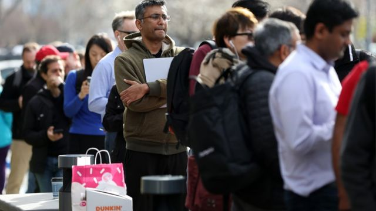
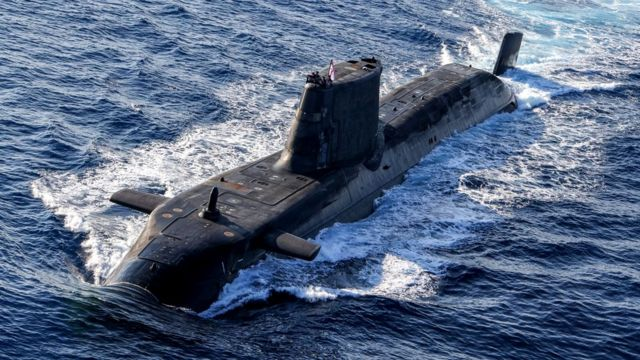

# [Press] 中国“两会”闭幕、奥斯卡上的亚裔、硅谷银行倒闭和本周更多要闻

#  中国“两会”闭幕、奥斯卡上的亚裔、硅谷银行倒闭和本周更多要闻

##  1.两会闭幕，新一届政府浮出水面，李强两会记者会“首秀”

每年中国的“两会”上，有“一头一尾”两出重头戏，分别是开幕时的总理《政府工作报告》，以及闭幕以后的总理记者会。对于中国的政治肌体而言，“记者会”多少有些异物感，容易产生排异反应。中国高层领导人极少举行记者会，因此“两会”后的中国总理记者会，几乎汇集了中外媒体一整年的好奇心和注意力。

尽管记者会上的提问被普遍认为是已预设好的，但答问者时常会有超出预料的言论，在一定程度上也塑造了时任总理的形象。

3月13日上午，第十四届中国全国人大第一次记者会召开，新总理李强挥手走进会场，这是李强作为总理的“首秀”，他长期在地方政府任职，并无丰富的中央政府工作经验，因此此前他在全国和世界舞台上也不太为人所知。记者会上李强没有回答挑战性强的问题，但也给人们留下了第一印象。

##  2.杨紫琼、关继威等亚裔演员横扫奥斯卡

第95届奥斯卡颁奖典礼于3月12日举行，马来西亚影星杨紫琼（Michelle Yeoh）凭在电影《妈的多重宇宙》（Everything Everywhere All at Once，又译：《奇异女侠玩救宇宙》、《瞬息全宇宙》）中的表现横扫影展奖项并最终在奥斯卡荣获"最佳女主角"奖项。这部电影共获11项提名。除了最佳影片，同片的关家永（Daniel Kwan）、关继威（Ke Huy Quan）与许玮伦（Stephanie Hsu）等也分别入围最佳导演、最佳男配角角以及最佳女配角。

夺得最佳男配角奖之后，关继威发表了一番动情的获奖感言，提到他年少时从越南乘坐小船，中途住过香港难民营，最后到达加利福尼亚州的历程。

杨紫琼在典礼前夕和BBC聊了参与这部电影对她的意义以及作为一名亚洲女演员在好莱坞的历程。

> 图像来源，  Getty Images
>
> 图像加注文字，在硅谷银行一家分行外排队取款的长队。

##  3.硅谷银行倒闭、瑞信股价暴跌，“雷曼时刻”又来了？

本周，硅谷银行遭到挤兑，突然倒闭，引发美国官方紧急介入，犹如罩在全球市场头顶的乌云，然而这朵还没飘散，一朵更大的乌云倏忽而至，抢走了各个媒体的新闻头条。本周三，瑞士信贷的股价下跌了24%，在纽交所开盘一度暴跌近30%。

这家总部位于瑞士苏黎世的银行和金融服务公司，成立于1856年，业务包括财富管理、投资银行、瑞士银行和资产管理，而且业务遍布全球50多个国家。从规模上讲，瑞信的体量更是硅谷银行无法比拟。即便经历大量资金外流和连续亏损，瑞信管理的资产规模依然超过1万亿瑞士法郎，相当于1.1万亿美元，或者7.5万亿元人民币。而全世界GDP超过1万亿美元的国家仅有17个。

这些数据都指向一个事实——瑞信成为“大而不能倒”的金融机构之一，一如当年的雷曼。

> 图像来源，  Ministry of Defence

##  4\. 英美澳就核潜艇达成协议惹恼中国

美国、英国和澳大利亚三国领导人公布了建立新核动力潜艇舰队的计划细节，此举被认为旨在抗衡中国在印太地区的影响力。

根据“奥库斯”（AUKUS，即澳、英、美三国军事联盟）安全协议，澳大利亚首先将会从美国那里至少获得三艘核动力潜艇。

三国联盟亦将使用尖端技术，合作建立一个新的舰队，包括由英国劳斯莱斯（Rolls-Royce）公司制造的反应堆。

北京表示，这项重大的海军交易“损害了和平与稳定”。中国驻联合国代表团指责美英澳核潜艇合作“是三违反行径”，冲击核不扩散体系。

