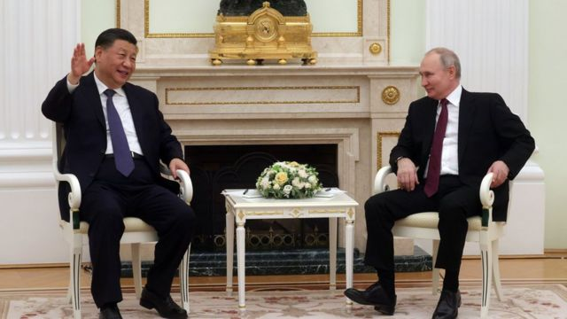
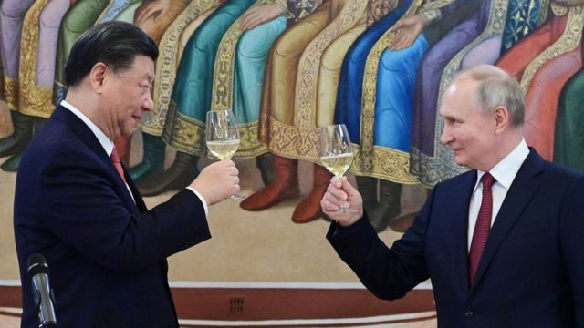
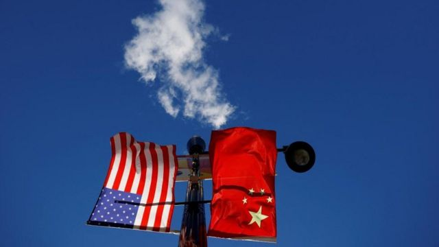
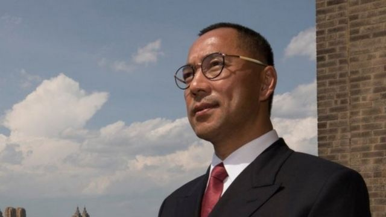
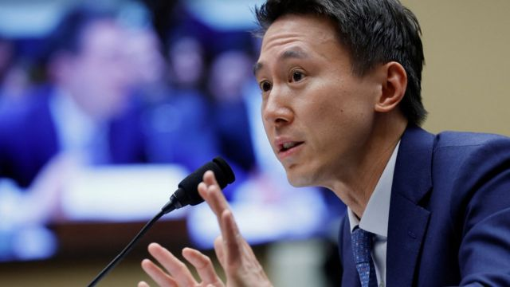
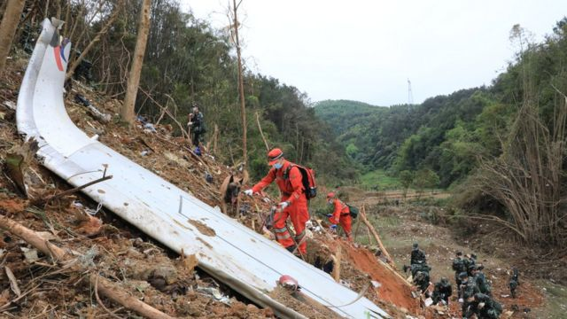
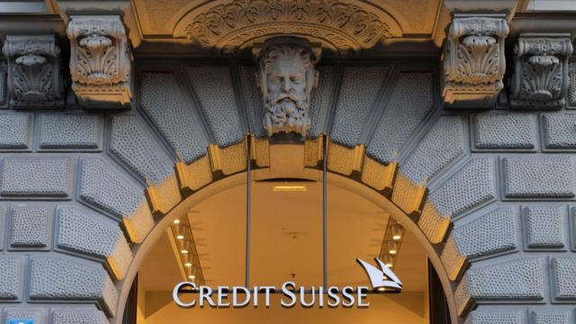

# [Press] 习近平普京峰会、郭文贵被捕、TikTok美国听证会和本周更多重要故事

#  习近平普京峰会、郭文贵被捕、TikTok美国听证会和本周更多重要故事

> 图像来源，  KREMLIN POOL/SPUTNIK/EPA
>
> 图像加注文字，习近平（左）与普京（右）以“亲爱的朋友”相称。

**在国际社会警告习近平勿对俄提供杀伤力武器和国际刑事法院（ICC）对普京发出逮捕令的背景下，俄中两国元首在莫斯科会谈。双方同意“通过和谈”解决乌克兰问题，普京又称愿意协助中资企业取代撤离俄国的西方企业。**

流亡大亨郭文贵在美国被捕的消息成为本周的热议话题——检察人员指控他网络诈骗、证券欺诈、银行诈骗和洗钱罪行。多年前要求国际刑警组织发出“红色通缉令”的北京低调回应。

同样在美国，一位新加坡公民成为了众议院一场中国事务听证会的焦点——在英美多国纷纷要求政府人员从手机卸载该应用之际，TikTok首席执行官周受资在众多议员面前极力淡化自己与字节跳动乃至中国共产党之间有关联的指控。

刚刚过去的一周，BBC中文以上新闻内容受到读者的关注。如果你错过了它们，我们带你一一回顾。

##  1\. 习普会强调和谈解决乌克兰危机，俄中“亲爱的朋友”谋求经济相互依存

> 图像来源，  KREMLIN POOL/SPUTNIK/EPA
>
> 图像加注文字，习近平称，中俄关系“对世界格局和人类前途命运至关重要”。

中国国家主席习近平星期一（3月20日）抵达莫斯科，对俄罗斯进行国事访问。

俄罗斯总统普京（Vladimir Putin）与习近平一连举行了两天会晤，双方在星期二的正式会谈后签署联合声明，强调要“通过和谈”来解决乌克兰危机。两国提出强化双边关系的系列计划，普京又称，愿意协助中资企业到俄国投资，取代因乌克兰战争而撤离的西方企业。

在国际刑事法院（ICC）数天前针对发生在乌克兰的战争罪嫌批准逮捕普京之际，习近平邀请普京访问北京。目前，中国并不承认ICC权力。

俄中元首会谈之际，北大西洋公约组织（NATO）秘书长斯托尔滕贝格（Jens Stoltenberg）再次警告北京不要向莫斯科提供“可致命援助”，否则中国将是对一场“非法战争”提供支持。

澳大利亞智庫洛伊研究所（The Lowy Institute）研究員徐元敬（Jennifer Hsu）对BBC指出，中国向俄罗斯提供军援无异于同时排挤欧盟与美国，而这是灾难性的。“因此我想中国不可能公然对俄提供可致命援助，但这并不代表这不会秘密进行。”

英国皇家国际事务研究所（Chatham House）中国事务高级研究员于洁博士对BBC评论说，习近平形容两人的会面“坦诚友好、富有成果”，这意味着莫斯科与北京之间仍有某些分歧。

##  2\. 中俄渐行渐近 中美国际角色受检验

> 图像来源，  Reuters

习近平与普京高调会晤，观察人士提醒，中俄两国关系主要建基于对美国霸权同仇敌忾。

本周，中国美国商会发表对其900多家会员企业的最新年度调查，首次显示55%的企业不再将中国视为前三大投资重点之一，即它们应投资发展业务的地方。商会总裁何迈可（Michael Hart）表示，美国企业对在中国开展业务的态度“比过去很长一段时间都更加消极”。

同样在本周，总部在美国的皮尤研究中心（Pew Research Center）发表另一项调查，显示英、法、德三国的欧洲年轻人对于美国作为“世界警察”的角色，以及中国逐渐增强的经济体量感到担忧。

##  3\. 美国起诉郭文贵诈骗等罪上热搜 中国冷处理

> 图像来源，  Twitter
>
> 图像加注文字，中国2017年要求国际刑警组织对郭文贵发布红色通告，即俗称“红色通缉令”。

美国当局指控居住在纽约的中国地产业大亨郭文贵策划了一场10亿美元骗局，其涉嫌罪行包括网络诈骗、证券欺诈、银行诈骗和洗钱。

郭文贵是中国政府的批评者，曾与前白宫首席战略顾问斯蒂芬·班农（Stephen Bannon）关系密切。

在被问到对该案的看法， 中国外交部发言人汪文斌没有正面回答，称“注意到了有关报道。”

中国大陆媒体以简短的通稿进行报道，称郭文贵为“潜逃美国的国际刑警组织红色通报在逃人员”，并引述美国司法部指他“用骗来的钱来满足自己及家人”。

##  4\. 美国国会召开TikTok听证会 周受资接受质询

> 图像来源，  Reuters
>
> 图像加注文字，来自新加坡的周受资此前并不在应对外界对TikTok质疑的第一线上。

在全球对于TikTok的怀疑态度越来越强，且可能导致美国对这一中国应用程序实施禁令之际，如今焦点落在了该公司首席执行官周受资（Shou Zi Chew）身上。

这名40岁的新加坡人星期四就该应用程式的数据安全和隐私保护，以及被指与北京有关联等问题，向美国众议院能源及商业委员会（US House Energy and Commerce Committee）作证， 历经超过四个半小时。

周受资在这一场不寻常的听证中接受议员连番提问，当中不乏尖刻和穷追猛打的攻击。无论是民主党人还是共和党人，都咬住不放。

TikTok一名发言人在事后表示，这些政客是在“哗众取宠”。

##  5\. 中国东航空难一周年 民航部门称调查仍在继续

> 图像来源，  Xinhua
>
> 图像加注文字，东航MU5735空难共造成132人丧生，他们分别是123名乘客和九位机组人员。

中国东方航空MU5735客机空难发生届满一年，死难者家属迄今仍在等待调查结果。中国民用航空局称，“事故非常复杂、极为罕见，调查还在持续深入进行中”。

2022年3月21日下午，由一架美国波音737-800型客机执飞的东航MU5735客机从云南昆明飞往广东广州途中，坠落广西梧州藤县琅南镇莫埌村附近山谷，机上132人全部罹难。MU5735空难由此成为自1994年以来中国本土最严重空难。

中国与国际民航事故调查规定均有要求在事发后一年公布调查结果，但这并非强制规定。中国民用航空局星期一晚间称：“技术调查组将在前期工作基础上继续开展原因分析及实验验证等工作。”

美国方面也获邀参与是次调查，相关方面回应BBC中文查询时称，将继续支持中方的调查工作。

##  6\. 马英九拟返乡祭祖 其大陆之行引关注

台湾前总统，中国国民党前主席马英九将于3月27日至4月7日赴中国大陆祭祖，为期12天的行程预计访问南京、武汉、长沙、重庆与上海，并率青年学子与大陆学生交流。这是自1949年两岸分治74年来，首次有中华民国卸任总统踏足中国大陆。

2015年11月7日，马英九在新加坡与中共中央总书记，中国国家主席习近平举行过历史性会晤。但据报他这次到访大陆期间，不会与习近平见面。

值得留意的是，马英九访陆行程料与蔡英文总统访美行程有所重叠。对此，马英九基金会执行长萧旭岑强调，马英九在春节前已规划访陆，事前不知道蔡英文出访行程，完全是巧合。

##  7\. 瑞银集团收购瑞信 百年老字号跌倒恐涟漪不断

> 图像来源，  Getty Images
>
> 图像加注文字，被四折卖掉的瑞信，今年167岁。

硅谷银行危机48小时内政府就接手，一波未平，更大的瑞信危机接踵而至，上星期三（15日）股价暴跌，到星期日(19日），这场危机就以一场史诗级交易，暂告段落。

瑞士联邦政府宣布，瑞士信贷将被瑞银集团收购，交易总对价为30亿瑞士法郎（32亿美元）。这相当于17日收盘市值的40%。

